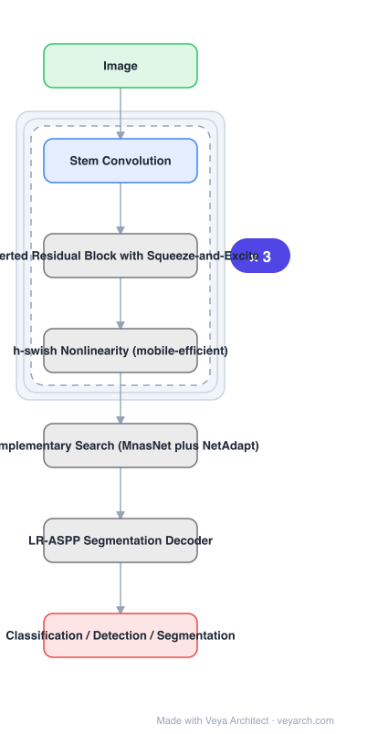

# Architecture: MobileNetV3

## Motivation

The goal is stated plainly: the **best possible mobile computer vision architecture optimizing the accuracy-latency tradeoff on mobile devices**. Prior work had split into hand-crafted structures (SqueezeNet, MobileNetV1/V2, ShuffleNet, CondenseNet, ShiftNet) and algorithmic neural architecture search — both useful, but the paper's move is to **blend automated search with novel architecture advances** rather than choose one.

## Core Idea

Four contributions, deliberately separable and each evaluated on its own: (1) **complementary search techniques**, (2) **new efficient versions of nonlinearities practical for the mobile setting**, (3) **new efficient network design**, (4) **a new efficient segmentation decoder**. The result is two released models, MobileNetV3-Large and MobileNetV3-Small, for high- and low-resource use cases.

## Architecture

### Overview

<b>Layer-by-layer (7 nodes)</b>

| # | Layer | Type | Params |
|---|---|---|---|
| 1 | Image | `input` |  |
| 2 | Stem Convolution | `conv2d` |  |
| 3 | Inverted Residual Block with Squeeze-and-Excite | `custom` |  |
| 4 | h-swish Nonlinearity (mobile-efficient) | `custom` |  |
| 5 | Complementary Search (MnasNet plus NetAdapt) | `custom` |  |
| 6 | LR-ASPP Segmentation Decoder | `custom` |  |
| 7 | Classification / Detection / Segmentation | `output` |  |

### Components

1. **Complementary search** — the paper reviews efficient mobile building blocks and the complementary nature of the **MnasNet** and **NetAdapt** algorithms; NetAdapt is complementary to MnasNet and can be combined with it.
2. **Inverted residual block with squeeze-and-excite** — inherits MobileNetV2's resource-efficient block with inverted residuals and linear bottlenecks, plus SE.
3. **h-swish nonlinearity** — a mobile-efficient nonlinearity, motivated by the observation that some activations are costly to compute precisely on mobile hardware.
4. **New efficient network design** — architectural changes that improve the efficiency of the models found through the joint search.
5. **LR-ASPP segmentation decoder** — a new lightweight decoder for mobile semantic segmentation.

### Data Flow

Image → stem convolution → searched stack of inverted residual blocks with SE and h-swish → task head; for segmentation, the final features feed the LR-ASPP decoder.

### State / Memory

No recurrent state. The design targets latency on real mobile phones, so the relevant quantities are inference latency and MAdds rather than parameter count alone.

## Design Decisions

- **Blend search with hand design** — the paper's stated method for pushing the state of the art forward, not one or the other.
- **Make nonlinearities mobile-practical** — exact implementations of some activations are expensive on device; this is a hardware-aware choice, distinct from accuracy-driven changes.
- **Improve on what search found** — the new network design is applied to raise the efficiency of the jointly searched models, so it is a second stage on top of search.
- **Cover segmentation, not just classification** — hence a dedicated decoder.
- **Evaluate each element separately** — thorough experiments across a wide range of use cases and mobile phones to understand contributions of different elements.
- **Two sizes** — Large and Small for high- and low-resource use cases.

## Evolution

- **SqueezeNet** (parameter reduction focus).
- **MobileNetV1** (depthwise separable convolution), **MobileNetV2** (inverted residuals and linear bottlenecks).
- **ShuffleNet** (group convolution + channel shuffle), **CondenseNet**, **ShiftNet**.
- **MnasNet, NetAdapt** (search; the pair is combined here).
- **MobileNetV3 (2019)**: search + nonlinearities + network design + segmentation decoder.
- **Successors**: MobileNetV4 (2024).
- **Siblings**: GhostNet, ShuffleNet V2, RepViT.
- **Contrast**: pruning / quantization / distillation — upper bounded by their pre-trained baselines.

## Characteristics

| Property | Value |
|---|---|
| Task | mobile classification / detection / segmentation |
| Block | inverted residual with squeeze-and-excite |
| Nonlinearity | h-swish (mobile-efficient) |
| Search | MnasNet + NetAdapt (complementary) |
| Decoder | LR-ASPP for segmentation |
| Models | MobileNetV3-Large, MobileNetV3-Small |

## Limitations

- The searched configuration is specific to the hardware and latency targets used during search; other devices may behave differently.
- Nonlinearity approximations trade a small accuracy loss for speed; the trade is hardware-dependent.
- Optimized for mobile-scale accuracy, not for server-scale accuracy.
- Reproducing the models requires the search pipeline, not only the architecture definition.

## Implementation Notes

Essentials: (1) run MnasNet and NetAdapt as *complementary* stages and combine them — NetAdapt is the refinement pass, not an alternative to MnasNet, (2) use h-swish rather than exact swish; the mobile-practicality of the nonlinearity is a stated contribution, and using the exact form loses the speed, (3) apply the architectural redesign on top of the searched model, since it improves on what search found rather than replacing it, (4) for segmentation use the LR-ASPP decoder rather than a heavy ASPP — a standard ASPP defeats the mobile latency budget, (5) report measured latency across several mobile phones, because the objective is the accuracy-latency tradeoff and accuracy alone does not show it.
