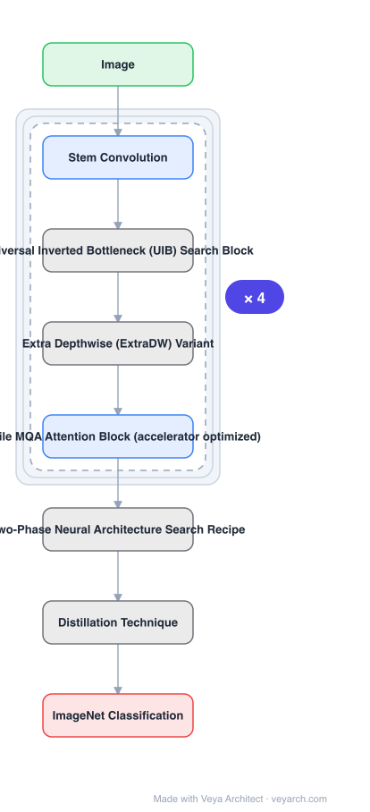

# Architecture: MobileNetV4

## Motivation

Efficient models are typically tuned until they are Pareto optimal on one target — a mobile CPU, say — and then degrade on DSPs, GPUs and dedicated accelerators. Since deployment targets are diverse and a model must often serve several, the paper optimizes for **universality**: one design space whose searched models are mostly Pareto optimal across every device class tested. A secondary motivation is privacy: on-device inference avoids streaming private data over the internet.

## Core Idea

Three coupled contributions. A **Universal Inverted Bottleneck (UIB)** — one search block that subsumes Inverted Bottleneck, ConvNeXt, FFN and a new ExtraDW variant, so NAS can move between micro-architectures instead of being locked into one. **Mobile MQA** — an attention block built for mobile accelerators. And a **refined two-phase NAS recipe** that separates coarse from fine-grained search.

## Architecture

### Overview

<b>Layer-by-layer (8 nodes)</b>

| # | Layer | Type | Params |
|---|---|---|---|
| 1 | Image | `input` |  |
| 2 | Stem Convolution | `conv2d` |  |
| 3 | Universal Inverted Bottleneck (UIB) Search Block | `custom` |  |
| 4 | Extra Depthwise (ExtraDW) Variant | `custom` |  |
| 5 | Mobile MQA Attention Block (accelerator optimized) | `attention` |  |
| 6 | Two-Phase Neural Architecture Search Recipe | `custom` |  |
| 7 | Distillation Technique | `custom` |  |
| 8 | ImageNet Classification | `output` |  |

### Components

1. **Universal Inverted Bottleneck (UIB)** — improves the inverted bottleneck with two *optional* depthwise convolutions. Despite its simplicity it unifies several prominent micro-architectures (IB, ConvNeXt, FFN) and adds the ExtraDW variant. Provides flexibility in spatial and channel mixing, an option to extend the receptive field, and improved compute efficiency.
2. **Mobile MQA** — an attention block for mobile accelerators; >39% inference speedup versus Multi-Head Attention on those accelerators.
3. **Two-phase NAS recipe** — coarse then fine-grained search, reported to significantly boost search efficiency and effectiveness.
4. **Distillation technique** — a novel technique applied on top to further boost accuracy.
5. **Performance modeling and analysis** — methods introduced to explain how the cross-device performance is achieved.

### Data Flow

Image → stem convolution → stacked UIB blocks (with optional depthwise variants per block) → Mobile MQA attention in hybrid variants → classifier head. Block-level choices (which depthwise convolutions are present, expansion factors, kernel sizes) come from the two-phase NAS.

### State / Memory

No recurrent state. The UIB block is a feed-forward unit; the "memory" of the design is the set of searched block configurations, not runtime state.

## Design Decisions

- **One unified block instead of many** — NAS over a block that can *become* IB/ConvNeXt/FFN/ExtraDW is more efficient than searching over separate families.
- **Optimize the attention for the accelerator** — Mobile MQA exists because standard MHA is a poor fit for mobile accelerators; the 39% figure is on-device, not FLOPs.
- **Two-phase NAS** — coarse then fine-grained, to make search tractable over the expanded UIB space.
- **Universality as the objective** — reported as mostly Pareto optimal across mobile CPU, DSP, GPU, Apple Neural Engine and Pixel EdgeTPU; explicitly noted as not found in any other tested model.
- **Distillation on top** — separate from architecture search, applied to push accuracy further.

## Evolution

- **MobileNetV1/V2/V3** (predecessors): depthwise separable convolutions, inverted residuals, NAS + NetAdapt.
- **ConvNeXt, FFN blocks** (absorbed into UIB).
- **MobileNetV4 (2024)**: UIB + Mobile MQA + two-phase NAS + distillation.
- **Siblings**: RepViT, StarNet, FasterNet, EfficientViT, GhostNet.
- **Contrast**: MobileNetV2 (in catalog) — efficient but not accelerator-universal.

## Characteristics

| Property | Value |
|---|---|
| Task | efficient image classification / backbone |
| Core block | Universal Inverted Bottleneck (UIB) |
| Attention | Mobile MQA (>39% faster than MHA on mobile accelerators) |
| Search | two-phase NAS |
| Targets | mobile CPU, DSP, GPU, Apple Neural Engine, Pixel EdgeTPU |
| Result | MNv4-Hybrid-Large 87% ImageNet-1K, 3.8 ms Pixel 8 EdgeTPU |

## Limitations

- Search-derived: reproducing the suite requires the NAS recipe, not just the architecture definition.
- Universality is "mostly" Pareto optimal, not strictly optimal everywhere.
- Distillation adds a training-time dependency on a teacher.
- Optimized for mobile-scale models; not aimed at server-scale accuracy.

## Implementation Notes

Essentials: (1) implement UIB with both optional depthwise convolutions so a single block can degenerate into IB, ConvNeXt, FFN or ExtraDW — that degeneracy is the whole point of the block, (2) use Mobile MQA rather than MHA in hybrid variants, and measure on-device rather than by FLOPs, (3) run NAS in two phases, coarse then fine-grained, (4) report latency on several device classes — single-device numbers cannot support the universality claim, (5) apply the distillation technique as a separate final stage so its contribution is separable from the architecture.
