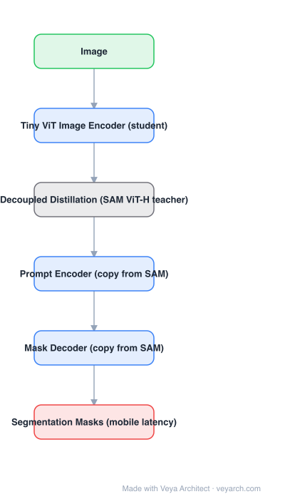

# Architecture: MobileSAM

## Motivation

SAM's cost is concentrated in the **image encoder**: the prompt encoder and mask decoder are already tiny, so interactive use is cheap once the embedding exists. That means the whole problem of "make SAM fast" reduces to "make the image encoder small" — everything else can be reused verbatim.

## Core Idea

Distill the ViT-H image encoder into a **tiny ViT**, and make the distillation cheap by **decoupling** it: distill the encoder alone (match teacher and student embeddings), instead of backpropagating through the full SAM pipeline (teacher encoder + decoder) as coupled distillation would require. Then optionally fine-tune the mask decoder against the frozen tiny encoder.

## Architecture

### Overview

<b>Layer-by-layer (6 nodes)</b>

| # | Layer | Type | Params |
|---|---|---|---|
| 1 | Image | `input` |  |
| 2 | Tiny ViT Image Encoder (student) | `conv2d` |  |
| 3 | Decoupled Distillation (SAM ViT-H teacher) | `custom` |  |
| 4 | Prompt Encoder (copy from SAM) | `embed` |  |
| 5 | Mask Decoder (copy from SAM) | `attention` |  |
| 6 | Segmentation Masks (mobile latency) | `output` |  |

### Components

1. **Tiny ViT image encoder (student)** — a small hierarchical ViT; this is the only architectural change and the entire source of the speedup.
2. **SAM ViT-H encoder (teacher, frozen)** — used only during distillation to produce target embeddings.
3. **Decoupled distillation objective** — MSE between student and teacher image embeddings, computed on the encoder output directly. Because gradients do not flow through the teacher's decoder or through the prompt/mask path, the memory and compute per step are tiny.
4. **Prompt encoder + mask decoder (copied from SAM)** — reused unchanged, which is why prompt behaviour (points, boxes, masks, ambiguity-aware multi-mask) is identical to SAM.
5. **Optional decoder fine-tuning** — with the student encoder frozen, further align the decoder.
6. **Training scale** — reported to use ~**0.1% of SA-1B (about 11k images)** and **under 1%** of the compute of a full SAM training run.

### Data Flow

Image → tiny ViT encoder → image embedding → (SAM prompt encoder + mask decoder, unchanged) → masks. During training: teacher ViT-H embedding → MSE target for the student embedding.

### State / Memory

No recurrent state. At inference the model behaves exactly like SAM with a smaller encoder, so the standard "compute embedding once, answer many prompts" caching still applies.

## Design Decisions

- **Change only the bottleneck** — keep the prompt encoder/decoder and therefore all of SAM's interactive semantics.
- **Decoupled (encoder-only) distillation** — the key efficiency trick: joint distillation through SAM's full graph is what makes naive distillation expensive.
- **Embedding-space MSE** — the student is asked to reproduce the teacher's embedding, not its masks, so it needs no mask labels.
- **Drop-in checkpoint** — the tiny encoder can replace ViT-H in existing SAM pipelines with no other change.

## Evolution

- **SAM** (predecessor): ViT-H encoder, excellent masks, too slow for on-device use.
- **MobileSAM**: decoupled distillation → tiny ViT encoder; same prompt encoder/decoder.
- **MobileSAMv2**: replaces the prompt-conditioned decoder stage with prompt-aware candidate sampling for a further speedup (everything-to-everything segmentation).
- **Siblings**: FastSAM (YOLOv8-seg + prototype masks), EfficientSAM (SAMI masked-image-pretraining distillation, better fidelity than MobileSAM), EdgeSAM (encoder-only distillation with a lightweight decoder, NPU/phone-oriented), SAM-HQ.
- **Context**: SAM 2 (video), SAM 3 (concepts).

## Characteristics

| Property | Value |
|---|---|
| Task | promptable segmentation at mobile latency |
| Encoder | tiny ViT (student), distilled from SAM ViT-H |
| Decoder | SAM mask decoder, reused unchanged |
| Distillation | decoupled (encoder-only), embedding MSE |
| Training data | ~0.1% of SA-1B (~11k images), <1% of compute |
| Latency | order-of-magnitude faster than ViT-H SAM |

## Limitations

- Mask quality is below SAM; the gap is largest on small objects, thin structures, and fine boundaries.
- Distilling embeddings only does not directly optimize mask quality — a quality gap versus mask-level fine-tuning remains.
- Still an image model: no video consistency (SAM 2 territory).
- Very small encoders lose open-domain robustness, so domain-specific data helps more than it would for SAM.

## Implementation Notes

Essentials: (1) freeze the SAM ViT-H encoder and teacher-decoder, (2) train the tiny encoder with embedding MSE on SA-1B images — do not backprop through the teacher's decoder, that is the expensive part, (3) reuse SAM's prompt encoder and mask decoder weights as-is, (4) optionally fine-tune the decoder with the student encoder frozen, (5) verify with both mask metrics and end-to-end latency on the target device, since encoder FLOPs and mobile latency are not proportional.
