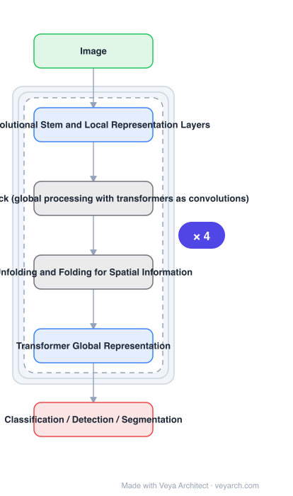

# Architecture: MobileViT

## Motivation

Light-weight CNNs are the de-facto choice for mobile vision because their **spatial inductive biases** let them learn representations with fewer parameters. But they are **spatially local**. ViTs learn global representations, but they are **heavy-weight**, and simply shrinking them to a mobile budget does not work: for a parameter budget of about 5–6M, DeiT is 3% less accurate than MobileNetV3. So neither family alone gives a light-weight model with global representations.

## Core Idea

Combine the strengths of CNNs and ViTs into a **light-weight, low-latency, general-purpose** mobile vision transformer. The key is that MobileViT presents **a different perspective for the global processing of information with transformers** — transformers are used to obtain global representations while convolutions retain local spatial inductive bias, within one compact block.

## Architecture

### Overview

<b>Layer-by-layer (6 nodes)</b>

| # | Layer | Type | Params |
|---|---|---|---|
| 1 | Image | `input` |  |
| 2 | Convolutional Stem and Local Representation Layers | `conv2d` |  |
| 3 | MobileViT Block (global processing with transformers as convolutions) | `custom` |  |
| 4 | Unfolding and Folding for Spatial Information | `custom` |  |
| 5 | Transformer Global Representation | `attention` |  |
| 6 | Classification / Detection / Segmentation | `output` |  |

### Components

1. **Convolutional layers for local representation** — provide the spatial inductive bias that lets the network learn with few parameters.
2. **MobileViT block** — the unit that does global processing with transformers, offering a different perspective from inserting standard transformer layers into a CNN.
3. **Unfold / fold operations** — the mechanism that lets a transformer operate over spatial positions: features are unfolded into patch tokens, transformed, then folded back into the spatial layout.
4. **Transformer global representation** — multi-headed self-attention over the unfolded tokens, giving global context.
5. **General-purpose heads** — the same backbone serves classification, detection and segmentation.

### Data Flow

Image → convolutional stem and local representation layers → MobileViT block (unfold spatial features into patch tokens → transformer blocks for global representation → fold back to spatial) → task head (classification / detection / segmentation).

### State / Memory

No recurrent state. The fold/unfold mechanism is what keeps the transformer's token view and the CNN's spatial view compatible without materializing a large token sequence over the full resolution.

## Design Decisions

- **Keep the CNN's inductive bias** — it is the reason light-weight CNNs learn with few parameters, and discarding it is why shrunken ViTs underperform.
- **Use transformers for global representation only** — not as a wholesale replacement for convolutions.
- **Do not simply interleave standard transformer layers** — the paper explicitly presents a different perspective for global processing, which is the contribution.
- **Validate generality, not one benchmark** — results are reported across tasks and datasets, and the model is described as general-purpose.
- **Match on parameter count when comparing** — the fair comparison against MobileNetV3 and DeiT is at ~6M parameters.

## Evolution

- **MobileNetV3** (predecessor, CNN comparison point).
- **DeiT / ViT** (predecessor, ViT comparison point): heavy-weight; poor when shrunk to mobile size.
- **MobileViT (2021)**: CNN locality + transformer globality in one light-weight block.
- **Siblings**: RepViT, MobileNetV4, EfficientViT, GhostNet.
- **Contrast**: ViT variants merely reduced to a mobile parameter budget, which perform worse than light-weight CNNs.

## Characteristics

| Property | Value |
|---|---|
| Task | mobile classification / detection / segmentation |
| Block | MobileViT block (transformers as global processing over unfolded patches) |
| Locality | convolutional layers with spatial inductive bias |
| Parameters | ~6M |
| ImageNet | 78.4% top-1 (+3.2% over MobileNetV3, +6.2% over DeiT at similar params) |
| COCO | +5.7% over MobileNetV3 at similar parameters |

## Limitations

- The transformer stage is the latency bottleneck; benefit depends on how much of the network uses it.
- Generality is claimed across tasks, but the reported absolute numbers are still mobile-scale.
- Fold/unfold introduces patch-size hyper-parameters that trade locality against globality.
- Designed for mobile budgets; not intended to compete with large backbones on accuracy alone.

## Implementation Notes

Essentials: (1) keep convolutional local-representation layers — the spatial inductive bias is why the model learns at ~6M parameters, and a pure transformer at that budget is the failing baseline, (2) implement the block's unfold → transformer → fold path rather than inserting standard transformer layers over the full-resolution feature map, since a different perspective on global processing is the named contribution, (3) compare at equal parameter count (~6M) against MobileNetV3 and DeiT; accuracy alone does not show the claim, (4) evaluate on detection as well as classification — the general-purpose claim is not established by ImageNet alone, (5) keep the transformer stage small in resolution terms, since it is where latency concentrates on mobile hardware.
