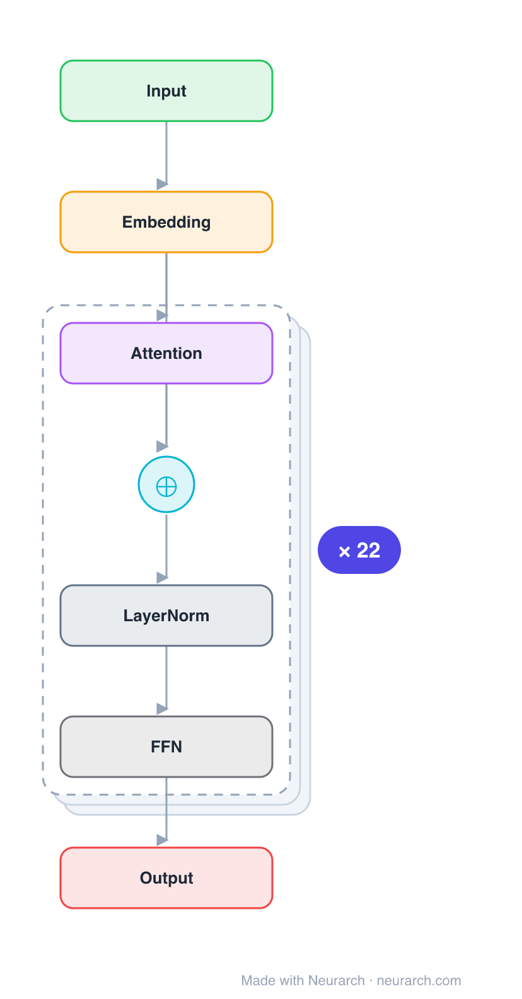

# Architecture: ModernBERT

## Motivation

Encoder-only transformer models such as BERT offer a great performance-size tradeoff for retrieval and classification tasks. Despite being the workhorse of numerous production pipelines, there have been limited Pareto improvements to BERT since its release in 2019. Meanwhile, decoder-only LLMs have benefited from numerous architectural and training improvements. ModernBERT brings modern model optimizations to encoder-only models, representing a major Pareto improvement over older encoders.

## Core Idea

A modernized bidirectional encoder transformer that incorporates recent architectural advances (RoPE, alternating global/local attention, GeGLU MLPs, RMSNorm/LayerNorm) and is trained on 2 trillion tokens with native 8192 sequence length, achieving state-of-the-art results on classification and retrieval tasks while being the most speed and memory efficient encoder.

## Architecture

### Overview

<b>Layer-by-layer (91 nodes)</b>

| # | Layer | Type | Params |
|---|---|---|---|
| 1 | Input | `input` | shape: [1, 8192, 768] |
| 2 | Embedding | `embedding` | vocabSize: 50368, embeddingDim: 768, maxSeqLen: 8192 |
| 3 | Attention_1 | `multiHeadAttention` | numHeads: 12, hiddenDim: 768 |
| 4 | Add_1 | `add` |  |
| 5 | LayerNorm_1_1 | `layerNorm` | normalizedShape: 768 |
| 6 | FFN_1 | `geglu` | dim: 768, hiddenDim: 1152 |
| 7 | Attention_2 | `multiHeadAttention` | numHeads: 12, hiddenDim: 768 |
| 8 | Add_2 | `add` |  |
| 9 | LayerNorm_2_1 | `layerNorm` | normalizedShape: 768 |
| 10 | FFN_2 | `geglu` | dim: 768, hiddenDim: 1152 |
| 11 | Attention_3 | `multiHeadAttention` | numHeads: 12, hiddenDim: 768 |
| 12 | Add_3 | `add` |  |
| 13 | LayerNorm_3_1 | `layerNorm` | normalizedShape: 768 |
| 14 | FFN_3 | `geglu` | dim: 768, hiddenDim: 1152 |
| 15 | Attention_4 | `multiHeadAttention` | numHeads: 12, hiddenDim: 768 |
| 16 | Add_4 | `add` |  |
| 17 | LayerNorm_4_1 | `layerNorm` | normalizedShape: 768 |
| 18 | FFN_4 | `geglu` | dim: 768, hiddenDim: 1152 |
| 19 | Attention_5 | `multiHeadAttention` | numHeads: 12, hiddenDim: 768 |
| 20 | Add_5 | `add` |  |
| 21 | LayerNorm_5_1 | `layerNorm` | normalizedShape: 768 |
| 22 | FFN_5 | `geglu` | dim: 768, hiddenDim: 1152 |
| 23 | Attention_6 | `multiHeadAttention` | numHeads: 12, hiddenDim: 768 |
| 24 | Add_6 | `add` |  |
| 25 | LayerNorm_6_1 | `layerNorm` | normalizedShape: 768 |
| 26 | FFN_6 | `geglu` | dim: 768, hiddenDim: 1152 |
| 27 | Attention_7 | `multiHeadAttention` | numHeads: 12, hiddenDim: 768 |
| 28 | Add_7 | `add` |  |
| 29 | LayerNorm_7_1 | `layerNorm` | normalizedShape: 768 |
| 30 | FFN_7 | `geglu` | dim: 768, hiddenDim: 1152 |
| 31 | Attention_8 | `multiHeadAttention` | numHeads: 12, hiddenDim: 768 |
| 32 | Add_8 | `add` |  |
| 33 | LayerNorm_8_1 | `layerNorm` | normalizedShape: 768 |
| 34 | FFN_8 | `geglu` | dim: 768, hiddenDim: 1152 |
| 35 | Attention_9 | `multiHeadAttention` | numHeads: 12, hiddenDim: 768 |
| 36 | Add_9 | `add` |  |
| 37 | LayerNorm_9_1 | `layerNorm` | normalizedShape: 768 |
| 38 | FFN_9 | `geglu` | dim: 768, hiddenDim: 1152 |
| 39 | Attention_10 | `multiHeadAttention` | numHeads: 12, hiddenDim: 768 |
| 40 | Add_10 | `add` |  |
| 41 | LayerNorm_10_1 | `layerNorm` | normalizedShape: 768 |
| 42 | FFN_10 | `geglu` | dim: 768, hiddenDim: 1152 |
| 43 | Attention_11 | `multiHeadAttention` | numHeads: 12, hiddenDim: 768 |
| 44 | Add_11 | `add` |  |
| 45 | LayerNorm_11_1 | `layerNorm` | normalizedShape: 768 |
| 46 | FFN_11 | `geglu` | dim: 768, hiddenDim: 1152 |
| 47 | Attention_12 | `multiHeadAttention` | numHeads: 12, hiddenDim: 768 |
| 48 | Add_12 | `add` |  |
| 49 | LayerNorm_12_1 | `layerNorm` | normalizedShape: 768 |
| 50 | FFN_12 | `geglu` | dim: 768, hiddenDim: 1152 |
| 51 | Attention_13 | `multiHeadAttention` | numHeads: 12, hiddenDim: 768 |
| 52 | Add_13 | `add` |  |
| 53 | LayerNorm_13_1 | `layerNorm` | normalizedShape: 768 |
| 54 | FFN_13 | `geglu` | dim: 768, hiddenDim: 1152 |
| 55 | Attention_14 | `multiHeadAttention` | numHeads: 12, hiddenDim: 768 |
| 56 | Add_14 | `add` |  |
| 57 | LayerNorm_14_1 | `layerNorm` | normalizedShape: 768 |
| 58 | FFN_14 | `geglu` | dim: 768, hiddenDim: 1152 |
| 59 | Attention_15 | `multiHeadAttention` | numHeads: 12, hiddenDim: 768 |
| 60 | Add_15 | `add` |  |
| 61 | LayerNorm_15_1 | `layerNorm` | normalizedShape: 768 |
| 62 | FFN_15 | `geglu` | dim: 768, hiddenDim: 1152 |
| 63 | Attention_16 | `multiHeadAttention` | numHeads: 12, hiddenDim: 768 |
| 64 | Add_16 | `add` |  |
| 65 | LayerNorm_16_1 | `layerNorm` | normalizedShape: 768 |
| 66 | FFN_16 | `geglu` | dim: 768, hiddenDim: 1152 |
| 67 | Attention_17 | `multiHeadAttention` | numHeads: 12, hiddenDim: 768 |
| 68 | Add_17 | `add` |  |
| 69 | LayerNorm_17_1 | `layerNorm` | normalizedShape: 768 |
| 70 | FFN_17 | `geglu` | dim: 768, hiddenDim: 1152 |
| 71 | Attention_18 | `multiHeadAttention` | numHeads: 12, hiddenDim: 768 |
| 72 | Add_18 | `add` |  |
| 73 | LayerNorm_18_1 | `layerNorm` | normalizedShape: 768 |
| 74 | FFN_18 | `geglu` | dim: 768, hiddenDim: 1152 |
| 75 | Attention_19 | `multiHeadAttention` | numHeads: 12, hiddenDim: 768 |
| 76 | Add_19 | `add` |  |
| 77 | LayerNorm_19_1 | `layerNorm` | normalizedShape: 768 |
| 78 | FFN_19 | `geglu` | dim: 768, hiddenDim: 1152 |
| 79 | Attention_20 | `multiHeadAttention` | numHeads: 12, hiddenDim: 768 |
| 80 | Add_20 | `add` |  |
| 81 | LayerNorm_20_1 | `layerNorm` | normalizedShape: 768 |
| 82 | FFN_20 | `geglu` | dim: 768, hiddenDim: 1152 |
| 83 | Attention_21 | `multiHeadAttention` | numHeads: 12, hiddenDim: 768 |
| 84 | Add_21 | `add` |  |
| 85 | LayerNorm_21_1 | `layerNorm` | normalizedShape: 768 |
| 86 | FFN_21 | `geglu` | dim: 768, hiddenDim: 1152 |
| 87 | Attention_22 | `multiHeadAttention` | numHeads: 12, hiddenDim: 768 |
| 88 | Add_22 | `add` |  |
| 89 | LayerNorm_22_1 | `layerNorm` | normalizedShape: 768 |
| 90 | FFN_22 | `geglu` | dim: 768, hiddenDim: 1152 |
| 91 | Output | `output` |  |

ModernBERT is an encoder-only transformer with modernized components. The architecture uses alternating global and local attention (global every 3 layers, local sliding window of 128 tokens otherwise), Rotary Positional Embeddings (RoPE), GeGLU feed-forward layers, and LayerNorm. It supports native 8192 token context length and is designed for efficient inference on common GPUs.

### Components

1. **Alternating Global/Local Attention** — Global attention every 3 layers with local attention over a 128-token sliding window otherwise. This yields identical downstream performance to all-global attention while providing major speedups.

2. **Rotary Positional Embeddings (RoPE)** — Replaces learned absolute position embeddings with rotary positional encoding, enabling better length generalization.

3. **GeGLU Feed-Forward Layers** — Uses GeGLU (Gated Linear Units with GELU) instead of standard MLP, chosen over SwiGLU based on ablation showing near-identical performance.

4. **LayerNorm** — Chosen over RMSNorm for practical PyTorch compatibility, despite RMSNorm being theoretically faster.

5. **Modified OLMo Tokenizer** — Uses a modified OLMo tokenizer that supports code and recent vocabulary, outperforming legacy BERT/RoBERTa tokenizers.

6. **No Parallel Attention** — Sequential attention and MLP computation (parallel attention caused significant downstream degradation for encoder-sized models).

### Data Flow

1. **Input**: Token sequence → embedding layer (with RoPE applied)
2. **Encoder layers (×N)**: Each layer applies:
   - Multi-head self-attention (global or local depending on layer)
   - LayerNorm + residual connection
   - GeGLU feed-forward network
   - LayerNorm + residual connection
3. **Output**: Contextualized representations for classification or retrieval

### State / Memory

- **No autoregressive state**: As an encoder, ModernBERT processes the full sequence bidirectionally with no causal masking.
- **KV cache**: Not applicable for encoder-only models (all positions computed simultaneously).
- **Local attention window**: For local attention layers, only a 128-token window is attended to, reducing memory.

## Design Decisions

1. **Alternating global/local attention** — Global every 3 layers + local 128-token sliding window. Ablation showed identical downstream performance to all-global attention at 100B tokens, with major speedups.

2. **GeGLU over SwiGLU** — Close to no difference in ablation; GeGLU chosen.

3. **LayerNorm over RMSNorm** — Despite RMSNorm being theoretically faster, LayerNorm chosen for PyTorch native compatibility and out-of-the-box efficiency.

4. **No parallel attention** — While beneficial for large decoder models, parallel attention caused significant downstream degradation for encoder-sized models at 8192 sequence length.

5. **8192 native context length** — Supports long-context applications (e.g., RAG pipelines) natively, unlike BERT's 512 limit.

6. **2T token training** — Trained on 2 trillion tokens including code, significantly more than BERT's ~3.3B tokens.

## Evolution

**Predecessors:**
- **BERT** (Devlin et al., 2019) — Original bidirectional encoder transformer.
- **RoBERTa** (Liu et al., 2019) — Improved BERT training recipe.
- **DEBERTa** (He et al., 2021) — Disentangled attention.
- Modern decoder LLM advances (RoPE, GeGLU, etc.) adapted for encoders.

**Successors:**
- Future encoder models building on ModernBERT's architectural choices and training recipe.

## Characteristics

| Property | Value |
|----------|-------|
| Year | 2024 |
| Authors | Warner, Chaffin, Clavié et al. (Answer.AI, LightOn) |
| Category | DL/Transformer |
| Source Paper | `ModernBERT_Unknown_Clavie_Taghadouini_2025.md` |
| PaperVault Path | `DL-Architectures/01-transformers/ModernBERT_Unknown_Clavie_Taghadouini_2025.md` |

## Limitations

1. **Encoder-only** — Cannot generate text; limited to classification, retrieval, and representation tasks.
2. **Model size** — Available in 139M and 395M parameter sizes; not competitive with large decoder LLMs for tasks requiring world knowledge.
3. **Training cost** — 2T token training requires significant compute, though less than large decoder models.
4. **Bidirectional limitation** — Cannot be used for autoregressive generation tasks.

## Implementation Notes

See `implementation/` for a minimal runnable implementation. Key details:
- Alternating global/local attention (global every 3 layers, local 128-token window)
- RoPE positional embeddings, GeGLU FFN, LayerNorm
- Native 8192 context length
- Available at github.com/AnswerDotAI/ModernBERT
- HuggingFace compatible

## Information Layers

- **Evidence:** Source paper available in `references/papers/` (Warner et al., 2024, "Smarter, Better, Faster, Longer")
- **Analysis:** ModernBERT's key contribution is systematically applying decoder LLM advances to encoder models. The alternating global/local attention is particularly notable — it maintains quality while dramatically reducing compute for long sequences. The choice of LayerNorm over RMSNorm highlights practical engineering considerations over theoretical optimality.
- **Hypothesis:** The success of ModernBERT suggests that encoder-only models remain competitive for retrieval and classification, and that the gap between encoders and decoders can be narrowed by transferring architectural innovations.
