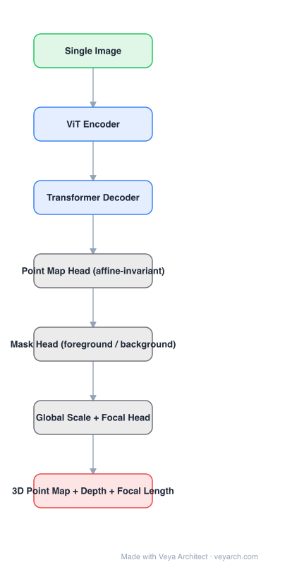

# Architecture: MoGe

## Motivation

Monocular geometry models are trained on datasets whose ground truth is only partially reliable: far-field regions, sky, transparent surfaces, and objects with no annotations are everywhere. Aligning a whole prediction with a global scale/shift therefore injects wrong supervision into regions where the annotation is meaningless. MoGe's position is that this supervision problem — not the network — is the main limit on open-domain accuracy.

## Core Idea

Predict an **affine-invariant 3D point map** (a dense 3D point per pixel, defined up to an unknown global scale and shift), and train it with **optimal supervision**: for each region, use the best available alignment/annotation rather than one global fit, and explicitly predict a **foreground mask** that marks where geometry is reconstructable at all. With the point map plus the mask plus a global scale/shift, depth and focal length follow.

## Architecture

### Overview

<b>Layer-by-layer (7 nodes)</b>

| # | Layer | Type | Params |
|---|---|---|---|
| 1 | Single Image | `input` |  |
| 2 | ViT Encoder | `conv2d` |  |
| 3 | Transformer Decoder | `attention` |  |
| 4 | Point Map Head (affine-invariant) | `custom` |  |
| 5 | Mask Head (foreground / background) | `custom` |  |
| 6 | Global Scale + Focal Head | `custom` |  |
| 7 | 3D Point Map + Depth + Focal Length | `output` |  |

### Components

1. **ViT encoder** — a vision transformer backbone producing patch tokens for the single input image.
2. **Transformer decoder** — refines tokens into dense per-pixel features (DPT-style reassembly in the practical implementation).
3. **Point map head** — regresses a 3D point per pixel; the representation is richer than depth because it encodes shape, not just distance.
4. **Mask head** — predicts foreground/background (reconstructable vs ambiguous), used both at training time to restrict supervision and at inference to mask out unreliable geometry.
5. **Global scale + focal head** — estimates the global scale/shift that makes the point map consistent with the camera model, and predicts camera focal length; this is what turns an affine-invariant map into usable geometry.
6. **Optimal supervision module (training only)** — per-region scale/shift alignment and gradient masking so incomplete or unreliable annotations do not corrupt the regression.

### Data Flow

Single image → ViT encoder → decoder → {point map, foreground mask, global scale/shift, focal length} → depth map and camera parameters derived analytically.

### State / Memory

No recurrent state; single-image feed-forward inference. Video variants use overlapping windows and alignment, not recurrence.

## Design Decisions

- **Point map instead of depth** — encodes scene shape explicitly and lets depth/focal be derived, at the cost of needing the scale/shift head.
- **Affine invariance** — removes the dependence on unknown metric scale, which is what makes open-domain generalization possible.
- **Optimal (per-region) supervision** — the paper's central contribution: use the best available supervision per region instead of a single global alignment.
- **Explicit mask head** — makes "I don't know" a modeled output rather than an error source.

## Evolution

- **MiDaS / DPT / Depth Anything** (predecessors): ordinal or relative depth, global alignment supervision.
- **UniDepth / Metric3D**: metric depth with explicit camera modeling.
- **DUSt3R / MASt3R**: two-view pointmap regression (shared representation idea, different input regime).
- **MoGe**: single-image affine-invariant point map + optimal supervision + focal prediction.
- **MoGe-2**: metric-scale variant; used in production pipelines (e.g. depth anchoring for egocentric pipelines).
- **Siblings**: GeoCalib (camera calibration from a single image).

## Characteristics

| Property | Value |
|---|---|
| Task | open-domain monocular geometry (point map, depth, focal) |
| Encoder | ViT (B/L variants) |
| Outputs | affine-invariant point map, foreground mask, global scale/shift, focal length |
| Supervision | per-region optimal alignment + mask |
| Input | single image |

## Limitations

- Affine-invariant by construction: metric scale requires the global scale head or an external prior, and is less reliable than two-view methods.
- Sky, mirrors, transparent and textureless regions remain outside the modeled foreground.
- Point map regression at full resolution is memory-heavy; high-resolution inputs need tiling.
- Single-image geometry is still ill-posed; accuracy on far-field geometry is limited.

## Implementation Notes

Essentials: (1) ViT encoder with dense feature reassembly, (2) point map head with a confidence/scale-aware loss, (3) a mask head that both gates the loss and masks inference output, (4) a global scale/shift and focal prediction path. When reproducing, per-region supervision masking is the part that matters most for open-domain accuracy.
