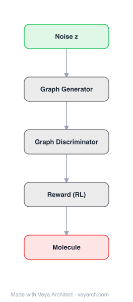

# Architecture: MolGAN

## Motivation

Discovering new chemical compounds with desired properties is a hard problem with high-impact applications such as de novo drug design. The space of synthesizable molecules is vast and discrete, which makes search procedures expensive and difficult to scale. Prior deep generative approaches (Gómez-Bombarelli et al., 2016; Kusner et al., 2017; Guimaraes et al., 2017; Dai et al., 2018) mostly operate on the SMILES string representation of molecules using RNN-based models. While effective, this route forces the model to spend capacity learning both SMILES syntax and the inherent order ambiguity of a linearized graph, and it is not transferable to generic (non-molecular) graphs.

A parallel line of work (Li et al., 2018b; Simonovsky & Komodakis, 2018) generates molecular graphs directly, but these likelihood-based methods require either a fixed/random node ordering or an expensive graph matching procedure to evaluate the likelihood, because all node permutations would have to be considered explicitly — already prohibitive for small graphs. MolGAN targets exactly this bottleneck: by switching to an implicit, likelihood-free formulation (a GAN), the generator is free to pick any convenient node ordering since no explicit likelihood needs to be computed.

Finally, in de novo drug design the goal is not just chemically valid molecules but molecules with useful properties (e.g., solubility, synthesizability, drug-likeness). MolGAN therefore couples the adversarial objective with a reinforcement learning signal, optimizing non-differentiable chemical metrics provided by external software (RDKit), and sidesteps the sequential, slow generation of SMILES-based GANs such as ORGAN.

## Core Idea

GAN-based implicit generative model for small molecular graphs using graph convolutional discriminator.

## Architecture

### Overview

<b>Layer-by-layer (5 nodes)</b>

| # | Layer | Type | Params |
|---|---|---|---|
| 1 | Noise z | `input` |  |
| 2 | Graph Generator | `custom` |  |
| 3 | Graph Discriminator | `custom` |  |
| 4 | Reward (RL) | `custom` |  |
| 5 | Molecule | `output` |  |

MolGAN is an implicit generative model for small molecular graphs composed of three cooperating neural networks: a generator `Gθ`, a discriminator `Dφ`, and a reward network `R̂ψ`. The generator maps a latent vector `z ~ N(0, I)` to a dense, probabilistic description of a complete molecular graph (an annotation matrix `X` for atom types and an adjacency tensor `A` for bond types) in a single, non-sequential forward pass. Discrete sparse graphs (`X̃`, `Ã`) are then obtained via categorical sampling, making the output a concrete molecule rather than a sequence.

Both the discriminator and the reward network consume the generated (or real) graph directly. They are permutation-invariant by construction, built from Relational-GCN (Schlichtkrull et al., 2017) graph convolution layers followed by a node-aggregation operator (Li et al., 2016) that collapses node embeddings into a single graph-level vector. The discriminator distinguishes real from generated molecules via the improved WGAN objective, while the reward network learns a differentiable surrogate of an external, non-differentiable reward (e.g., solubility) and propagates its gradient back to the generator through a deterministic policy gradient (DDPG-style) update.

Training is a joint minimax + RL procedure. The generator loss is a convex combination `L(θ) = λ·L_WGAN + (1−λ)·L_RL`, where λ controls the trade-off between matching the data distribution and optimizing the desired chemical property. To stabilize training, the reward network is pre-trained for the first half of the epochs (WGAN-only on the generator), and the combined loss is used only in the second half.

### Components

- **Generator `Gθ`** — A multi-layer perceptron that takes a 32-dim latent vector `z ~ N(0, I)` and outputs, in one shot, a dense annotation matrix `X ∈ R^{N×T}` (atom-type probabilities) and a dense adjacency tensor `A ∈ R^{N×N×Y}` (bond-type probabilities). In the QM9 setup: `N=9` nodes, `T=5` atom types (C, O, N, F, padding), `Y=4` bond types (single, double, triple, no bond). The MLP has hidden layers `[128, 256, 512]` with `tanh` activations, and the final layer is linearly projected to the `X`/`A` shapes and softmax-normalized along the type dimension. Discrete sparse outputs `X̃`, `Ã` are obtained via categorical sampling.
- **Discriminator `Dφ`** — A Relational-GCN encoder (two layers, `[64, 32]` hidden units) that convolves node signals `X̃` over the adjacency tensor `Ã`, supporting multiple edge/bond types via edge-type-specific affine functions `fy`. Node embeddings are aggregated into a 128-dim graph vector (Li et al. 2016 aggregation: `h_G = tanh(Σ_v σ(i(h_v)) ⊙ tanh(j(h_v)))`), then passed through a 2-layer MLP `[128, 1]` with `tanh` hidden activation. Output is an unbounded scalar (WGAN critic).
- **Reward network `R̂ψ`** — Architecturally identical to the discriminator (Relational-GCN + aggregation + MLP) but with a sigmoid output producing a scalar in `(0, 1)`. It is trained via mean-squared-error against the true reward from external software (RDKit); invalid molecules receive reward 0. Parameters are not shared with the discriminator.
- **Discretization variants** — Because categorical sampling is non-differentiable, three forward-pass strategies are explored: (i) pass the continuous `X`, `A` directly; (ii) add Gumbel noise to `X`, `A` before forwarding continuous values; (iii) straight-through Gumbel-Softmax (Jang et al. 2016; Maddison et al. 2016) — sample categorically in the forward pass, use relaxed continuous values in the backward pass.
- **Training objectives** — Improved WGAN with gradient penalty (Gulrajani et al. 2017, α=10) for the adversarial loss; DDPG-style deterministic policy gradient (Lillicrap et al. 2015) for the RL loss, using the differentiable reward surrogate `R̂ψ(G)` instead of REINFORCE.

### Data Flow

1. **Sample latent** — Draw `z ~ N(0, I)` of dimension 32.
2. **Generate dense graph** — The generator MLP maps `z` to dense `X ∈ R^{9×5}` and `A ∈ R^{9×9×4}`, each softmax-normalized along the type dimension, giving categorical distributions over atom types and bond types.
3. **Discretize** — Obtain sparse discrete `X̃` and `Ã` via one of the three discretization strategies (continuous pass, Gumbel-noise, or straight-through Gumbel-Softmax). The pair `(X̃, Ã)` represents an annotated molecular graph.
4. **Discriminate** — Both real graphs `x ~ p_data` and generated graphs are fed to `Dφ`: Relational-GCN layers propagate node signals along the adjacency tensor, node embeddings are aggregated into a graph vector `h_G`, and an MLP outputs a scalar critic score. The WGAN loss (with gradient penalty) updates `Dφ` and `Gθ`.
5. **Reward** — The same graph is fed to `R̂ψ`, which produces a scalar reward prediction in `(0,1)`. `R̂ψ` is trained by MSE against the true external reward (e.g., RDKit solubility/QED/SA); invalid molecules yield reward 0.
6. **Generator update** — The generator is updated with `L(θ) = λ·L_WGAN + (1−λ)·L_RL`. During the first half of training only the WGAN term is active; in the second half the RL term (maximizing `R̂ψ(G)`, differentiable) is added.
7. **Inference** — Sample `z`, run the generator, discretize, and decode the resulting `(X̃, Ã)` into a molecule via RDKit for evaluation of validity, novelty, uniqueness, and the optimized chemical metrics.

### State / Memory

Stateless at inference: the generator is a feed-forward MLP conditioned only on the latent `z`, and the discriminator/reward networks are pure graph encoders with no recurrence.

During training, two stateful mechanisms are introduced:
- **Reward-network pre-training schedule** — A binary "phase" state controls whether the RL loss is applied to the generator (first half: off; second half: on). This prevents the generator from diverging before `R̂ψ` is accurate.
- **Mode-collapse early stopping** — A sliding monitor of the *uniqueness* score (fraction of unique valid samples) acts as a stateful stopping criterion: if uniqueness drops below an arbitrary 2% threshold, training is halted to avoid a fully collapsed generator. The reward network itself also maintains learned parameters `ψ` that serve as a persistent, differentiable memory of the external reward landscape.

## Design Decisions

- **Implicit (GAN) over likelihood-based (VAE) generation.** The central design choice. Likelihood-based graph generators require either a fixed node ordering or prohibitively expensive graph matching over all permutations. By dropping the explicit likelihood, the generator is free to choose any node ordering, sidestepping the permutation problem entirely. The cost is the well-known instability of GAN training, which the authors mitigate with improved WGAN + gradient penalty and minibatch discrimination.
- **One-shot (non-sequential) generation.** The generator predicts the entire adjacency tensor and annotation matrix at once via an MLP, rather than sequentially building the graph node-by-node (as in Johnson 2017; You et al. 2018; Li et al. 2018b). This is significantly faster and easier to optimize, at the cost of being limited to graphs of a pre-chosen maximum size (`N=9` for QM9).
- **Relational-GCN for the discriminator and reward network.** Using R-GCN (Schlichtkrull et al. 2017) makes both networks permutation-invariant and able to handle multiple bond/edge types, which is essential for chemistry. The same architecture is reused for `Dφ` and `R̂ψ` but parameters are not shared, since the two serve different objectives.
- **Deterministic policy gradient (DDPG) instead of REINFORCE.** Initial experiments with REINFORCE on a stochastic policy converged poorly due to the high-dimensional one-shot action space. DDPG, known to scale to high-dimensional action spaces, is used instead, with a *learned differentiable reward surrogate* `R̂ψ` providing gradients — avoiding the need for experience replay or target networks.
- **Combined loss `λ·L_WGAN + (1−λ)·L_RL`.** λ regulates the trade-off between matching the data distribution and optimizing the desired property. Empirically, lower λ (stronger RL) yields higher validity and solubility because invalid molecules receive zero reward; λ=0 gave the best sum of scores and was used in subsequent experiments.
- **Three discretization strategies.** Because categorical sampling blocks gradients, the authors explore (i) passing continuous values, (ii) Gumbel-noise continuous values, and (iii) straight-through Gumbel-Softmax, letting the best variant be picked per objective via grid search.

## Evolution

**Predecessors:**
- **GAN (Goodfellow et al. 2014)** — the implicit generative framework MolGAN adapts to graph-structured data.
- **WGAN / Improved WGAN (Arjovsky et al. 2017; Gulrajani et al. 2017)** — provides the stable, Earth-Mover-distance-based training objective MolGAN relies on, with gradient penalty enforcing the Lipschitz constraint.
- **Relational-GCN (Schlichtkrull et al. 2017)** — the multi-edge-type graph convolution used for the permutation-invariant discriminator and reward network.
- **ORGAN (Guimaraes et al. 2017)** — the closest related work: a SeqGAN-based model that generates SMILES strings and optimizes chemical properties via REINFORCE. MolGAN differs by working directly on graphs and using DDPG instead of REINFORCE.
- **CharacterVAE / GrammarVAE / SDVAE (Gómez-Bombarelli 2016; Kusner 2017; Dai 2018)** — VAE-based SMILES generators that MolGAN compares against.
- **GraphVAE (Simonovsky & Komodakis 2018)** — the direct likelihood-based graph-generation predecessor whose graph-matching bottleneck motivates MolGAN's implicit approach.
- **Li et al. 2016** — the node-aggregation operator (`h_G = tanh(Σ σ(i(h_v))⊙tanh(j(h_v)))`) used to collapse node embeddings into a graph-level vector.

**Successors / contemporaries (mentioned in related work):**
- **Junction Tree VAE (Jin et al. 2018)** and **NeVAE (Samanta et al. 2018)** — other VAE-based graph generators for molecules, cited as related graph-direct generative work.
- **Graph-based adversarial link-prediction models (Minervini et al. 2017; Wang et al. 2018; Bojchevski et al. 2018)** — adversarial methods on graphs that, unlike MolGAN, target link prediction rather than generation from scratch.
- The paper explicitly suggests future exploration of **recurrent graph-based generative models** (Johnson 2017; Li et al. 2018b; You et al. 2018) within the MolGAN framework to overcome the small-graph limitation of one-shot prediction.

## Characteristics

| Property | Value |
|----------|-------|
| Year | 2018 |
| Authors | De Cao & Kipf |
| Category | GNN/Architecture |
| Source Paper | `MolGAN_An_implicit_generative_model_for_small_molecular_grap_Kipf_2018.md` |
| PaperVault Path | `GNN/03-gnn-architectures/MolGAN_An_implicit_generative_model_for_small_molecular_grap_Kipf_2018.md` |

## Limitations

- **Mode collapse.** The central, explicitly acknowledged limitation. Both the WGAN and the RL objective do not encourage diversity, so the generator tends to collapse to a handful of distinct molecules. Uniqueness stays near the 2% early-stopping threshold across all experiments. The authors leave addressing this to future work (e.g., better reward design or pre-training) and position MolGAN as a testbed for GAN-stability research.
- **Restricted to small graphs.** The one-shot prediction of the full adjacency tensor scales as O(N²) in the number of nodes and is only feasible for small molecules (≤9 heavy atoms on QM9). The authors note that recurrent/sequential graph generators would be needed for larger structures.
- **No explicit likelihood.** By construction MolGAN cannot compute a likelihood or evidence lower bound, so it cannot be directly compared with VAE-based methods on likelihood-based metrics; only validity/novelty/uniqueness/property scores are comparable.
- **Reward-network warm-up required.** `R̂ψ` must be pre-trained for several epochs before its gradient is used to update the generator, otherwise the generator diverges because the surrogate reward is inaccurate early on.
- **Property-specific reward network.** Each chemical metric requires its own trained reward network; to optimize multiple objectives simultaneously the authors define a joint reward as the product of normalized scores, since the reward network is specific to a single type of reward.
- **Validity does not imply chemical usefulness.** Operating directly on graphs guarantees valid graphs but not valid molecules; invalid molecular graphs are assigned zero reward, which implicitly optimizes validity but does not guarantee novelty or diversity.

## Implementation Notes

See `implementation/` for a minimal runnable implementation.

## Information Layers

- **Evidence:** Source paper available in `references/papers/`
- **Analysis:** MolGAN reframes molecular graph generation as a one-shot implicit generative problem, trading the permutation-matching bottleneck of likelihood-based methods (GraphVAE) for GAN training instability. The architecture cleanly separates three roles — distribution matching (discriminator), property optimization (reward network), and generation (MLP) — and reuses a Relational-GCN + Li-et-al aggregation backbone for both evaluators. The λ hyperparameter empirically governs a validity-vs-fidelity trade-off, with λ=0 (RL-only in the second phase) giving the best property scores because invalid graphs receive zero reward. The most striking empirical result is the tension between high validity (≈100%) and very low uniqueness (≈2%), confirming that the model is perpetually on the edge of mode collapse and is kept usable only by an early-stopping heuristic.
- **Hypothesis:** The mode-collapse problem may be inherent to coupling a one-shot generator with a scalar reward/discriminator signal — a sequential generator with intermediate supervision might diversify outputs but would sacrifice MolGAN's speed advantage. It is also plausible that the reward network, being a learned surrogate, biases the generator toward regions of chemical space it has seen during its own training, potentially limiting exploration; an ablation comparing surrogate vs. true-reward REINFORCE would clarify this.
