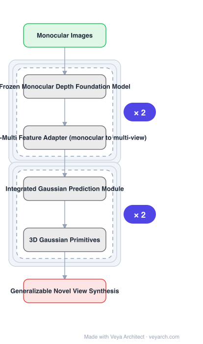

# Architecture: MonoSplat

## Motivation

Generalizable 3D Gaussian reconstruction methods — pixelSplat, MVSplat, and the later FreeSplat and eFreeSplat which explore free-view reconstruction and training without epipolar constraints — often fail on **scenes with unfamiliar visual content and layouts**. Their understanding of the visual world is **constrained by the training data distribution**, which hampers **zero-shot domain generalization**. Meanwhile, contemporary monocular depth foundation models (MiDaS, Depth Anything), trained on extensive datasets, predict monocular depth across diverse visual domains exceptionally well.

## Core Idea

If a thorough understanding of the visual world is what makes Gaussian reconstruction generalize, then a **pretrained monocular depth estimator** should suffice to build a widely applicable framework. MonoSplat converts a **frozen** monocular depth foundation model into a Gaussian reconstruction model through two components: a **Mono-Multi Feature Adapter** and an **Integrated Gaussian Prediction module**.

## Architecture

### Overview

<b>Layer-by-layer (6 nodes)</b>

| # | Layer | Type | Params |
|---|---|---|---|
| 1 | Monocular Images | `input` |  |
| 2 | Frozen Monocular Depth Foundation Model | `custom` |  |
| 3 | Mono-Multi Feature Adapter (monocular to multi-view) | `custom` |  |
| 4 | Integrated Gaussian Prediction Module | `custom` |  |
| 5 | 3D Gaussian Primitives | `custom` |  |
| 6 | Generalizable Novel View Synthesis | `output` |  |

### Components

1. **Frozen monocular depth foundation model** — the source of visual priors; kept frozen, which is why trainable parameters stay minimal.
2. **Mono-Multi Feature Adapter** — transforms **monocular features from the frozen depth model into multi-view features with cross-view awareness**; the step where monocular priors become usable for multi-view reconstruction.
3. **Integrated Gaussian Prediction module** — synergistically integrates monocular and multi-view features to generate precise Gaussian primitives.
4. **3D Gaussian primitives** — the output representation, rendered splatted rather than ray-marched.

### Data Flow

Monocular images → frozen depth foundation model → monocular features → Mono-Multi Feature Adapter → multi-view features with cross-view awareness → Integrated Gaussian Prediction (monocular + multi-view features fused) → 3D Gaussian primitives → novel view synthesis.

### State / Memory

No recurrent state. The notable property is parameter efficiency: freezing the depth backbone means only the adapter and prediction module are trainable.

## Design Decisions

- **Freeze the depth foundation model** — the source of generality, and the reason for minimal trainable parameters.
- **Convert monocular features to multi-view features rather than use them directly** — cross-view awareness is required for multi-view consistent reconstruction, and monocular features alone do not have it.
- **Integrate both feature types rather than choose one** — the prediction module synergistically combines monocular and multi-view features.
- **Design for zero-shot generalization explicitly** — the motivating failure is unfamiliar content and layouts, so that is the evaluation criterion.
- **Keep the framework simple** — described as a simple yet effective framework with an elegant design philosophy.

## Evolution

- **NeRF** (predecessor): continuous scene function, per-scene optimization.
- **3D Gaussian Splatting** (predecessor): explicit primitives and splatting.
- **pixelSplat, MVSplat** (predecessors): generalizable Gaussian reconstruction from multi-view training.
- **FreeSplat, eFreeSplat** (predecessors): free-view reconstruction, training without epipolar constraints.
- **MonoSplat (2025)**: monocular depth foundation model as the backbone.
- **Siblings**: dust3r.
- **Contrast**: multi-view-trained generalizable methods, bounded by their training distribution.

## Characteristics

| Property | Value |
|---|---|
| Task | generalizable novel view synthesis |
| Backbone | frozen monocular depth foundation model |
| Adapter | Mono-Multi Feature Adapter (monocular → cross-view-aware multi-view) |
| Decoder | Integrated Gaussian Prediction module |
| Output | 3D Gaussian primitives |
| Properties | minimal trainable parameters, strong zero-shot generalization |
| Source | arXiv:2505.15185 (2025) |

## Limitations

- Quality is bounded by the frozen depth model's priors; domains where that model fails are inherited failures.
- Freezing the backbone limits adaptation to a specific target domain.
- Cross-view awareness is learned by the adapter rather than given by the backbone, so it is only as good as the adaptation.
- Zero-shot generalization is the focus; in-distribution accuracy may trail methods specialized to a training distribution.

## Implementation Notes

Essentials: (1) keep the depth foundation model **frozen** — its priors are the source of generalization and the reason trainable parameters stay minimal; fine-tuning it trades away both, (2) implement the **Mono-Multi Feature Adapter** to convert monocular features into multi-view features; feeding monocular features directly to the Gaussian head cannot produce cross-view-consistent geometry, (3) have the prediction module integrate **both** monocular and multi-view features rather than only one — the integration is stated as synergistic, (4) evaluate **zero-shot** on unfamiliar scenes and layouts, since that is the specific failure being addressed and in-distribution numbers will not show it, (5) report trainable parameter count separately from total, since the efficiency claim is about trainable parameters only.
