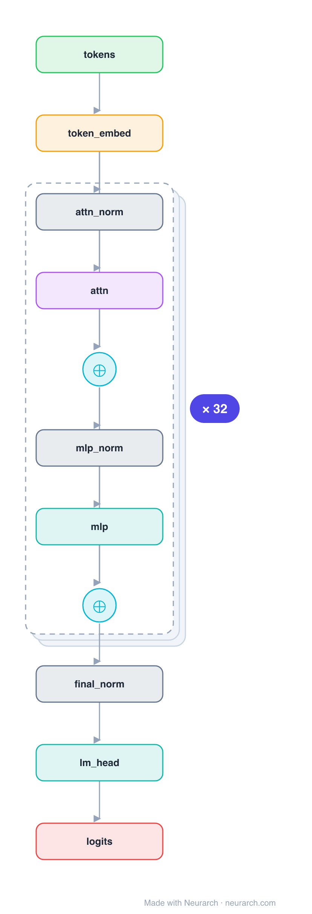

# Architecture: MPT-7B

## Motivation

MosaicML's 2023 open, commercially-usable LLM. Its defining choice is ALiBi: instead of learned or rotary position embeddings, it biases attention scores by a linear penalty on key-query distance, which lets the model extrapolate to context lengths well beyond training. No biases, tied embeddings, plain GELU MLP.

## Core Idea

MosaicML's 2023 open, commercially-usable LLM.

## Architecture

### Overview

*Identical repeated blocks are folded into one representative block with a `× N` badge, so the whole architecture fits on screen. `model.json` uses a NAXS block template + `repeat` directive: the identical repeated layers are defined once and expand to all 197 nodes (open it in Neurarch to see and edit every layer). Vector: [diagram.svg](assets/diagram.svg).*

| Hyperparameter | Value |
|---|---|
| Type | Decoder-only transformer (causal LM) |
| Parameters | 6.6B |
| Layers | 32 |
| Hidden size | 4,096 |
| Attention | Multi-head: 32 heads, head dim 128 |
| FFN | GELU MLP, intermediate size 16,384 (4x) |
| Normalization | LayerNorm, pre-norm |
| Positions | ALiBi (linear attention bias, no positional embeddings) |
| Vocabulary | 50,432 |
| Max context | 2,048 trained; extrapolates via ALiBi |

`model.json` is the full graph (repeated layers expressed via a NAXS block template + `repeat`), hand-built against the official config.json.

### Design Notes

- ALiBi (Attention with Linear Biases): no positional embedding tensor at all; a fixed per-head linear distance penalty is added to attention scores, enabling length extrapolation.
- No biases anywhere and tied input/output embeddings, keeping the parameter count tight.
- Standard multi-head attention with a 128 head dim; a clean baseline for the ALiBi positional approach.

### Parameter Check

Neurarch's per-layer parameter estimate over this graph: **6.65B**.
Deviation from the authoritative count (6.65B): **+0.0%**.

> MPT ties the LM head to the token embedding, so the 50,432 x 4,096 matrix is counted once.

## Design Decisions

> **Analysis** — Observations derived from studying the architecture.

- ALiBi (Attention with Linear Biases): no positional embedding tensor at all; a fixed per-head linear distance penalty is added to attention scores, enabling length extrapolation.
- No biases anywhere and tied input/output embeddings, keeping the parameter count tight.
- Standard multi-head attention with a 128 head dim; a clean baseline for the ALiBi positional approach.

## Implementation Notes

- `model.json` contains the full structural graph with real dimensions and parameters, using a NAXS block template + `repeat` for the identical repeated layers.
- Open in [Neurarch](https://www.neurarch.com/) to visualize, edit, or export training code.
- Diagrams fold repeated identical blocks with a `× N` badge; `model.json` defines each repeated layer once at real dimensions and expands to all nodes.

## Limitations

- This package focuses on the architectural structure. Training pipelines, 
dataset preparation, and production optimizations are out of scope.

## Evolution

> See `references/related/` for predecessor and successor architectures.

