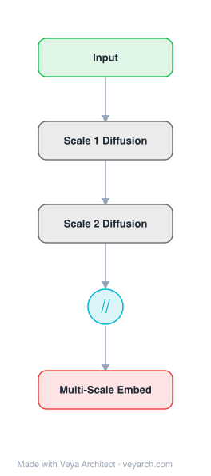

# Architecture: Multiscale Dynamical Embeddings

## Motivation

Complex systems comprising many interacting dynamical elements display rich behaviors across different time and length scales. The topology of the underlying graph constrains and molds local dynamics. Understanding how network connectivity influences dynamics is a task arising across many scientific domains.

However, it is often impractical to keep a full description of the dynamics and the network for system analysis. Many studies aim to reduce complexity by extracting lower-dimensional descriptions that explain behavior with fewer aggregated variables. Classical dimensionality reduction sources include symmetries and homogeneously connected blocks (stochastic blockmodels), but these often posit strong locality assumptions (i.i.d. edges) and cannot capture global features like cyclic structures and higher-order dynamical couplings.

Existing embedding techniques focus on representing topological information (e.g., communities) using geometry induced by diffusion processes. However, networks often come equipped with more general dynamics than diffusion, or contain signed and directed edges for which appropriate diffusion is unclear. The paper proposes a dynamical embedding inspired by control theory that can account for such cases.

## Core Idea

Multiscale dynamical embeddings of complex networks capturing temporal dynamics at different scales.

## Architecture

### Overview

<b>Layer-by-layer (5 nodes)</b>

| # | Layer | Type | Params |
|---|---|---|---|
| 1 | Input | `input` |  |
| 2 | Scale 1 Diffusion | `custom` |  |
| 3 | Scale 2 Diffusion | `custom` |  |
| 4 | ∥ | `concat` |  |
| 5 | Multi-Scale Embed | `output` |  |

The proposed dynamical embedding associates to each node the trajectory of its zero-state impulse response. For each time t, a representation of the nodes in signal (vector) space is constructed, providing a dynamics-based geometric representation with associated similarity and distance measures. Nodes that are close in this embedding induce a similar state in the network at a particular time scale t following an impulse.

The key construction is the similarity matrix Ψ(t), whose entries quantify the alignment of impulse responses from different nodes at time t. This time-dependent similarity can be used for dimensionality reduction, community detection, node importance/centrality, and network comparison. The approach generalizes diffusion-based embeddings by supporting arbitrary linear dynamics, including directed networks without strong connectivity and signed networks.

### Components

- **Impulse response mapping**: For each node i, the zero-state impulse response y_i(t) is computed by injecting an impulse at node i and observing the system's response. This maps each node to a trajectory in signal space: i ↦ y_i(t).

- **Similarity matrix Ψ(t)**: The time-dependent node similarity is defined via inner product: ψ_ij(t) = ⟨y_i(t), y_j(t)⟩ = y_i(t)^T · W · y_j(t), where W is an optional weighting matrix (e.g., degree weighting W = diag(d)).

- **Distance matrix D^(2)(t)**: The squared Euclidean distance derived from the similarity: D_ij^(2)(t) = ||W^{1/2}(y_i(t) - y_j(t))||^2 = ψ_ii + ψ_jj - 2ψ_ij.

- **Linear dynamics formulation**: For continuous time: ẋ = Ax + Bu, y = Cx, where A is the system matrix (adjacency), B and C are input/output matrices. The impulse response matrix is Y(t) = C·exp(At)·B, and Ψ(t) = B^T·exp(A^T t)·C^T·W·C·exp(At)·B.

- **Time-scale parameter t**: Acts as a sampling of the network dynamics at a particular time-scale. t=1 gives structural analysis (direct coupling); t>1 integrates multi-step pathways; integration over t recovers Gramian matrices from control theory.

### Data Flow

1. **Input**: Network with adjacency matrix A, dynamics specification (system matrices A, B, C), and optional weighting matrix W.
2. **Impulse injection**: For each node i, inject an impulse at time t=0 and record the zero-state response y_i(t).
3. **Response assembly**: Collect impulse responses into matrix Y(t) = [y_1, ..., y_n] = C·exp(At)·B.
4. **Similarity computation**: Compute Ψ(t) = Y(t)^T · W · Y(t), yielding pairwise node similarities at time t.
5. **Distance derivation**: Compute D^(2)(t) from Ψ(t) using the squared Euclidean distance formula.
6. **Multi-scale analysis**: Vary t to obtain similarity/distance at different time scales, or integrate over t for a time-averaged measure.
7. **Downstream tasks**: Use the embeddings for dimensionality reduction (project nodes onto low-dimensional space), community detection (find dynamical modules), or node importance ranking.

### State / Memory

The time parameter t serves as an implicit memory mechanism—short time scales capture direct local coupling, while longer time scales accumulate information from multi-step pathways. The impulse response y_i(t) itself encodes the entire history of the system's evolution from the initial impulse, making the embedding inherently temporal. Integration over t (eliminating time dependence) recovers Gramian-based measures from control theory, providing a time-averaged summary.

## Design Decisions

- **Impulse response as embedding**: Chosen because it captures the dynamical effect of each node on the system, going beyond purely topological measures. Nodes that drive the system similarly are assigned high similarity, even without direct proximity.

- **Bilinear inner product similarity**: Chosen for conceptual appeal—there is an associated distance matrix (squared Euclidean), and the formulation connects naturally to Gramian matrices in control theory.

- **General linear dynamics over diffusion-only**: Supports arbitrary linear dynamics (ẋ = Ax + Bu), enabling analysis of directed networks without strong connectivity, signed networks, and non-diffusion dynamics. This generalizes diffusion-based community detection.

- **Time-scale parameter t**: Enables multi-scale analysis—different time scales reveal different structural features (local coupling at t=1, multi-step pathways at t>1, steady-state at large t).

- **Weighting matrix W**: Provides flexibility—degree weighting emphasizes influence on high-degree nodes, while projection-based W can recover modularity matrix and its generalizations as special cases.

## Evolution

**Predecessors:**
- Diffusion-based graph embeddings — use random walks or diffusion processes for node similarity
- Spectral clustering / modularity matrix — community detection via graph Laplacian eigenvectors
- Stochastic block models — statistical approach to community detection
- Control theory Gramian matrices — controllability/observability measures
- Resistance distance — related to the time-integrated similarity for diffusion dynamics

**Successors:**
- The dynamical embedding framework influenced subsequent work on dynamics-aware graph learning
- The connection between control theory and network analysis opened directions for controllability-aware graph embeddings
- The multi-scale temporal analysis inspired time-aware community detection methods

## Characteristics

| Property | Value |
|----------|-------|
| Year | 2019 |
| Authors | Schaub et al. |
| Category | GNN/Embedding |
| Source Paper | `Multiscale_dynamical_embeddings_of_complex_networks_Schaub_Lambiotte_Barahona_2019.md` |
| PaperVault Path | `GNN/02-network-embedding/Multiscale_dynamical_embeddings_of_complex_networks_Schaub_Lambiotte_Barahona_2019.md` |

## Limitations

- The framework is limited to linear dynamics; nonlinear dynamics require extensions or approximations.
- Computing impulse responses for all nodes requires n simulations, which can be expensive for large networks.
- The choice of system matrices (A, B, C) and weighting W affects the results and requires domain knowledge.
- The time-scale parameter t must be chosen appropriately; there is no single optimal value for all analysis tasks.
- The approach is analytical rather than learned—it does not optimize embeddings for specific downstream tasks.
- The connection to control theory Gramians requires integration over time, which may be computationally expensive.
- For very large networks, computing matrix exponentials exp(At) becomes prohibitive.

## Implementation Notes

See `implementation/` for a minimal runnable implementation.

## Information Layers

- **Evidence:** Source paper available in `references/papers/`
- **Analysis:** The key insight is that node similarity should be defined by dynamical effect (how nodes drive the system) rather than purely topological proximity. The time-scale parameter t provides a principled multi-scale view—different structural features emerge at different time scales, from direct coupling to global community structure.
- **Hypothesis:** The recovery of modularity matrix and resistance distance as special cases suggests that many existing graph analysis methods are implicitly capturing dynamical similarity at particular time scales. The framework may unify seemingly disparate graph analysis approaches under a common dynamical perspective.
