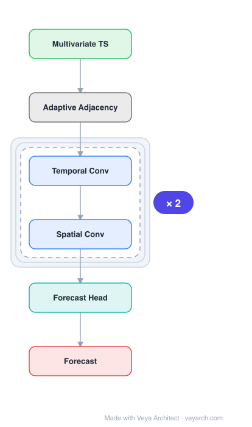

# Architecture: MTGNN

## Motivation

The paper addresses **multivariate time series forecasting** — predicting future values of a set of interdependent variables (e.g., traffic speed, electricity usage, temperature) from their historical observations. The fundamental assumption is that each variable depends not only on its own past but also on other variables via latent spatial/relational dependencies. Prior statistical methods (VAR, Gaussian Process) assume linear inter-variable dependencies and scale quadratically with the number of variables, leading to overfitting. Deep learning methods like LSTNet and TPA-LSTM capture non-linear temporal patterns via CNN+RNN combinations but **do not explicitly model pair-wise dependencies among variables**, weakening both accuracy and interpretability.

Graph neural networks (GNNs) are natural candidates because they propagate information through relational structure. However, spatial-temporal GNNs (e.g., DCRNN, ST-GCN) require a **pre-defined graph structure** as input — a requirement that multivariate time series data generally cannot satisfy since the dependencies among variables are unknown a priori. The paper identifies two challenges: (1) **Unknown Graph Structure** — the relationships among variables must be discovered from data, not provided as ground truth; (2) **Joint Graph & GNN Learning** — even when a graph exists, it is sub-optimal and should be updated during training alongside the GNN.

MTGNN fills this gap by proposing an end-to-end framework that **learns the graph structure and the GNN simultaneously** from multivariate time series data, without requiring a pre-defined topology, while also capturing spatial and temporal patterns through dedicated modules.

## Core Idea

Multivariate time series forecasting via learned graph structure with 1D convolution and adaptive adjacency.

## Architecture

### Overview

<b>Layer-by-layer (6 nodes)</b>

| # | Layer | Type | Params |
|---|---|---|---|
| 1 | Multivariate TS | `input` |  |
| 2 | Adaptive Adjacency | `custom` |  |
| 3 | Temporal Conv | `conv2d` |  |
| 4 | Spatial Conv | `gcn_conv` |  |
| 5 | Forecast Head | `linear` |  |
| 6 | Forecast | `output` |  |

MTGNN is an end-to-end framework with three core modules: a **graph learning layer**, a **graph convolution module**, and a **temporal convolution module**. The graph learning layer adaptively extracts a sparse directed adjacency matrix from the input data (optionally integrating external knowledge like variable attributes). The graph convolution module uses a mix-hop propagation layer to capture spatial dependencies among variables, designed specifically for directed graphs and to avoid the over-smoothing problem common in GCNs. The temporal convolution module uses dilated inception layers to capture temporal patterns at multiple frequencies and over very long sequences. All three modules are jointly trained via gradient descent with a curriculum learning strategy.

### Components

- **Graph learning layer:** Learns a sparse adjacency matrix `A` from node embeddings. Each variable `i` is mapped to two learned embeddings (`e1_i`, `e2_i`); the adjacency is computed via `A = softmax(ReLU(e1 · e2^T))`, producing a directed (asymmetric) graph. A sparsity constraint is applied via `max(0, ...)` on the activation. External prior knowledge can be injected by constraining or initializing the embeddings.
- **Mix-hop propagation layer (graph convolution):** Generalizes standard graph convolution to handle directed graphs and mitigate over-smoothing. It separates propagation into two sub-steps: a **propagation** step that aggregates neighborhood information across K hops, and a **selection** step that learns to weight information from different hops. This decoupling allows the model to capture both local and broader spatial dependencies without forcing all nodes toward a common representation.
- **Dilated inception layer (temporal convolution):** Replaces recurrent units with 1D convolutions using a dilated inception design. Multiple convolutional filters with different dilation rates run in parallel, enabling the model to capture temporal patterns at multiple frequencies/scales and to process very long sequences efficiently. The receptive field grows exponentially with the number of layers.
- **Curriculum learning strategy:** To handle the highly non-convex joint optimization and reduce memory for large graphs, training splits variables into subgroups and progressively increases the subgroup size, helping find a better local optimum.
- **Output layer:** A linear transform maps the spatio-temporal features to the final forecast for each variable.

### Data Flow

1. **Input:** Multivariate time series `X ∈ R^(N×T)` where N is the number of variables (nodes) and T is the historical window length.
2. **Graph learning:** The graph learning layer maps each variable to learned embeddings and computes a sparse directed adjacency matrix `A ∈ R^(N×N)` via `softmax(ReLU(e1 · e2^T))`.
3. **Graph convolution (spatial):** The mix-hop propagation layer aggregates neighborhood information along the learned adjacency `A` across K hops, producing spatially-aware node representations at each time step.
4. **Temporal convolution:** The dilated inception layer applies parallel 1D convolutions with varying dilation rates across the temporal dimension, capturing multi-scale temporal patterns and long-range dependencies.
5. **Output:** A linear projection produces the forecast for the next `Q` time steps for all N variables.
6. **Training:** End-to-end gradient descent (Adam) with curriculum learning — the model starts training on small subgroups of variables and progressively expands, jointly updating the graph structure, graph convolution, and temporal convolution parameters.

### State / Memory

Stateless at inference. The learned adjacency matrix `A` is recomputed from the trained embeddings at each forward pass (it is a function of learned parameters, not a stored graph). There is no recurrent hidden state; temporal memory is handled implicitly through the receptive field of the dilated convolutions. During training, the curriculum strategy maintains a schedule of subgroup sizes.

## Design Decisions

- **Learning the graph from data (no pre-defined structure):** Unlike DCRNN or ST-GCN which require a known graph, MTGNN's graph learning layer extracts the adjacency from learned embeddings, making the framework applicable to any multivariate time series — with or without externally defined structure.
- **Directed (asymmetric) adjacency via two embedding matrices:** Using separate source (`e1`) and target (`e2`) embeddings produces a directed graph, matching the asymmetric nature of many real-world dependencies (e.g., traffic flow direction).
- **Mix-hop propagation to avoid over-smoothing:** Standard GCN propagation pushes all node representations toward convergence with depth. By decoupling propagation from selection and learning hop-specific weights, MTGNN retains discriminative node representations across deeper layers.
- **Dilated inception for temporal modeling:** Chosen over RNNs/LSTMs for computational efficiency and the ability to capture multiple temporal frequencies simultaneously, with an exponentially growing receptive field that handles long sequences without excessive depth.
- **Curriculum learning for joint optimization:** The graph learning + GNN optimization is highly non-convex; progressively increasing the number of variables (subgroup size) helps escape poor local optima and reduces peak memory usage.

## Evolution

**Predecessors:**
- LSTNet (Lai et al., 2018) — CNN+RNN for multivariate time series; captures non-linear patterns but no explicit inter-variable modeling.
- TPA-LSTM (Shih et al., 2019) — RNN with temporal attention; no pair-wise variable dependencies.
- DCRNN (Li et al., 2018) — diffusion convolutional recurrent network for traffic; requires pre-defined graph.
- ST-GCN (Yu et al., 2018) — spatio-temporal GCN; requires pre-defined graph structure.
- Graph WaveNet (Wu et al., 2019) — adaptive adjacency + dilated causal convolution; a direct precursor of the learned-adjacency idea.

**Successors:**
- StemGNN (Cao et al., 2020) — spectral-domain approach to joint inter/intra-series modeling.
- ST-GDN (Zhang et al., 2021) — hierarchical graph diffusion with multi-scale temporal attention.
- AGCRN (Bai et al., 2020) — adaptive graph convolutional recurrent network extending learned-structure ideas.
- The graph learning paradigm became a standard component in subsequent spatio-temporal forecasting models.

## Characteristics

| Property | Value |
|----------|-------|
| Year | 2020 |
| Authors | Wu et al. |
| Category | GNN/TimeSeries |
| Source Paper | `Connecting_the_Dots_Multivariate_Time_Series_Forecasting_wit_Neural_Wu_Long_etal_2020.md` |
| PaperVault Path | `GNN/06-gnn-for-time-series/Connecting_the_Dots_Multivariate_Time_Series_Forecasting_wit_Neural_Wu_Long_etal_2020.md` |

## Limitations

- **Learned graph is data-dependent:** The discovered adjacency reflects training-data correlations, which may not capture true causal dependencies and can be sensitive to data quality and distribution shifts.
- **Scalability of graph learning:** The adjacency computation is `O(N²)` in the number of variables, limiting applicability to very high-dimensional time series without subgrouping.
- **No explicit causal modeling:** The directed graph captures asymmetric correlation, not necessarily causation; temporal precedence alone does not establish causal links.
- **Fixed temporal receptive field:** While dilated convolutions cover long sequences, the receptive field is bounded by the network depth and dilation schedule, potentially missing very long-range periodic patterns.
- **Curriculum learning adds complexity:** The subgroup training schedule introduces hyperparameters (schedule, subgroup size) that require tuning and complicate reproducibility.

## Implementation Notes

See `implementation/` for a minimal runnable implementation.

## Information Layers

- **Evidence:** Source paper available in `references/papers/`
- **Analysis:** MTGNN's central innovation is treating multivariate time series as a graph learning problem — discovering latent variable dependencies via trainable embeddings rather than requiring a pre-defined topology. The mix-hop propagation and dilated inception choices address over-smoothing and long-range temporal capture respectively, making the framework broadly applicable. The curriculum learning strategy is a practical concession to the non-convexity of joint graph-plus-GNN optimization.
- **Hypothesis:** The learned adjacency may encode spurious correlations that generalize poorly under distribution shift. Separating causal discovery from representation learning, or incorporating domain knowledge as hard constraints, could improve robustness. The reliance on 1D convolutions for temporal modeling may underperform on strongly recurrent or seasonal patterns where explicit frequency decomposition (as in StemGNN) offers an advantage.
