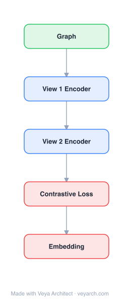

# Architecture: Multi-view Clustering with Graph Embedding

## Motivation

Advances in data acquisition have given rise to graph representations where data is inherently represented as nodes and links rather than feature vectors. Brain networks, for example, have anatomic regions as nodes and functional/structural connectivities as links. These linkage structures often come from different sources (multi-view data)—fMRI captures functional activity correlations while DTI provides structural white matter connections.

Existing multi-view clustering approaches are based on vector representations and combining vectors from different views. However, the complex structures and lack of vector representations within graph data pose serious challenges for vector-based approaches. It is desirable to find methods that better capture and exploit graph structural information for multi-view clustering of graph instances.

The paper proposes MCGE (Multi-view Clustering with Graph Embedding) to address two challenges: (1) learning graph embeddings that encode multi-view structure information, and (2) leveraging multi-view graph embeddings to facilitate multi-view clustering on graph instances.

## Core Idea

Multi-view clustering with graph embedding for connectome analysis.

## Architecture

### Overview

<b>Layer-by-layer (5 nodes)</b>

| # | Layer | Type | Params |
|---|---|---|---|
| 1 | Graph | `input` |  |
| 2 | View 1 Encoder | `gcn_conv` |  |
| 3 | View 2 Encoder | `gcn_conv` |  |
| 4 | Contrastive Loss | `loss` |  |
| 5 | Embedding | `output` |  |

MCGE is an iterative framework that jointly performs multi-view graph embedding and multi-view clustering. It models multi-view graph data as tensors and applies tensor factorization to learn multi-view graph embeddings that capture local structure across all views. It employs graph kernels to measure similarity between graph instances, constructs a multi-view kernel tensor, and obtains common latent factors encoding global structure.

The two stages—multi-view graph embedding and multi-view clustering—work iteratively: clustering results refine the graph embeddings, and updated embeddings improve clustering, continuing until convergence. This approach captures both local structure (via graph embeddings) and global structure (via graph kernel similarity) for multi-view clustering.

### Components

- **Tensor representation**: Multi-view graph data for each subject is modeled as a tensor, where each slice corresponds to a view (e.g., fMRI, DTI brain networks).

- **Tensor factorization for graph embedding**: Decomposes the multi-view graph tensor to learn node embeddings that capture local structure within graphs across all views, while encoding latent correlations between views.

- **Graph kernel**: Measures similarity between graph instances in each view, constructing a kernel matrix per view. The multi-view kernel tensor is built from these per-view kernel matrices.

- **Common latent factors**: Obtained from the kernel tensor, encoding global structure information shared across views and subjects.

- **Iterative refinement loop**: Graphs clustered into the same group have similar local structure. For each graph, the multi-view embeddings of neighbor graphs (clustered in the same group) are used to refine its embedding. Updated embeddings then improve the clustering in the next iteration.

- **Clustering module**: Uses the common latent factors and refined graph embeddings to assign subjects to groups (e.g., HIV vs. control, Bipolar vs. control).

### Data Flow

1. **Input**: Multi-view graph data (e.g., fMRI and DTI brain networks for multiple subjects).
2. **Tensor construction**: Model each subject's multi-view graphs as tensors.
3. **Graph embedding**: Apply tensor factorization to learn multi-view graph embeddings capturing local structure across views.
4. **Similarity computation**: Use graph kernels to compute pairwise similarity between graph instances in each view.
5. **Kernel tensor construction**: Build a multi-view kernel tensor from per-view kernel matrices.
6. **Global structure extraction**: Obtain common latent factors from the kernel tensor encoding global structure.
7. **Clustering**: Use common latent factors and graph embeddings for multi-view clustering.
8. **Embedding refinement**: Use embeddings of graphs in the same cluster to refine each graph's embedding.
9. **Iterate**: Repeat clustering and refinement until convergence.

### State / Memory

The iterative framework maintains state across iterations—clustering results from the previous iteration inform the embedding refinement in the current iteration, and the refined embeddings inform the next clustering. This feedback loop continues until convergence, with each iteration's results serving as memory for the next.

## Design Decisions

- **Tensor factorization for multi-view embedding**: Captures local structure of graphs across all views simultaneously, encoding latent correlations between views that separate per-view processing would miss.

- **Graph kernel for global structure**: Complements the local structure captured by graph embeddings with global graph-level similarity, addressing the need to fuse local and global structure information.

- **Iterative two-stage framework**: The mutual reinforcement between clustering and embedding refinement allows each stage to benefit from the other's improvements, converging to better solutions than one-shot approaches.

- **Joint multi-view processing**: Rather than processing each view independently and combining results, MCGE jointly learns embeddings across views, capturing cross-view correlations.

- **Application to connectome analysis**: The framework is specifically designed for and evaluated on brain network analysis (HIV and Bipolar datasets), where multi-view (fMRI + DTI) graph data is naturally available.

## Evolution

**Predecessors:**
- Graph embedding methods (DeepWalk, node2vec, LINE) — single-view graph embedding
- Multi-view clustering (vector-based) — combining feature vectors from multiple views
- Graph kernels — measuring similarity between graph instances
- Tensor factorization — for multi-dimensional data analysis
- Single-view graph clustering methods

**Successors:**
- MCGE inspired subsequent multi-view graph learning methods for brain network analysis
- The iterative embedding-clustering paradigm influenced joint representation learning and clustering frameworks

## Characteristics

| Property | Value |
|----------|-------|
| Year | 2017 |
| Authors | Yu & Ragin |
| Category | GNN/Embedding |
| Source Paper | `Multi_view_clustering_with_graph_embedding_for_connectome_an_Yu_Ragin_2017.md` |
| PaperVault Path | `GNN/02-network-embedding/Multi_view_clustering_with_graph_embedding_for_connectome_an_Yu_Ragin_2017.md` |

## Limitations

- The framework is designed for and evaluated specifically on brain network (connectome) analysis; generalization to other multi-view graph domains requires validation.
- Tensor factorization can be computationally expensive for large graphs or many views.
- The iterative framework requires multiple passes, increasing computation time.
- The graph kernel computation can be expensive for large numbers of graph instances.
- The method requires all views to be available for all subjects; missing views are not handled.
- The clustering quality depends on the choice of graph kernel and tensor factorization rank.
- The framework is unsupervised; leveraging label information (semi-supervised settings) is not addressed.

## Implementation Notes

See `implementation/` for a minimal runnable implementation.

## Information Layers

- **Evidence:** Source paper available in `references/papers/`
- **Analysis:** MCGE's key insight is that local graph structure (captured by tensor factorization embeddings) and global graph similarity (captured by graph kernels) provide complementary information for multi-view clustering, and that iteratively refining one using the other leads to better solutions than either alone.
- **Hypothesis:** The mutual reinforcement between embedding and clustering may be capturing a form of self-training, where confident clustering assignments provide pseudo-labels that improve the embeddings, which in turn sharpen the clustering boundaries.
