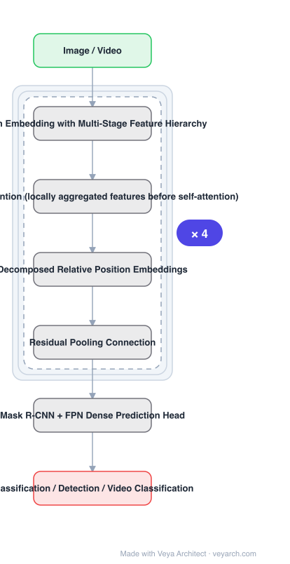

# Architecture: MViTv2

## Motivation

Visual signals are dense, so self-attention's **quadratic** compute and memory scaling is a severe burden for high-resolution object detection and space-time video understanding. Two strategies had appeared: **local window attention** (for detection) and **pooling attention**, which locally aggregates features before computing self-attention (for video). Pooling attention fuelled Multiscale Vision Transformers — an architecture extending ViT simply, with a feature hierarchy from high to low resolution instead of ViT's fixed resolution. MViTv2 improves pooling attention and then asks whether this single family can serve **classification, detection and video** as a general backbone.

## Core Idea

Two simple improvements to pooling attention, plus a standard dense-prediction framework on top. The improvements are: **decomposed relative position embeddings** (shift-invariant, injecting position information into transformer blocks) and a **residual pooling connection** (compensating for the effect of pooling strides in attention computation).

## Architecture

### Overview

<b>Layer-by-layer (7 nodes)</b>

| # | Layer | Type | Params |
|---|---|---|---|
| 1 | Image / Video | `input` |  |
| 2 | Patch Embedding with Multi-Stage Feature Hierarchy | `custom` |  |
| 3 | Pooling Attention (locally aggregated features before self-attention) | `custom` |  |
| 4 | Decomposed Relative Position Embeddings | `custom` |  |
| 5 | Residual Pooling Connection | `custom` |  |
| 6 | Mask R-CNN + FPN Dense Prediction Head | `custom` |  |
| 7 | Classification / Detection / Video Classification | `output` |  |

### Components

1. **Patch embedding with multi-stage feature hierarchy** — inherited from MViT: resolution decreases across stages instead of staying fixed.
2. **Pooling attention** — locally aggregates features before self-attention, which is the mechanism that makes dense visual signals tractable.
3. **Decomposed relative position embeddings** — shift-invariant positional embeddings using **decomposed location distances**, injecting position information into transformer blocks.
4. **Residual pooling connection** — compensates for the effect of pooling strides in attention computation.
5. **Mask R-CNN + FPN head** — a standard dense prediction framework applied to object detection and instance segmentation.

### Data Flow

Image or video → patch embedding → multiple stages, each with pooling attention plus decomposed relative position embedding and a residual pooling connection, resolution shrinking across stages → multi-scale features → Mask R-CNN + FPN for detection/segmentation, or a classification head.

### State / Memory

No recurrent state. The design targets the quadratic cost of attention on dense signals by pooling before attention, which is the compute/memory lever; the residual pooling connection exists because that pooling itself loses information.

## Design Decisions

- **Study one family across three tasks** — the paper's framing question is whether MViT can be a general backbone for spatial *and* spatiotemporal recognition, not a video-only model.
- **Two simple improvements rather than a redesign** — explicitly described as simple-yet-effective upgrades; pooling attention is improved along two named axes.
- **Decomposed position distances, for shift invariance** — position information is injected in a way that does not depend on absolute location.
- **Residual connection to offset pooling strides** — acknowledges that pooling attention discards information, and repairs it cheaply.
- **Use a standard dense prediction framework** — Mask R-CNN with FPN, so gains come from the backbone rather than a bespoke head.

## Evolution

- **VGG, ResNet** (historical backbone design).
- **ViT** (predecessor): popular for classification, challenging for high-resolution detection and video.
- **MViT** (predecessor): pooling attention with a multi-stage feature hierarchy, SOTA for video.
- **MViTv2 (2021)**: decomposed position embeddings + residual pooling connection; studied across three tasks.
- **Siblings**: Swin V2, PVT, CSWin, MaxViT, VideoMAE.
- **Contrast**: local-window-attention backbones — the other strategy for the same quadratic-cost problem.

## Characteristics

| Property | Value |
|---|---|
| Task | classification / detection / video classification |
| Heritage | MViT: multi-stage feature hierarchy |
| Attention | pooling attention (aggregate locally before self-attention) |
| Improvement 1 | decomposed relative position embeddings (shift-invariant) |
| Improvement 2 | residual pooling connection (compensates pooling stride) |
| Head | Mask R-CNN + FPN |
| Kinetics-400 | 86.1% |

## Limitations

- Pooling attention still discards spatial detail; the residual connection mitigates but does not remove this.
- Decomposition and pooling strides introduce per-stage hyper-parameters.
- Being one family across tasks, per-task tuning is limited — a task-specialized backbone may win on a single benchmark.
- Video and image settings have different optimal hierarchies, so a shared configuration is a compromise.

## Implementation Notes

Essentials: (1) pre-pool features before computing self-attention — that is the mechanism that keeps dense visual signals tractable, and removing it returns the quadratic cost, (2) add **both** improvements: decomposed relative position embeddings and the residual pooling connection; the second exists specifically because pooling loses information, (3) use decomposed location distances so position information is shift-invariant — absolute position embeddings are what the improvement replaces, (4) evaluate across classification, detection and video, since serving all three as one family is the paper's framing question and a single-task result does not answer it, (5) use a standard Mask R-CNN + FPN head so the comparison isolates the backbone.
