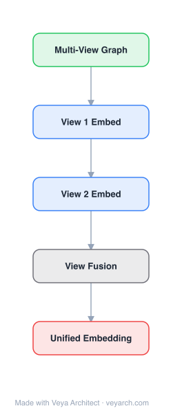

# Architecture: Multi-view Network Embedding

## Motivation

Existing network embedding methods (DeepWalk, LINE, node2vec) assume a **single type of proximity** between nodes — a single "view" of the network. However, real-world networks often have **multiple types of proximities**: in author networks, proximity can be co-authorship or citation; in social media (Twitter), proximities include following, retweet, reply, and mention. Each individual view is sparse and biased, so embeddings from a single view are incomplete. Prior multi-view learning methods (multi-view clustering, multi-view matrix factorization) have two key limitations: (1) **insufficient collaboration** — they seek compatible representations across views rather than promoting views to collaborate and vote for robust representations; (2) **lack of weight learning** — they assign equal weights to all views, ignoring that different views have different importance. MVNE fills this gap with a collaboration framework where views vote for robust representations, guided by an **attention mechanism** that learns per-node view weights, enabling each node to focus on its most informative views.

## Core Idea

Attention-based collaboration framework for multi-view network embedding.

## Architecture

### Overview

<b>Layer-by-layer (5 nodes)</b>

| # | Layer | Type | Params |
|---|---|---|---|
| 1 | Multi-View Graph | `input` |  |
| 2 | View 1 Embed | `embed` |  |
| 3 | View 2 Embed | `embed` |  |
| 4 | View Fusion | `custom` |  |
| 5 | Unified Embedding | `output` |  |

MVNE is a multi-view network representation learning framework that promotes collaboration across multiple network views (each view = one type of proximity/relationship). The architecture has two main stages: (1) **view-specific representation learning** — for each view, learn a separate node embedding that preserves proximities within that view; (2) **attention-based voting** — combine view-specific embeddings into robust final representations, where an attention mechanism learns per-node, per-view weights that determine how much each view contributes to each node's final embedding. The attention mechanism is trained with a small amount of labeled data, enabling it to learn which views are most informative for each node. The entire model is trained end-to-end via backpropagation, alternating between optimizing view-specific embeddings and learning attention weights.

### Components

1. **View-Specific Node Embeddings** — Per-view representation matrices:
   - For each view v, a separate embedding matrix X^(v) ∈ ℝ^(N×d) captures proximity within that view
   - Each view's adjacency matrix A^(v) defines the proximity structure for that view
   - Learned to preserve first-order and second-order proximity within the view (similar to LINE)
   - Each view captures a different facet of node relationships (e.g., co-authorship vs. citation)

2. **Attention Mechanism** — Per-node view weighting:
   - For each node u and view v, an attention weight α_uv is learned
   - α_uv determines how much view v contributes to node u's final embedding
   - Attention weights are learned using a small amount of labeled data (semi-supervised)
   - Enables each node to focus on its most informative views
   - Implemented as a learnable function of node features and view identity

3. **Voting / Fusion** — Combines view-specific embeddings:
   - Final embedding: x_u = Σ_v α_uv · X^(v)_u
   - Weighted combination of view-specific embeddings, with per-node attention weights
   - The voting process promotes collaboration: views with high weight for a node "dominate" its representation, while low-weight views contribute less
   - Produces robust representations that leverage all views

4. **Joint Objective** — End-to-end training:
   - L = L_view_specific + λ · L_attention
   - L_view_specific: proximity preservation loss for each view (first/second-order)
   - L_attention: supervised loss using labeled data to learn attention weights
   - Optimized via backpropagation, alternating between view-specific embeddings and attention weights

### Data Flow

1. **Input:** Multi-view network with V views, each with adjacency matrix A^(v), plus a small set of labeled nodes
2. **View-Specific Embedding:** For each view v, learn X^(v) preserving proximities in A^(v) (first-order and second-order proximity)
3. **Attention Weight Learning:** For each node u and view v, learn attention weight α_uv using labeled data (semi-supervised)
4. **Voting/Fusion:** Combine view-specific embeddings: x_u = Σ_v α_uv · X^(v)_u
5. **Joint Optimization:** Minimize the unified loss L via backpropagation, alternating between optimizing view-specific embeddings and attention weights
6. **Output:** Low-dimensional node embeddings x_u ∈ ℝ^d that leverage information from all views, weighted by learned attention

### State / Memory

- **No recurrent state:** MVNE is a feedforward embedding model trained via backpropagation; no temporal memory mechanism.
- **Learned parameters:** V view-specific embedding matrices X^(v), attention weight parameters (function weights), and the fusion mechanism are the persistent learned state.
- **Memory scaling:** Memory scales as O(V·N·d) for view-specific embeddings plus attention parameters, where V is the number of views.

## Design Decisions

1. **Separate per-view embeddings** — Rather than using a single shared embedding for all views, MVNE maintains separate per-view embeddings. This captures view-specific structural patterns that would be lost if all views were merged into one adjacency matrix.

2. **Attention-based view weighting** — Instead of equal weights (as in prior multi-view methods), MVNE learns per-node, per-view attention weights. This is the key innovation: different nodes may benefit from different views, and the attention mechanism learns this automatically. A node with strong co-authorship but weak citation links should weight the co-authorship view more heavily.

3. **Semi-supervised attention learning** — The attention weights are learned using a small amount of labeled data, not unsupervised. This grounds the view weighting in task-relevant signal, ensuring that the "most informative" views are informative for the actual downstream task, not just for generic proximity preservation.

4. **Collaboration over compatibility** — Prior multi-view methods seek "compatible" representations (similar across views). MVNE instead promotes "collaboration" — views vote for robust representations, and the attention mechanism determines each view's contribution. This is a fundamentally different objective that produces more robust, task-relevant embeddings.

5. **End-to-end backpropagation** — The entire model (view-specific embeddings + attention) is trained jointly via backpropagation, allowing the components to mutually adapt. This avoids the suboptimality of a staged pipeline.

## Evolution

**Predecessors:**
- **DeepWalk** (Perozzi et al., 2014) — Skip-gram on random walks; single-view.
- **LINE** (Tang et al., 2015) — First/second-order proximity; single-view.
- **node2vec** (Grover & Leskovec, 2016) — Biased random walks; single-view.
- **Multi-view clustering** (Kumar & Daumé, 2011; Cai et al., 2013) — Multi-view learning for clustering, not embedding; equal weights.
- **Multi-view matrix factorization** (Singh & Gordon, 2008) — Compatible representations across views; no weight learning.
- **Attention mechanism** (Bahdanau et al., 2015) — Attention in neural machine translation; inspired the view weighting approach.

**Successors:**
- **MNE** (Zhang et al., 2018) — Multi-network embedding with stable node identities.
- **mvn2vec** (Sun et al., 2018) — Multi-view network embedding via random walk fusion.
- **GAT** (Veličković et al., 2018) — Graph attention networks; attention over neighbors in GNNs, extending the attention concept to graph structure.
- **HAN** (Wang et al., 2019) — Heterogeneous graph attention network; attention over meta-paths/views.

## Characteristics

| Property | Value |
|----------|-------|
| Year | 2017 |
| Authors | Qu, Tang, Shang, Ren, Zhang, Han (UIUC, HEC Montreal, Peking University) |
| Category | GNN/Embedding |
| Source Paper | `An_attention_based_collaboration_framework_for_multi_view_ne_Tang_Shang_Ren_etal_2017.md` |
| PaperVault Path | `GNN/02-network-embedding/An_attention_based_collaboration_framework_for_multi_view_ne_Tang_Shang_Ren_etal_2017.md` |

## Limitations

1. **Transductive** — MVNE learns per-node embeddings and cannot generate embeddings for unseen nodes without retraining, limiting applicability to dynamic networks.
2. **Requires labeled data for attention** — The attention mechanism is semi-supervised, requiring labeled nodes. In fully unsupervised settings, the attention weights cannot be learned effectively.
3. **Fixed view set** — The number of views must be known at training time; adding new views requires retraining.
4. **Linear fusion** — The voting mechanism is a weighted linear combination of view-specific embeddings. Nonlinear interactions between views may not be fully captured.
5. **Memory overhead** — Maintaining V separate embedding matrices increases memory by a factor of V compared to single-view methods.
6. **No deep architecture** — View-specific embeddings use shallow models (proximity preservation), not deep neural networks. Complex nonlinear view interactions may be missed.

## Implementation Notes

See `implementation/` for a minimal runnable implementation.

## Information Layers

- **Evidence:** Source paper available in `references/papers/` (Qu, Tang, Shang, Ren, Zhang, Han, 2017, "An Attention-based Collaboration Framework for Multi-View Network Representation Learning," CIKM '17)
- **Analysis:** MVNE's key innovation is the introduction of the attention mechanism to multi-view network embedding, enabling per-node view weighting rather than uniform treatment. This was ahead of its time — the attention mechanism was just gaining prominence in NMT (Bahdanau et al., 2015), and MVNE was among the first to apply it to graph/network data. The collaboration-over-compatibility paradigm is a principled shift: rather than forcing views to agree, views are allowed to disagree and the attention mechanism resolves which view to trust per node. The semi-supervised attention learning grounds the view weighting in task relevance. The main limitation is the linear fusion and shallow view-specific embeddings — later GNN-based methods (GAT, HAN) would incorporate attention into deeper architectures with nonlinear message passing. MVNE remains significant as a pioneer of attention in graph representation learning.
- **Hypothesis:** The attention mechanism's effectiveness implies that view importance is **node-specific**, not global — different nodes benefit from different views, and a global view weighting would be suboptimal. This suggests that the "best" view for a node depends on its structural role and local neighborhood patterns. The semi-supervised attention learning's success implies that task-relevant signal is needed to calibrate view importance — unsupervised proximity preservation alone is insufficient to determine which views matter for downstream tasks. This anticipates the broader insight in GNNs that attention/weighting should be learned, not fixed, and should be conditioned on both node and task context.
