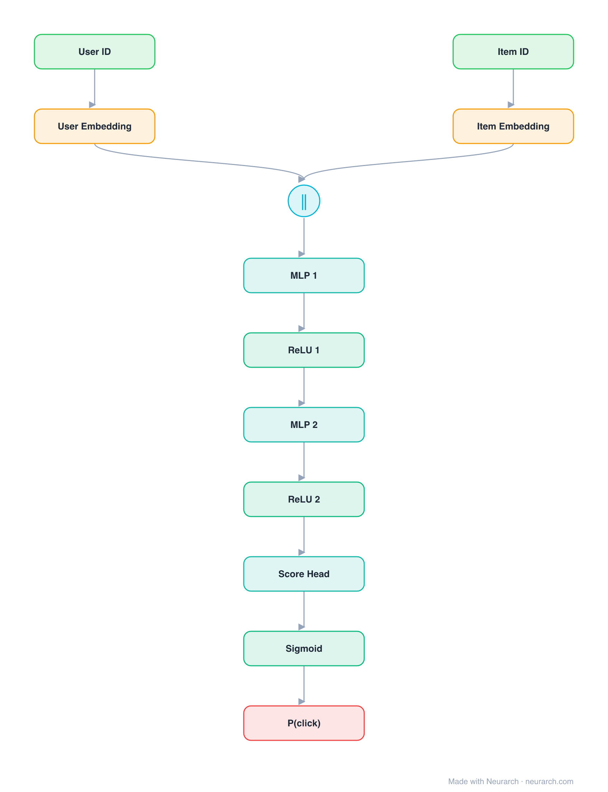

# Architecture: NCF (concat-MLP)

## Motivation

Neural Collaborative Filtering in its simplest form: user and item embeddings concatenated into an MLP that learns the interaction function instead of assuming a dot product.

## Core Idea

Neural Collaborative Filtering in its simplest form: user and item embeddings concatenated into an MLP that learns the interaction function instead of assuming a dot product.

## Architecture

### Overview

<b>Layer-by-layer (12 nodes)</b>

| # | Layer | Type | Params |
|---|---|---|---|
| 1 | User ID | `input` | shape: [1] |
| 2 | User Embedding | `embedding` | vocabSize: 100000, embeddingDim: 32 |
| 3 | Item ID | `input` | shape: [1] |
| 4 | Item Embedding | `embedding` | vocabSize: 1000000, embeddingDim: 32 |
| 5 | Concat [u; i] | `concatenate` | dim: -1, numInputs: 2 |
| 6 | MLP 1 | `linear` | inFeatures: 64, outFeatures: 64 |
| 7 | ReLU 1 | `relu` |   |
| 8 | MLP 2 | `linear` | inFeatures: 64, outFeatures: 32 |
| 9 | ReLU 2 | `relu` |   |
| 10 | Score Head | `linear` | inFeatures: 32, outFeatures: 1 |
| 11 | Sigmoid | `sigmoid` |   |
| 12 | P(click) | `output` |   |

This graph ships in Neurarch's in-app template library; the copy here passes shape propagation with zero errors.

### Design Notes

- The pure-MLP variant of the NCF paper; the fused GMF+MLP variant is the separate [neumf](../neumf/) entry.
- The paper's claim that an MLP beats the inner product sparked a years-long replication debate (Rendle et al. 2020); keep both graphs around to test it yourself.

## Design Decisions

> **Analysis** — Observations derived from studying the architecture.

- The pure-MLP variant of the NCF paper; the fused GMF+MLP variant is the separate [neumf](../neumf/) entry.
- The paper's claim that an MLP beats the inner product sparked a years-long replication debate (Rendle et al. 2020); keep both graphs around to test it yourself.

## Implementation Notes

- `model.json` contains the full structural graph with real dimensions and parameters.
- Open in [Neurarch](https://www.neurarch.com/) to visualize, edit, or export training code.
- Diagrams fold repeated identical blocks with a `× N` badge; `model.json` holds all nodes at real dimensions.

## Limitations

- This package focuses on the architectural structure. Training pipelines, 
dataset preparation, and production optimizations are out of scope.

## Evolution

> See `references/related/` for predecessor and successor architectures.

