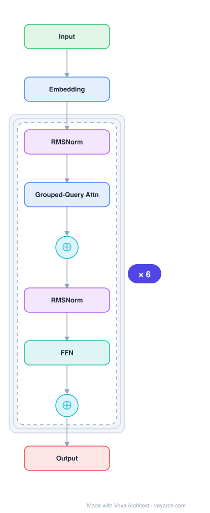

# Architecture: Nemotron (Jet-Nemotron)

## Motivation

While full-attention transformer models dominate language modeling, they suffer from quadratic compute and linear memory bottlenecks during generation. Hybrid models combining full and linear attention offer improved efficiency but still fall significantly behind state-of-the-art full-attention models on challenging benchmarks (MMLU, math, retrieval, coding, long-context). The goal is to match the accuracy of full-attention models while delivering exceptional generation throughput.

## Core Idea

A hybrid-architecture language model family developed using Post Neural Architecture Search (PostNAS) — a novel pipeline that starts from a pre-trained full-attention model, freezes its MLP weights, and efficiently explores attention block designs to create models that match or exceed full-attention accuracy while delivering up to 53.6× generation throughput speedup.

## Architecture

### Overview

<b>Layer-by-layer (9 nodes)</b>

| # | Layer | Type | Params |
|---|---|---|---|
| 1 | Input | `input` |  |
| 2 | Embedding | `embed` |  |
| 3 | RMSNorm | `norm` |  |
| 4 | Grouped-Query Attn | `attention` |  |
| 5 | ⊕ | `residual` |  |
| 6 | RMSNorm | `norm` |  |
| 7 | FFN | `ffn` |  |
| 8 | ⊕ | `residual` |  |
| 9 | Output | `output` |  |

Jet-Nemotron is built upon PostNAS, which performs a coarse-to-fine search for efficient attention block designs starting from a pre-trained full-attention model. The pipeline keeps MLP weights frozen and explores: (1) optimal full-attention layer placement and elimination, (2) linear attention block selection, (3) new attention block design, and (4) hardware-aware hyperparameter search. The result is a hybrid model with some full-attention layers and some linear attention layers.

### Components

1. **PostNAS Pipeline** — Four-stage architecture search:
   - Stage 1: Full attention placement and elimination (determine which layers keep full attention)
   - Stage 2: Linear attention block selection (choose from Mamba2, GLA, Gated DeltaNet, RWKV, etc.)
   - Stage 3: New attention block design (design novel attention blocks like SConv with time-mixing)
   - Stage 4: Hardware-aware architectural hyperparameter search

2. **Hybrid attention layers** — Mix of:
   - Full-attention layers (standard multi-head attention)
   - Linear attention layers (Mamba2, GLA, Gated DeltaNet, RWKV, or custom SConv blocks)

3. **Frozen MLP weights** — MLP weights from the pre-trained full-attention model are frozen during architecture search, enabling efficient exploration.

4. **SConv (Stateful Convolution) block** — A new attention block design with:
   - Time-mixing component
   - Kernel generator
   - DConv (depthwise convolution)

### Data Flow

1. **Input**: Token → embedding
2. **Hybrid blocks (×N)**:
   - Full-attention blocks: standard multi-head self-attention + frozen MLP
   - Linear attention blocks: efficient linear attention (Mamba2/GLA/Gated DeltaNet/RWKV/SConv) + frozen MLP
3. **Output**: Next token prediction

**PostNAS search flow:**
1. Start with pre-trained full-attention model
2. Freeze MLP weights
3. Stage 1: Learn optimal full-attention layer placement
4. Stage 2: Select best linear attention block for remaining layers
5. Stage 3: Design new attention blocks if needed
6. Stage 4: Hardware-aware hyperparameter optimization

### State / Memory

- **Linear attention state**: Linear attention blocks (Mamba2, GLA, etc.) maintain constant-size state, enabling O(1) inference memory per step.
- **Full-attention KV cache**: Full-attention layers require KV cache, but only for those layers (reduced vs. all-full-attention).
- **No recurrent state for full-attention**: Full-attention layers use standard KV cache.
- **Frozen MLP state**: MLP weights are frozen, reducing trainable parameters during search.

## Design Decisions

1. **Start from pre-trained model** — Unlike training from scratch, PostNAS leverages existing pre-trained full-attention models, dramatically reducing the cost of architecture exploration.

2. **Freeze MLP weights** — MLPs consume the majority of parameters; freezing them during attention design search makes exploration efficient while preserving learned representations.

3. **Coarse-to-fine search** — The four-stage pipeline narrows the search space progressively: first which layers need full attention, then which linear attention to use, then custom block design, finally hyperparameter tuning.

4. **Hardware-aware search** — The final stage optimizes for actual hardware throughput (NVIDIA H100), not just theoretical FLOPs.

5. **Hybrid full + linear attention** — Rather than replacing all attention with linear variants, Jet-Nemotron keeps full attention where it matters most and uses linear attention elsewhere for efficiency.

## Evolution

**Predecessors:**
- **Transformer** (Vaswani et al., 2017) — Base architecture.
- **Mamba2** (Gu & Dao, 2024) — Linear attention / SSM option.
- **RWKV** (Peng et al., 2023) — Linear attention option.
- **Gated DeltaNet** (Yang et al., 2025) — Linear attention option.
- **GLA** (Gated Linear Attention) — Linear attention option.
- **Zamba2** — Prior hybrid model.
- **Hymba** — Prior hybrid model.

**Successors:**
- Future PostNAS-based models with more efficient attention blocks.
- Hardware-aware architecture search frameworks.

## Characteristics

| Property | Value |
|----------|-------|
| Year | 2025 |
| Authors | Gu, Hu, Yang, Xi, Chen, Han, Cai (NVIDIA) |
| Category | DL/Transformer |
| Source Paper | `Jet-Nemotron_Efficient_Language_Model_with_Post_Neural_Architecture_Se_Yuxian_Yang_2025.md` |
| PaperVault Path | `DL-Architectures/01-transformers/Jet-Nemotron_Efficient_Language_Model_with_Post_Neural_Architecture_Se_Yuxian_Yang_2025.md` |

## Limitations

1. **Depends on pre-trained model** — PostNAS requires a pre-trained full-attention model as starting point, adding to total training cost.
2. **MLP freezing trade-off** — Freezing MLPs limits adaptation capacity during architecture search.
3. **Hardware specificity** — Hardware-aware search is optimized for specific GPUs (H100); may not transfer perfectly to other hardware.
4. **Search space complexity** — The four-stage search involves many design choices that may not generalize.
5. **Linear attention limitations** — Even with optimal placement, linear attention may struggle with certain tasks (state-tracking, long-range retrieval).

## Implementation Notes

See `implementation/` for a minimal runnable implementation. Key details:
- PostNAS: start from pre-trained full-attention model, freeze MLPs
- Stage 1: full-attention placement (which layers keep full attention)
- Stage 2: linear attention selection (Mamba2, GLA, Gated DeltaNet, RWKV, SConv)
- Stage 3: new attention block design (SConv with time-mixing, kernel generator)
- Stage 4: hardware-aware hyperparameter search
- Jet-Nemotron-2B: comparable to Qwen3, 53.6× throughput speedup
- Jet-Nemotron-4B: higher accuracy, still faster than sub-2B full-attention models
- Available at github.com/NVlabs/Jet-Nemotron

## Information Layers

- **Evidence:** Source paper available in `references/papers/` (Gu et al., 2025, "Jet-Nemotron: Efficient Language Model with Post Neural Architecture Search")
- **Analysis:** PostNAS represents a paradigm shift in architecture design: rather than training from scratch, it efficiently explores architectures by leveraging pre-trained models. The key insight is that MLPs (which contain most parameters) can be frozen during attention design search, making the search tractable. The hybrid full + linear attention approach is pragmatic: keep full attention where it's needed, use linear attention where it suffices. The hardware-aware final stage ensures real-world efficiency gains.
- **Hypothesis:** The PostNAS approach suggests that the optimal architecture is not uniform — different layers benefit from different attention mechanisms. The ability to start from pre-trained models may make architecture search accessible to more researchers, democratizing efficient model design.
