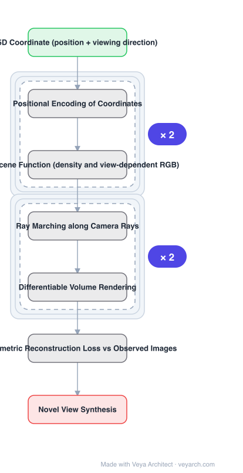

# Architecture: NeRF

## Motivation

NeRF addresses view synthesis in a new way: instead of the usual pipelines, it **directly optimizes parameters of a continuous 5D scene representation** to minimize the error of rendering a set of captured images. The representation must capture complicated geometry *and* view-dependent appearance from nothing but posed images.

## Core Idea

Represent a static scene as a **continuous 5D function**: input is spatial location \((x,y,z)\) plus viewing direction \((\theta,\phi)\); output is the radiance emitted in each direction at that point, and a **density** acting like a differential opacity controlling how much radiance accumulates along a ray. An MLP — no convolutional layers — is optimized to represent this function. Rendering is differentiable, so images with known camera poses are the only input required.

## Architecture

### Overview

<b>Layer-by-layer (7 nodes)</b>

| # | Layer | Type | Params |
|---|---|---|---|
| 1 | 5D Coordinate (position + viewing direction) | `input` |  |
| 2 | Positional Encoding of Coordinates | `custom` |  |
| 3 | MLP Scene Function (density and view-dependent RGB) | `dense` |  |
| 4 | Ray Marching along Camera Rays | `custom` |  |
| 5 | Differentiable Volume Rendering | `custom` |  |
| 6 | Photometric Reconstruction Loss vs Observed Images | `custom` |  |
| 7 | Novel View Synthesis | `output` |  |

### Components

1. **5D input coordinate** — spatial location plus viewing direction; the scene function's domain.
2. **Positional encoding** — applied to the coordinates before the MLP; required for the network to represent high-frequency detail.
3. **MLP scene function** — fully-connected, non-convolutional; regresses from a single 5D coordinate to a single volume density and view-dependent RGB colour.
4. **Ray marching** — camera rays are marched through the scene to generate sampled 3D points.
5. **Differentiable volume rendering** — classical volume rendering accumulates the sampled colours and densities into a 2D image; naturally differentiable, so gradients flow to the MLP.
6. **Photometric reconstruction loss** — the error between rendered and observed images; the only supervision.

### Data Flow

Set of images with known camera poses → march camera rays through the scene → sample 3D points → encode coordinates → MLP outputs density and view-dependent RGB per point → volume rendering accumulates into an image → loss against the observed image → backpropagate into the MLP.

### State / Memory

No state in the usual sense — the "memory" is the MLP weights, which *are* the scene. There is no explicit voxel/grid representation, which is the reason the representation is continuous and compact.

## Design Decisions

- **Continuous 5D function rather than a discrete representation** — the defining choice; resolution is not baked in.
- **View-dependent radiance** — output depends on viewing direction, which is what allows complicated appearance (specularities) to be represented.
- **Density as differential opacity** — makes classical volume rendering directly applicable.
- **Fully-connected, no convolutions** — the network is a coordinate function, not an image processor.
- **Exploit differentiability** — because volume rendering is differentiable, only posed images are needed; no ground-truth geometry.

## Evolution

- **Mesh- and voxel-based scene representations** (predecessors): discrete, fixed resolution.
- **Neural rendering / view synthesis methods** (predecessors): the prior work NeRF reports outperforming.
- **NeRF (2020)**: continuous 5D neural radiance field with differentiable volume rendering.
- **Successors**: 3D Gaussian Splatting family; MonoSplat.
- **Contrast**: convolutional scene representations, deliberately avoided.

## Characteristics

| Property | Value |
|---|---|
| Task | novel view synthesis |
| Representation | continuous 5D function (position + view direction) |
| Network | fully-connected MLP, no convolutions |
| Output per point | volume density + view-dependent RGB |
| Rendering | ray marching + differentiable volume rendering |
| Supervision | posed images only |

## Limitations

- The MLP must be queried thousands of times per ray, making rendering slow.
- One optimized network represents one scene — no generalization to new scenes without retraining.
- Requires accurate known camera poses; pose error degrades results.
- Restricted to static scenes as formulated; dynamic content and unbounded scenes need extensions.

## Implementation Notes

Essentials: (1) apply **positional encoding** to the 5D coordinates before the MLP — without it the network cannot represent high-frequency detail, (2) output **both** density and view-dependent radiance, with radiance conditioned on viewing direction; removing the view dependence loses specular and other direction-dependent appearance, (3) render by **marching rays and accumulating with classical volume rendering**, and keep that path differentiable — differentiability is what makes posed images sufficient supervision and eliminates any need for ground-truth geometry, (4) supervise with photometric error against the observed images, (5) expect per-scene optimization: a trained NeRF represents one scene, so plan evaluation and compute budgets per scene rather than amortized across a dataset.
