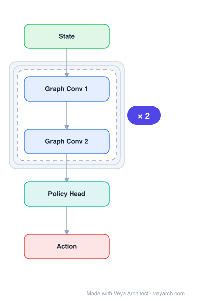

# Architecture: NerveNet

## Motivation

In standard reinforcement learning, observations from different body parts of an agent are concatenated and passed through an MLP to learn the policy. This approach ignores the physical structure and dependencies between body parts (e.g., joints with links). NerveNet addresses this by exploiting the body structure of agents using graph neural networks, propagating information between different body parts along the graph structure of the agent's body.

## Core Idea

A graph neural network-based policy network for reinforcement learning that exploits the physical body structure of agents. NerveNet uses tree graphs from MuJoCo to represent agent bodies, propagates information between body parts via message passing along physical links, and outputs action probabilities for each joint. This structured approach enables better generalization, transfer, and multi-task learning compared to monolithic MLP policies.

## Architecture

### Overview

<b>Layer-by-layer (5 nodes)</b>

| # | Layer | Type | Params |
|---|---|---|---|
| 1 | State | `input` |  |
| 2 | Graph Conv 1 | `gcn_conv` |  |
| 3 | Graph Conv 2 | `gcn_conv` |  |
| 4 | Policy Head | `linear` |  |
| 5 | Action | `output` |  |

NerveNet represents the agent's body as a graph (tree structure from MuJoCo), with body nodes and joint nodes. A GNN with synchronous message passing propagates information between connected body parts. The model has three components: input (node features), propagation (GNN message passing), and output (action probabilities). This structured policy network exploits physical dependencies for better learning and transfer.

### Components

1. **Graph Construction** — Agent body as a graph:
   - Tree graphs from MuJoCo physics simulator
   - Two types of nodes: body nodes (e.g., Thigh, Shin) and joint nodes (e.g., Knee)
   - Single root node: observes additional information
   - Edges represent physical links between body parts

2. **Input Model** — Node feature encoding:
   - Observations encoded per-node
   - Joint nodes: angular velocity, twist angle, torque, position
   - Body nodes: velocity, inertia, force
   - Root node: additional global observations

3. **Propagation Model** — GNN message passing:
   - Synchronous message passing between connected nodes
   - Information propagates along physical links (edges)
   - Multiple rounds of message passing (layers)
   - Each node aggregates messages from neighbors

4. **Output Model** — Action generation:
   - Per-joint action probabilities
   - Joint nodes output action (move joint)
   - Based on aggregated features from GNN

### Data Flow

1. **Input**: Observations from the environment (per body part/joint)
2. **Graph construction**: Build tree graph from agent body structure
3. **Node feature encoding**: Encode observations as node features
4. **GNN propagation**: Message passing along physical edges (multiple layers)
5. **Action output**: Joint nodes generate action probabilities
6. **Environment step**: Actions applied to joints
7. **Reward**: Task-defined (e.g., +speed, -energy cost)

### State / Memory

- **No explicit memory mechanism**: NerveNet is a feedforward GNN (per RL step).
- **Graph structure**: The agent's body structure defines the computation graph (persistent across steps).
- **GNN parameters**: Message passing weights are persistent model parameters.
- **PPO training**: Proximal Policy Optimization for policy training (KL divergence constraint).

## Design Decisions

1. **GNN for agent policy** — Exploiting body structure:
   - Standard RL uses MLPs (ignore body structure)
   - GNN propagates information along physical links
   - Captures physical dependencies between body parts
   - Actions of joints depend on other joints (not just own observations)

2. **Tree graph from MuJoCo** — Using physics simulator structure:
   - MuJoCo provides body structure as tree graphs
   - Body and joint nodes with physical links
   - Natural representation of agent morphology
   - No manual graph design needed

3. **Synchronous message passing** — GNN propagation:
   - All nodes update simultaneously
   - Multiple rounds capture multi-hop dependencies
   - Information flows between connected body parts

4. **PPO training** — Policy optimization:
   - Maximize cumulative reward
   - KL-divergence constraint between old/new policy
   - Value function loss for baseline
   - Standard RL training paradigm

## Evolution

**Predecessors:**
- **MLP-based RL policies** — Standard approach (concatenate observations, MLP).
- **Graph Neural Networks** (GCN, GAT) — Message passing on graphs.
- **MuJoCo** — Physics simulator providing body structure.

**Successors:**
- **Structure-aware RL** — Further exploration of body structure in RL.
- **Graph-based policies** — GNN policies for multi-agent RL.
- **Transfer learning in RL** — Structure transfer between agents.

## Characteristics

| Property | Value |
|----------|-------|
| Year | 2018 |
| Authors | Wang, Liao, Ba, Fidler |
| Category | DL/Reinforcement Learning |
| Source Paper | `NerveNet_Learning_Structured_Policy_with_Graph_Neural_Networ_Wang_Liao_2018.md` |
| PaperVault Path | `GNN/03-gnn-architectures/NerveNet_Learning_Structured_Policy_with_Graph_Neural_Networ_Wang_Liao_2018.md` |

## Limitations

1. **Fixed body structure** — The graph structure is fixed per agent; doesn't handle dynamic morphologies.
2. **MuJoCo dependency** — Relies on MuJoCo for body structure; may not generalize to other simulators.
3. **Limited message passing** — Number of GNN layers limits how far information can propagate.
4. **Computational overhead** — GNN message passing adds overhead compared to simple MLPs.
5. **RL-specific** — Designed for RL policy networks; not directly applicable to other domains.
6. **Transfer limits** — Structure transfer works for similar body plans; very different morphologies may not transfer.

## Implementation Notes

See `implementation/` for a minimal runnable implementation. Key details:
- Graph: tree from MuJoCo (body nodes + joint nodes + root)
- Node types: body (velocity, inertia, force), joint (angular velocity, twist angle, torque, position)
- GNN: synchronous message passing along physical edges
- Output: per-joint action probabilities
- Training: PPO (maximize reward, minimize KL divergence, value function loss)
- Environments: Centipede (4-40 legs), Snake, Walker task-set (5 walkers)
- Transfer: size transfer (different agent lengths), disability transfer (CrippleCentipede)
- Multi-task: one network for multiple agents (HalfHumanoid, Hopper, Horse, Ostrich, Wolf)
- Robustness: perturb agent parameters (mass, force scale)
- Results: comparable to SOTA MLP-based models, better transfer and multi-task learning
- NerveNet-1: separate policy/value networks (affects PPO)

## Information Layers

- **Evidence:** Source paper available in `references/papers/` (Wang et al., 2018, "NerveNet: Learning Structured Policy with Graph Neural Networks", ICLR 2018)
- **Analysis:** NerveNet's key insight is that the physical structure of RL agents contains valuable inductive bias that MLPs ignore. By representing the body as a graph and using GNN message passing, the model naturally captures dependencies between body parts — a joint's action should depend on other joints' states, not just its own observations. The transfer results are particularly compelling: a policy trained on a small agent can be transferred to a larger agent by reusing weights for corresponding joints. The multi-task results (one network controlling 5 very different walkers) demonstrate that the GNN captures generalizable locomotion principles. The robustness to parameter perturbation suggests that the structured policy learns more stable representations than MLPs.
- **Hypothesis:** The body structure prior may be essential for sample-efficient RL — the model doesn't need to discover physical dependencies from scratch. The transfer capability suggests that GNN policies learn generalizable "motor primitives" that are body-plan-agnostic. The PCA feature analysis showing invariant representations across leg pairs suggests the GNN discovers symmetries in locomotion. This approach may extend to any structured control problem (robotics, autonomous systems) where the system's physical structure is known.
