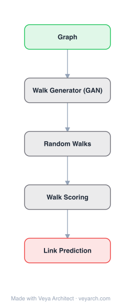

# Architecture: NetGAN

## Motivation

Generative models for graphs have a long history, with applications in data augmentation, anomaly detection, and recommendation. The de-facto standard has been explicit (prescribed) probabilistic models such as Barabási-Albert or stochastic blockmodels, which are designed to capture and reproduce a predefined subset of graph properties (e.g., degree distribution, community structure, clustering coefficient). Yet it has been shown repeatedly that our intuitions about real graph structure are misleading — heavy-tailed degree distributions were in strong disagreement with the models existing at the time of their discovery, and more recent work keeps surfacing surprising characteristics that question the validity of established models. This raises the core question: how do we define a model that captures all the essential — potentially still unknown — properties of real graphs?

In other fields (notably computer vision) the answer has been to switch from explicit prescribed models to implicit ones, where GANs significantly advanced the state of the art. But adapting GANs to graphs faces three obstacles: (1) discreteness of graph data, (2) the typical setting of learning from a single graph rather than a large repository of i.i.d. samples, and (3) the requirement of permutation invariance, since graphs are isomorphic under node reordering. Prior GAN attempts on graphs either learned subgraph topology (Liu et al. 2017) or tried to directly generate adjacency matrices (Tavakoli et al. 2017), which is quadratic in the number of nodes and infeasible beyond tiny graphs (reported runtime >60 hours for 154 nodes).

NetGAN fills this gap by reformulating graph generation as learning the distribution of biased random walks over the input graph. Random walks are permutation-invariant by construction, exploit the sparsity of real-world graphs (only nonzero adjacency entries are touched), and reduce the problem to a discrete-sequence generation task that GANs can handle. This lets NetGAN be the first implicit generative model for graphs that is both scalable to thousands of nodes and able to reproduce multiple network patterns without explicitly specifying any of them.

## Core Idea

Graph generation via random walks using GAN: generator produces biased random walks from learned distribution.

## Architecture

### Overview

<b>Layer-by-layer (5 nodes)</b>

| # | Layer | Type | Params |
|---|---|---|---|
| 1 | Graph | `input` |  |
| 2 | Walk Generator (GAN) | `custom` |  |
| 3 | Random Walks | `custom` |  |
| 4 | Walk Scoring | `custom` |  |
| 5 | Link Prediction | `output` |  |

NetGAN is an implicit generative model for graphs that learns to mimic the distribution of biased random walks over an input graph. Given a binary adjacency matrix `A`, a set of random walks of length `T` is first sampled from `A` (using the biased second-order strategy of node2vec, Grover & Leskovec 2016) to serve as the training set. NetGAN then trains a GAN where the generator produces synthetic random walks and the discriminator distinguishes them from real ones, both trained end-to-end via the Wasserstein GAN objective with gradient penalty.

The generator is a sequential neural network (an LSTM) that, at each step, outputs a probability distribution over the next node, samples a node via a Straight-Through Gumbel-Softmax estimator (to keep sampling differentiable), and feeds the sampled node back in. A latent code `z ~ N(0, I)` initializes the LSTM state, giving each walk a stochastic, controllable origin. The discriminator is also an LSTM that reads a walk node-by-node and outputs a single real/fake score.

After training, the generator is used to produce a large set of random walks (e.g., 500K), which are aggregated into a transition-count score matrix `S`. `S` is symmetrized and then binarized into an adjacency matrix `Â` by a sampling procedure that guarantees every node has at least one edge and reaches a desired number of edges, yielding the final generated graph.

### Components

- **Random-walk sampler (preprocessing)** — Generates the training set of biased second-order random walks (node2vec strategy) of length `T` from the input graph. This captures both local and global structure and is permutation-invariant by construction.
- **Generator `G`** — A sequential model based on an LSTM `f_θ`. At each step `t`, `f_θ` outputs (i) logits `p_t` over the next node and (ii) the new memory state `m_t = (C_t, h_t)`. The next node `v_t` is sampled from `Cat(σ(p_t))`. A latent code `z ~ N(0, I_d)` is passed through two fully-connected tanh layers to initialize `(C_0, h_0)`. To handle large graphs efficiently, the LSTM outputs a low-dimensional `o_t ∈ R^H` (H ≪ N) that is up-projected to `R^N` by `W_up`; sampled one-hot nodes are down-projected back to `R^H` by `W_down` before re-entering the LSTM.
- **Straight-Through Gumbel estimator** — Makes the categorical sampling of `v_t` differentiable: `v*_t = σ((p_t + g)/τ)` with Gumbel noise `g`, and `v_t = onehot(argmax v*_t)` is used in the forward pass while gradients flow through `v*_t`. Temperature `τ` trades off gradient flow (large τ, more uniform) vs. exactness (small τ, `v*_t ≈ v_t`).
- **Discriminator `D`** — A standard LSTM that reads a walk as a sequence of one-hot node vectors `v_t` and outputs a single score (probability of the walk being real).
- **WGAN-GP training objective** — Wasserstein GAN with gradient penalty (Gulrajani et al. 2017) to prevent mode collapse and stabilize training; Adam optimizer with L2 weight regularization.
- **Early-stopping strategies** — Two options: (i) **VAL-CRITERION** keeps a sliding window of the last 1,000 iterations' generated walks, builds a transition-count matrix, evaluates link-prediction ROC/AP on a validation set, and stops when performance plateaus (favors generalization); (ii) **EO-CRITERION** stops when a user-specified edge overlap between generated and original graph is reached (favors closer replicas). The choice lets the user trade off generalization vs. fidelity.
- **Adjacency assembly** — Post-training, generates a large walk set (e.g., 500K), builds the transition-count score matrix `S`, symmetrizes it (`s_ij = s_ji = max{s_ij, s_ji}`), and binarizes by (i) ensuring every node has at least one edge (sampling a neighbor with probability proportional to transition counts), then (ii) sampling additional edges without replacement until the desired edge count is reached. This avoids dropping low-degree nodes and producing singletons.

### Data Flow

1. **Input graph** — A single graph with `N` nodes given as a binary adjacency matrix `A ∈ {0,1}^{N×N}` (largest connected component, treated as undirected).
2. **Sample training walks** — Generate a set of biased second-order random walks of length `T` from `A` (node2vec strategy). These walks are the real training samples.
3. **Generator forward pass** — Draw `z ~ N(0, I_d)`; map `z` through two FC+tanh layers to initialize the LSTM state `(C_0, h_0)`. At each step `t`: LSTM outputs `(p_t, m_t)`; sample `v_t ~ Cat(σ(W_up · o_t))` via the Straight-Through Gumbel estimator; down-project `v_t` via `W_down` and feed it back into the LSTM for step `t+1`. The output is a synthetic walk `(v_1, …, v_T)`.
4. **Discriminator forward pass** — Both real walks and generated walks are fed to the discriminator LSTM, which outputs a scalar real/fake score.
5. **Adversarial update** — WGAN-GP loss updates generator `θ, θ'` and discriminator; Adam with L2 regularization; backprop end-to-end (gradients flow through the differentiable `v*_t`).
6. **Early stopping** — Either VAL-CRITERION (link-prediction on a held-out validation set using a transition-count matrix from the last 1,000 iterations) or EO-CRITERION (target edge overlap with the original graph) decides when to stop.
7. **Assemble adjacency** — Generate a large walk set (e.g., 500K) from the trained generator; build the transition-count score matrix `S`; symmetrize; binarize via the two-stage sampling procedure (guarantee every node ≥1 edge, then sample without replacement to the desired edge count) to obtain the final generated adjacency matrix `Â`.

### State / Memory

NetGAN is explicitly a stateful, memory-based model. The generator is an LSTM whose memory state `m_t = (C_t, h_t)` (cell state and hidden state) is carried across the `T` time steps of a walk. The latent code `z ~ N(0, I_d)` initializes this memory, and each sampled node updates it, so the walk is a temporally dependent sequence rather than a memoryless Markov chain.

The authors justify using a memory model despite random walks being (2nd-order) Markov processes: a model with large enough capacity could in principle memorize all edges, but for large graphs this is infeasible in practice, and pure memorization is not the goal — generalization is. Longer walks combined with memory help the model learn topology and patterns (e.g., community structure), and experiments confirm longer walks are beneficial. No persistent state is maintained across training iterations beyond the model parameters themselves.

## Design Decisions

- **Generate random walks, not adjacency matrices.** Reformulating graph generation as learning a distribution over random walks solves three problems at once: permutation invariance (walks are order-independent under node relabeling), sparsity (only nonzero adjacency entries are touched, unlike Tavakoli et al. 2017's quadratic adjacency-matrix generation), and scalability to thousands of nodes.
- **Biased second-order random walks (node2vec).** Chosen over uniform walks because they better capture both local and global graph structure.
- **LSTM generator with explicit memory.** A memory model is used despite walks being Markovian, because longer walks + memory help the model learn topology and general patterns rather than memorize edges; experiments confirm longer walks are beneficial.
- **Low-dimensional LSTM output + up/down projection.** The LSTM outputs `o_t ∈ R^H` with `H ≪ N`, up-projected to `R^N` by `W_up` and down-projected by `W_down`, avoiding the computational overhead of operating in `R^N` directly. This is what makes NetGAN applicable to large graphs.
- **Straight-Through Gumbel-Softmax for differentiable sampling.** Categorical sampling is non-differentiable; the Straight-Through Gumbel estimator (Jang et al. 2016) passes the one-hot sample forward but routes gradients through the continuous relaxation `v*_t`, with temperature `τ` trading off gradient flow vs. exactness.
- **WGAN with gradient penalty.** Chosen over the vanilla GAN objective to prevent mode collapse and stabilize training (Arjovsky et al. 2017; Gulrajani et al. 2017).
- **Two early-stopping strategies.** VAL-CRITERION (link-prediction generalization) and EO-CRITERION (target edge overlap) give the user explicit control over the generalization-vs-fidelity trade-off, since the "trivial" memorizing solution is not the goal.
- **Two-stage binarization of the score matrix.** Symmetrize, then (i) guarantee every node has ≥1 edge by sampling neighbors proportional to transition counts, then (ii) sample without replacement to the desired edge count. This avoids the failure mode where high-degree nodes dominate and low-degree nodes become singletons.

## Evolution

**Predecessors:**
- **GAN (Goodfellow et al. 2014)** — the implicit generative framework NetGAN adapts to graph data.
- **WGAN / WGAN-GP (Arjovsky et al. 2017; Gulrajani et al. 2017)** — the stable training objective NetGAN adopts.
- **node2vec (Grover & Leskovec 2016)** — the biased second-order random-walk sampling strategy used to build the training set; also a representative of node-embedding methods that NetGAN generalizes beyond.
- **DeepWalk (Perozzi et al. 2014), LINE (Tang et al. 2015), VGAE (Kipf & Welling 2016)** — node-embedding / graph-embedding predecessors that model individual edge probabilities but, as NetGAN shows, fail to preserve network patterns when used for whole-graph generation.
- **GraphGAN (Wang et al. 2017)** — a prescribed edge-level probabilistic model optimized with a GAN objective; an instance of the node-embedding-based approaches NetGAN distinguishes itself from.
- **Liu et al. (2017)** and **Tavakoli et al. (2017)** — prior GAN attempts on graph data (subgraph topology; direct adjacency-matrix generation). The latter's quadratic cost (>60h for 154 nodes) is the failure mode NetGAN's random-walk formulation avoids.
- **LSTM (Hochreiter & Schmidhuber 1997)** — the recurrent architecture used for both generator and discriminator.
- **Straight-Through Gumbel-Softmax (Jang et al. 2016)** — the differentiable sampling estimator.
- **Prescribed graph generative models** — configuration model (Bender & Canfield 1978; Molloy & Reed 1995), degree-corrected stochastic blockmodel (Karrer & Newman 2011), ERGM (Holland & Leinhardt 1981), BTER (Seshadhri et al. 2012), MAG (Kim & Leskovec 2011) — the explicit baselines NetGAN outperforms on average rank across graph statistics.

**Successors / extensions (discussed as future work):**
- **Conditional generator** — providing a desired starting node to ensure more even coverage of large graphs.
- **Hierarchical softmax output layer** — to speed up sampling, a method borrowed from NLP.
- **Attributed / k-partite / heterogeneous / dynamic (inductive) graph support** — adapting NetGAN to other graph modalities, especially the dynamic setting where new nodes are added over time.
- **Collection of smaller i.i.d. graphs** — extending beyond the single-large-graph setting to fields like chemistry and biology.

## Characteristics

| Property | Value |
|----------|-------|
| Year | 2018 |
| Authors | Bojchevski et al. |
| Category | GNN/Architecture |
| Source Paper | `NetGAN_Generating_Graphs_via_Random_Walks_Unknown_2018.md` |
| PaperVault Path | `GNN/03-gnn-architectures/NetGAN_Generating_Graphs_via_Random_Walks_Unknown_2018.md` |

## Limitations

- **Scalability of walk sampling.** It takes a very large number of generated random walks to get representative transition counts for large graphs (e.g., 500K). Sampling is trivially parallelizable, but the cost is still non-trivial.
- **Uneven node coverage.** Because the generator's starting node is not explicitly controlled, high-degree nodes tend to be overrepresented in the generated walks, which the two-stage binarization must compensate for; low-degree nodes risk being left out.
- **Evaluation difficulty.** Unlike images, it is nearly impossible to judge whether a generated graph is realistic by visual inspection. The paper relies on a battery of standard graph statistics, but the authors flag developing new measures for implicit graph generative models as an important open direction.
- **Single-large-graph setting only.** The current work focuses on learning from a single large graph; adaptation to collections of smaller i.i.d. graphs (common in chemistry/biology) is left to future work.
- **Plain (unattributed) graphs only.** NetGAN handles plain graphs; many important applications deal with attributed, k-partite, or heterogeneous networks, which require model adaptation.
- **No dynamic / inductive setting.** The model does not handle graphs where new nodes are added over time; adapting to the dynamic/inductive setting is flagged as promising future research.
- **Not guaranteed to produce a connected graph.** The adjacency-assembly procedure is not guaranteed to yield a fully connected graph.
- **Generalization vs. fidelity trade-off requires user tuning.** The choice between VAL-CRITERION and EO-CRITERION, and the target edge overlap, are task-dependent decisions the user must make.

## Implementation Notes

See `implementation/` for a minimal runnable implementation.

## Information Layers

- **Evidence:** Source paper available in `references/papers/`
- **Analysis:** NetGAN's key insight is a problem reformulation: instead of generating adjacency matrices (quadratic, permutation-sensitive) or edges (prescribed, pattern-specific), generate random walks — which are permutation-invariant, sparse, and reduce graph generation to a discrete-sequence GAN problem. The LSTM generator with up/down projection is the mechanism that makes this scalable: the LSTM never operates in `R^N`, only in `R^H` with `H ≪ N`. The Straight-Through Gumbel estimator is the bridge that makes categorical sampling differentiable. Empirically, NetGAN achieves the best average rank across graph statistics (degree, assortativity, triangle count, power-law exponent, community density, clustering, path length) while prescribed models excel only at the properties they directly model — confirming the paper's thesis that implicit models are needed when the full set of real-graph properties is unknown. The dual early-stopping criteria elegantly expose the generalization-vs-fidelity trade-off as a user-facing knob rather than a hidden artifact.
- **Hypothesis:** The reliance on a large number of post-training walks (500K) suggests the generator has not fully internalized the graph's transition distribution and is instead relying on Monte-Carlo averaging to denoise its output — a conditional generator (controllable start node) might both reduce the required walk count and improve coverage. The fact that node-embedding methods (VGAE, GraphGAN) fail to preserve network patterns when used for generation, despite being strong at link prediction, hints at a fundamental gap between edge-level and graph-level objectives that NetGAN's walk-level formulation partially bridges but does not fully close. Latent-space interpolation producing graphs with smoothly varying properties suggests the LSTM's latent code is a meaningful structural embedding, but the relationship between latent coordinates and specific graph statistics (e.g., community shares) appears learned rather than designed.
