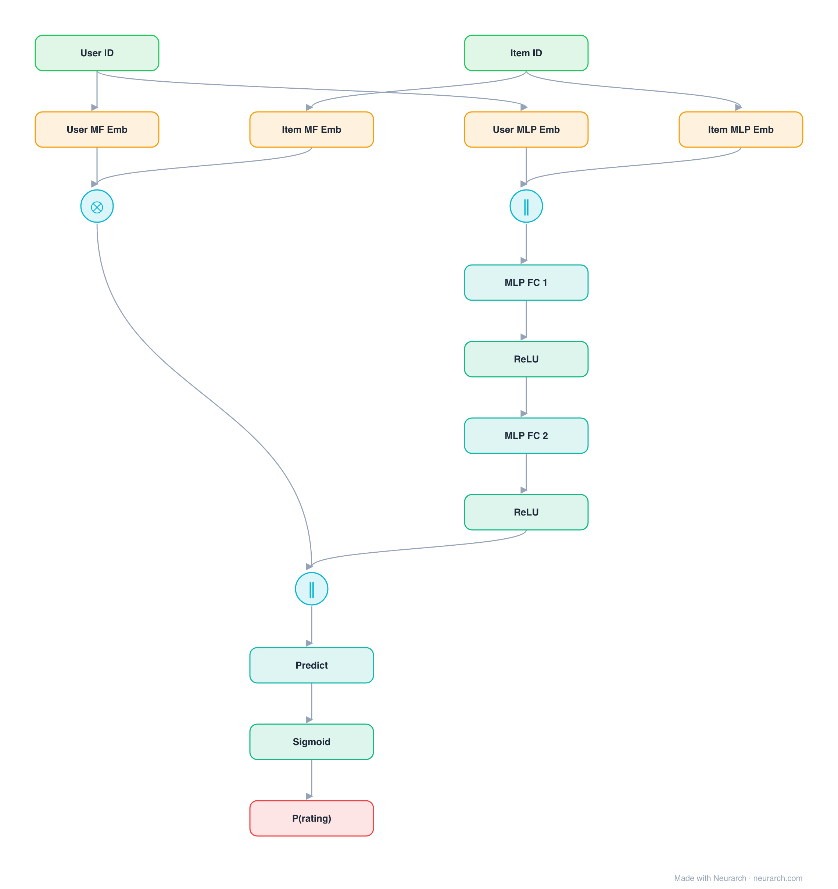

# Architecture: NeuMF (GMF + MLP)

## Motivation

The full NCF model: a Generalized Matrix Factorization path (element-wise product of embeddings) fused with an MLP path, each with its own embedding tables, joined before the final score.

## Core Idea

The full NCF model: a Generalized Matrix Factorization path (element-wise product of embeddings) fused with an MLP path, each with its own embedding tables, joined before the final score.

## Architecture

### Overview

<b>Layer-by-layer (16 nodes)</b>

| # | Layer | Type | Params |
|---|---|---|---|
| 1 | User ID | `input` | shape: [1] |
| 2 | Item ID | `input` | shape: [1] |
| 3 | User MF Emb | `embedding` | vocabSize: 100000, embeddingDim: 32 |
| 4 | Item MF Emb | `embedding` | vocabSize: 1000000, embeddingDim: 32 |
| 5 | User MLP Emb | `embedding` | vocabSize: 100000, embeddingDim: 64 |
| 6 | Item MLP Emb | `embedding` | vocabSize: 1000000, embeddingDim: 64 |
| 7 | GMF (⊙) | `multiply` |   |
| 8 | Concat | `concatenate` | axis: -1 |
| 9 | MLP FC 1 | `linear` | inFeatures: 128, outFeatures: 64 |
| 10 | ReLU | `relu` |   |
| 11 | MLP FC 2 | `linear` | inFeatures: 64, outFeatures: 32 |
| 12 | ReLU | `relu` |   |
| 13 | Fuse GMF+MLP | `concatenate` | axis: -1 |
| 14 | Predict | `linear` | inFeatures: 64, outFeatures: 1 |
| 15 | Sigmoid | `sigmoid` |   |
| 16 | P(rating) | `output` |   |

This graph ships in Neurarch's in-app template library; the copy here passes shape propagation with zero errors.

### Design Notes

- Two separate embedding sets, one per path, concatenated at the last layer: the structural detail most reimplementations get wrong.
- GMF preserves the classic MF inductive bias while the MLP path adds flexibility; the fusion is the paper's actual headline model.

## Design Decisions

> **Analysis** — Observations derived from studying the architecture.

- Two separate embedding sets, one per path, concatenated at the last layer: the structural detail most reimplementations get wrong.
- GMF preserves the classic MF inductive bias while the MLP path adds flexibility; the fusion is the paper's actual headline model.

## Implementation Notes

- `model.json` contains the full structural graph with real dimensions and parameters.
- Open in [Neurarch](https://www.neurarch.com/) to visualize, edit, or export training code.
- Diagrams fold repeated identical blocks with a `× N` badge; `model.json` holds all nodes at real dimensions.

## Limitations

- This package focuses on the architectural structure. Training pipelines, 
dataset preparation, and production optimizations are out of scope.

## Evolution

> See `references/related/` for predecessor and successor architectures.

