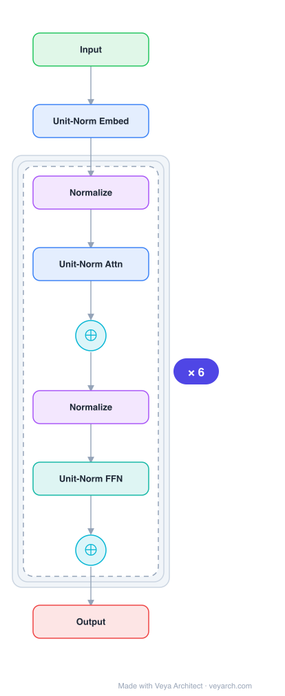

# Architecture: nGPT (Normalized Transformer)

## Motivation

The Transformer architecture is the foundation for most modern language models. An enormous number of modifications have been proposed to improve training stability, inference costs, context length, and robustness. Various normalization techniques (LayerNorm, RMSNorm) and weight decay have been applied, but there is growing evidence that representation learning on the hypersphere is associated with more stable training, greater embedding space separability, and better downstream performance. Prior work also suggests that transformers implicitly perform gradient descent as meta-optimizers.

## Core Idea

A novel architecture where all vectors forming embeddings, MLP, attention matrices, and hidden states are unit-norm normalized. The input stream of tokens travels on the surface of a hypersphere, with each layer contributing a displacement towards the target output predictions. These displacements are defined by MLP and attention blocks whose vector components also reside on the same hypersphere. This reduces training steps by 4-20× depending on sequence length.

## Architecture

### Overview

<b>Layer-by-layer (9 nodes)</b>

| # | Layer | Type | Params |
|---|---|---|---|
| 1 | Input | `input` |  |
| 2 | Unit-Norm Embed | `embed` |  |
| 3 | Normalize | `norm` |  |
| 4 | Unit-Norm Attn | `attention` |  |
| 5 | ⊕ | `residual` |  |
| 6 | Normalize | `norm` |  |
| 7 | Unit-Norm FFN | `ffn` |  |
| 8 | ⊕ | `residual` |  |
| 9 | Output | `output` |  |

nGPT normalizes all components to unit norm, constraining the representation space to a hypersphere. Each layer performs a spherical linear interpolation (SLERP) between the current hidden state and the attention/MLP outputs, controlled by learnable "eigen learning rates" (αA for attention, αM for MLP). The hidden state evolves as a sequence of displacements on the hypersphere surface.

### Components

1. **Normalized Embeddings** — All token embeddings are unit-norm normalized to the hypersphere surface.

2. **Normalized Attention** — Attention matrices (WQ, WK, WV, WO) are normalized along their embedding dimension after each batch pass. The attention output is normalized: `hA ← Norm(ATTN(h))`.

3. **Normalized MLP** — MLP weight matrices are normalized. The MLP output is normalized: `hM ← Norm(MLP(h))`.

4. **Eigen Learning Rates** — Learnable vectors αA (attention) and αM (MLP) that control the displacement magnitude at each layer. The hidden state update is: `h ← Norm(h + α(h_block − h))`, which is a SLERP-like interpolation on the hypersphere.

5. **Logit Scaling** — Since nGPT embeddings are normalized, logits (dot products) are bounded in [−1, 1]. A trainable scaling parameter sz adjusts the confidence (temperature) of the softmax distribution.

### Data Flow

1. **Input**: Token → normalized embedding (unit norm on hypersphere)
2. **Per layer (×L)**:
   - Attention: `hA ← Norm(ATTN(h))` — compute attention with normalized weights
   - Update: `h ← Norm(h + αA(hA − h))` — SLERP-like displacement towards attention output
   - MLP: `hM ← Norm(MLP(h))` — compute MLP with normalized weights
   - Update: `h ← Norm(h + αM(hM − h))` — SLERP-like displacement towards MLP output
3. **Output**: Normalized hidden state → scaled logits → softmax → token prediction

**Comparison with standard Transformer:**
| Standard Transformer | Normalized Transformer (nGPT) |
|---|---|
| `hA ← ATTN(RMSNorm(h))` | `hA ← Norm(ATTN(h))` |
| `h ← h + hA` | `h ← Norm(h + αA(hA − h))` |
| `hM ← MLP(RMSNorm(h))` | `hM ← Norm(MLP(h))` |
| `h ← h + hM` | `h ← Norm(h + αM(hM − h))` |
| Final: `h ← RMSNorm(h)` | All params normalized after each batch |
| Unconstrained parameters | All matrices/embeddings normalized |

### State / Memory

- **No explicit memory mechanism**: nGPT is a feedforward architecture without recurrent state.
- **KV cache**: Standard Transformer KV cache for autoregressive generation, but with normalized keys and values.
- **Eigen learning rates (αA, αM)**: Per-layer learnable parameters that control how much each layer displaces the hidden state. These are persistent model parameters, not runtime state.

## Design Decisions

1. **Hypersphere normalization** — Constraining all representations to the unit hypersphere provides:
   - More stable training (bounded representations)
   - Greater embedding space separability
   - Better downstream task performance

2. **SLERP-like updates** — Instead of additive residuals (`h ← h + block(h)`), nGPT uses interpolation (`h ← Norm(h + α(block(h) − h))`), which is a spherical linear interpolation on the hypersphere. This ensures the hidden state remains on the hypersphere surface.

3. **Eigen learning rates** — The α parameters control the magnitude of each layer's contribution, analogous to learning rates in gradient descent. This connects to the hypothesis that transformers perform implicit gradient descent.

4. **Logit scaling** — Normalized embeddings produce bounded logits [−1, 1], which limits softmax confidence. The trainable scaling parameter sz compensates for this, allowing the model to learn appropriate prediction confidence.

5. **Post-batch normalization** — All matrices and embeddings are normalized after each batch pass, maintaining the hypersphere constraint throughout training.

## Evolution

**Predecessors:**
- **Transformer** (Vaswani et al., 2017) — Base architecture.
- **LayerNorm** (Ba et al., 2016) — Normalization technique.
- **RMSNorm** — Simplified normalization.
- **Weight decay** (Loshchilov & Hutter, 2019) — Weight norm control.
- **Hypersphere representation learning** (Wang & Isola, 2020) — Theoretical foundations.

**Successors:**
- Future normalized architectures exploring hypersphere representations.
- Architectures combining normalization with implicit gradient descent perspectives.

## Characteristics

| Property | Value |
|----------|-------|
| Year | 2024 |
| Authors | Loshchilov, Hsieh, Sun, Ginsburg (NVIDIA) |
| Category | DL/Transformer |
| Source Paper | `nGPT_Normalized_Transformer_with_Representation_Learning_on_Transformer_2025.md` |
| PaperVault Path | `DL-Architectures/01-transformers/nGPT_Normalized_Transformer_with_Representation_Learning_on_Transformer_2025.md` |

## Limitations

1. **Bounded logit range** — Normalized embeddings produce logits in [−1, 1], requiring the scaling parameter sz to achieve proper prediction confidence. This may limit the model's ability to express high-confidence predictions.

2. **Normalization overhead** — Post-batch normalization of all matrices and embeddings adds computational overhead.

3. **SLERP approximation** — The update rule `Norm(h + α(block(h) − h))` is an approximation of true SLERP, which may introduce inaccuracies at large displacement angles.

4. **Theoretical understanding** — While the connection to implicit gradient descent is hypothesized, the exact theoretical mechanism is not fully established.

5. **Scale limitations** — Experiments primarily at smaller scales; behavior at very large scale (100B+ parameters) is unverified.

## Implementation Notes

See `implementation/` for a minimal runnable implementation. Key details:
- Normalize all embeddings, attention matrices, MLP matrices to unit norm
- Hidden state update: `h ← Norm(h + α(block_output − h))` (SLERP-like)
- Learnable eigen learning rates αA (attention), αM (MLP) per layer
- Trainable logit scaling parameter sz
- Post-batch normalization of all parameters
- 4-20× faster convergence vs. standard Transformer
- All representations on hypersphere surface
- Connection to implicit gradient descent / meta-optimization

## Information Layers

- **Evidence:** Source paper available in `references/papers/` (Loshchilov et al., 2024, "nGPT: Normalized Transformer with Representation Learning on the Hypersphere")
- **Analysis:** nGPT's key insight is that constraining all representations to the hypersphere surface and using SLERP-like updates creates a more principled and stable training dynamic. The 4-20× faster convergence suggests that normalization removes much of the optimization difficulty in standard Transformers. The connection to implicit gradient descent (where each layer's displacement acts like a gradient step) provides a theoretical lens for understanding Transformer depth.
- **Hypothesis:** The hypersphere constraint may be a fundamental inductive bias for representation learning. The eigen learning rates α may reveal which layers contribute most to learning, providing insight into the role of depth. The SLERP update rule may be more principled than additive residuals, as it respects the geometry of the representation space.
