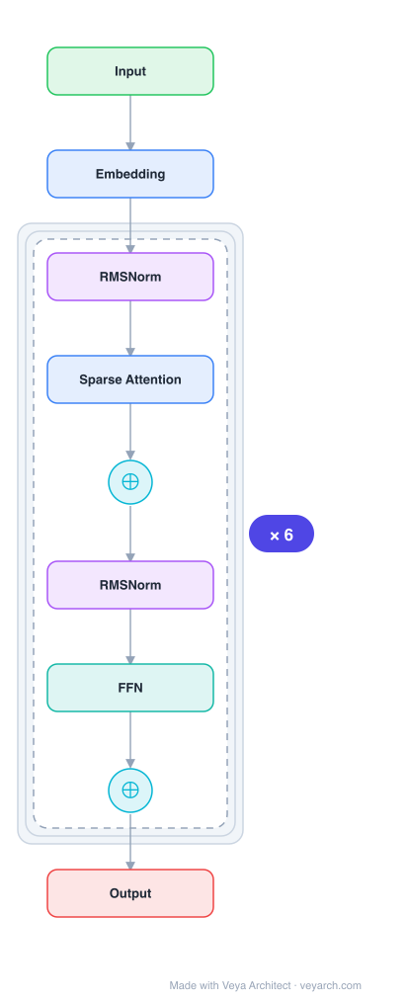

# Architecture: Native Sparse Attention (NSA)

## Motivation

Long-context modeling is crucial for next-generation language models, driven by diverse real-world applications ranging from in-depth reasoning and repository-level code generation to multi-turn autonomous agent systems. However, the high computational cost of standard attention mechanisms poses a significant bottleneck as sequence length increases. Theoretical estimates indicate that attention computation with softmax architectures accounts for 70–80% of total latency when decoding 64k-length contexts.

Existing sparse attention methods suffer from two critical limitations: (1) **Phase-restricted sparsity** — methods like H2O apply sparsity only during decoding while requiring expensive pre-processing during prefilling, or vice versa (MInference); (2) **Inference-only sparsity** — most methods apply sparsity post-hoc to a pretrained Full Attention backbone, introducing architectural bias and degrading performance. Additionally, many methods use non-trainable components (e.g., k-means clustering, SimHash) that prevent gradient flow, or use token-granular selection that causes non-contiguous memory access incompatible with FlashAttention.

NSA was designed to address all of these limitations simultaneously: hardware-aligned inference speedup and training-aware algorithm design in a natively trainable sparse attention mechanism.

## Core Idea

Hardware-aligned sparse attention with trainable compression and selection for efficient long-context LLMs.

## Architecture

### Overview



<details>
<summary><b>Layer-by-layer (9 nodes)</b></summary>

| # | Layer | Type | Params |
|---|---|---|---|
| 1 | Input | `input` |  |
| 2 | Embedding | `embed` |  |
| 3 | RMSNorm | `norm` |  |
| 4 | Sparse Attention | `attention` |  |
| 5 | ⊕ | `residual` |  |
| 6 | RMSNorm | `norm` |  |
| 7 | FFN | `ffn` |  |
| 8 | ⊕ | `residual` |  |
| 9 | Output | `output` |  |

</details>
NSA reduces per-query computation by organizing keys and values into temporal blocks and processing them through **three parallel attention branches**: compressed coarse-grained tokens (compression), selectively retained fine-grained token blocks (selection), and sliding windows for local context. The outputs of these three branches are combined via learned gates. The entire mechanism is natively trainable — sparsity is learned during pretraining rather than applied post-hoc, enabling end-to-end training with full gradient flow through the token selection process.

Formally, NSA replaces the original key-value pairs `k_{:t}, v_{:t}` with a compact, information-dense set of representation key-value pairs `K̃_t, Ṽ_t` constructed dynamically based on the current query `q_t`:

```
o*_t = Σ_{c∈C} g_{tc} · Attn(q_t, K̃_{tc}, Ṽ_{tc})
```

where `C = {cmp, slc, win}` represents compression, selection, and sliding window strategies, and `g_{tc} ∈ [0,1]` is a learned gate score derived from input features via an MLP and sigmoid activation.

### Components

1. **Token Compression Branch** — Aggregates sequential blocks of keys/values into block-level representations. The compressed key representation is defined as: `K̃_t^{cmp} = φ^{cmp}(k_{id+1:id+l})` for `1 ≤ i ≤ (t-l)/d`, where `l` is the block length, `d` is the sliding stride between adjacent blocks, and `φ` is a learnable MLP with intra-block position encoding mapping keys in a block to a single compressed key. Usually `d < l` to mitigate information fragmentation. Compressed representations capture coarse-grained higher-level semantic information and reduce computational burden.

2. **Token Selection Branch** — Selectively preserves the most relevant individual token blocks for fine-grained information. Uses **blockwise selection** motivated by hardware efficiency (continuous block accesses achieve higher GPU throughput than random reads; blockwise computation enables Tensor Core utilization) and the inherent distribution of attention scores (neighboring keys tend to share similar importance levels). Importance scores are computed for each block, and the top-n blocks are selected for attention computation.

3. **Sliding Window Branch** — Processes local contextual information via a sliding window attention pattern, ensuring nearby tokens are always attended to regardless of the compression or selection results.

4. **Gated Output Combination** — The outputs of the three branches are combined via learned gates `g_{tc}`: `o*_t = Σ g_{tc} · Attn(q_t, K̃_{tc}, Ṽ_{tc})`. The gates are derived from input features through an MLP with sigmoid activation, allowing the model to dynamically weight different attention strategies per query.

5. **Hardware-Optimized Kernels** — Specialized Triton kernels optimize blockwise sparse attention for Tensor Core utilization and memory access, ensuring balanced arithmetic intensity. This converts theoretical computation reductions into actual speed improvements.

### Data Flow

1. **Input**: Query token `q_t` and preceding keys/values `k_{:t}, v_{:t}` enter the NSA mechanism.
2. **Compression path**: Keys/values are split into temporal blocks of length `l` with stride `d`, each block compressed via a learnable MLP into a single representation. Compressed attention scores are computed against `q_t`.
3. **Selection path**: Keys/values are divided into selection blocks. Block-level importance scores are computed (using compressed attention scores as proxies). The top-n most important blocks are selected, and fine-grained attention is computed only over these selected blocks.
4. **Sliding window path**: Local attention is computed over a sliding window of recent tokens.
5. **Gated combination**: The three branch outputs are combined via learned gates `g_{tc}` to produce the final output `o*_t`.
6. **Hardware execution**: Specialized kernels execute the blockwise sparse computation with balanced arithmetic intensity, maximizing Tensor Core utilization and minimizing memory access overhead.

### State / Memory

- **KV-cache sparsity**: NSA maintains a high sparsity ratio by ensuring the total number of remapped keys/values `N_t` is much less than `t` (sequence length), directly reducing KV-cache memory requirements.
- **No additional persistent state**: NSA does not introduce recurrent state; it is a drop-in replacement for standard attention within Transformer layers.
- **Gating state**: The learned gates `g_{tc}` are computed per-query from input features, providing dynamic per-query routing without persistent memory.

## Design Decisions

1. **Natively trainable (not post-hoc)** — Unlike most sparse attention methods that apply sparsity to a pretrained Full Attention backbone, NSA is trained with sparsity from the start. This avoids the architectural bias introduced by post-hoc pruning and allows the model to learn optimal sparse patterns during pretraining. This is motivated by the finding that top 20% attention only covers 70% of total attention scores in pretrained models, making retrieval heads vulnerable to pruning.

2. **Three-branch hierarchical design** — Compression (coarse global patterns), selection (fine-grained important tokens), and sliding window (local context) address complementary needs. No single branch suffices: compression alone loses fine-grained information, selection alone misses global structure, and sliding window alone cannot capture long-range dependencies.

3. **Blockwise selection (not token-granular)** — Chosen for two reasons: (a) hardware efficiency — modern GPUs exhibit significantly higher throughput for continuous block accesses vs. random index-based reads, and blockwise computation enables optimal Tensor Core utilization; (b) attention score distribution — prior work shows attention scores exhibit spatial continuity, meaning neighboring keys tend to share similar importance levels.

4. **Hardware-aligned algorithm design** — Optimized for balanced arithmetic intensity (the ratio of compute operations to memory accesses). Training and prefilling are compute-bound (high arithmetic intensity), so reducing computation is the goal. Auto-regressive decoding is memory-bandwidth constrained (low arithmetic intensity), so reducing memory access is the goal. NSA addresses both phases.

5. **Compatibility with MQA/GQA** — Designed to work with Multiple-Query Attention (MQA) and Grouped-Query Attention (GQA), which share KV across multiple query heads. Unlike methods where each head independently selects KV-cache subsets (causing high memory access in GQA), NSA's blockwise design aligns with shared-KV architectures.

6. **End-to-end trainable operators** — All components (compression MLP, selection scoring, gating) are differentiable, enabling stable end-to-end training with gradient flow through the token selection process. This contrasts with methods using k-means clustering or SimHash that create discontinuities in the computational graph.

## Evolution

**Predecessors:**
- **Full Attention (Vaswani et al., 2017)** — The standard `O(n²)` attention mechanism whose quadratic cost motivates sparse alternatives.
- **H2O (Zhang et al., 2023)** — KV-cache eviction during autoregressive decoding, but requires expensive pre-processing during prefilling (phase-restricted).
- **Quest (Tang et al., 2024)** — Blockwise KV-cache selection, but each head independently selects, causing high memory access in GQA models.
- **FlashAttention** — Established block-based design as a fundamental principle in high-performance attention implementation; NSA adopts this principle for blockwise selection.
- **ClusterKV / MagicPIG** — Use non-trainable components (k-means, SimHash) that prevent gradient flow; NSA avoids this.

**Successors:**
- NSA represents a direction toward natively sparse LLMs; future work may explore more sophisticated compression/selection strategies and extend native sparsity to additional architectural components beyond attention.

## Characteristics

| Property | Value |
|----------|-------|
| Year | 2025 |
| Authors | Gao et al. |
| Category | DL/Transformer |
| Source Paper | `Native_Sparse_Attention_Gao_Dai_Luo_etal_2025.md` |
| PaperVault Path | `DL-Architectures/01-transformers/Native_Sparse_Attention_Gao_Dai_Luo_etal_2025.md` |

## Limitations

1. **Block size and stride hyperparameters** — The compression block length `l` and stride `d` are fixed hyperparameters that must be chosen carefully. Suboptimal choices could either lose important fine-grained information (too aggressive compression) or fail to achieve sufficient sparsity (too conservative).

2. **Top-n selection threshold** — The number of blocks selected in the selection branch is a fixed hyperparameter; different queries or sequence positions may benefit from different selection budgets, but NSA uses a uniform threshold.

3. **Kernel implementation complexity** — The specialized Triton kernels require careful implementation for specific hardware (A100 GPUs in the paper). Porting to other hardware platforms may require significant engineering effort.

4. **Pretraining cost** — While NSA reduces pretraining computation relative to Full Attention, it still requires pretraining from scratch with the sparse mechanism, which is computationally expensive (27B-parameter backbone, 260B tokens in experiments).

5. **Approximation of Full Attention** — Despite matching or exceeding Full Attention on benchmarks, the sparse approximation may miss rare but critical attention patterns not captured by the three-branch design, particularly for tasks with unusual attention distributions.

## Implementation Notes

See `implementation/` for a minimal runnable implementation.

Key implementation details from the paper:
- Pretraining: 27B-parameter Transformer backbone, 260B tokens
- Evaluation: general language benchmarks, long-context tasks (LongBench), chain-of-thought reasoning
- Kernel speedup measured on A100 GPUs with optimized Triton implementations
- Speedups on 64k-length sequences: 11.6× (decoding), 9.0× (forward), 6.0× (backward) vs. Full Attention
- Three branches: compression (MLP with intra-block position encoding), selection (blockwise top-n), sliding window
- Gates: MLP + sigmoid, per-query dynamic routing
- Blockwise computation for Tensor Core utilization and FlashAttention compatibility

## Information Layers

- **Evidence:** Source paper available in `references/papers/` — all architectural details (three-branch design, compression/selection formulas, gating mechanism, kernel optimizations, experimental setup) are directly stated in the paper.
- **Analysis:** NSA's key insight is that effective sparse attention requires simultaneously addressing hardware alignment (balanced arithmetic intensity, blockwise computation for Tensor Cores) and training-awareness (natively trainable, differentiable operators). The three-branch hierarchical design (compression + selection + sliding window) captures complementary attention patterns that no single strategy can address alone.
- **Hypothesis:** The native training approach suggests that models pretrained with sparsity from the start learn fundamentally different (and more sparsity-compatible) attention patterns than post-hoc pruned models. Whether even more aggressive sparsity ratios become viable with larger-scale pretraining remains an open question.
