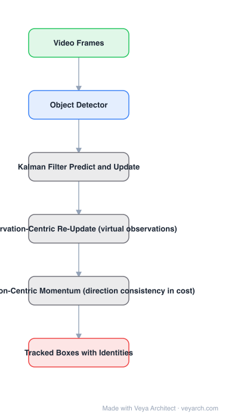

# Architecture: OC-SORT

## Motivation

SORT is *estimation-centric*. Three consequences the paper identifies: (1) it is sensitive to noise in the Kalman state estimate, (2) while a track is untracked the filter keeps predicting from its own state, so **error accumulates very fast** — a re-associated track is often lost again immediately, and (3) with modern detectors the *observation* has lower variance than the filter's propagated state, yet SORT prefers its own estimates. Occlusion and non-linear motion are where this shows up.

## Core Idea

Make the tracker **observation-centric**: **ORU** (observation-centric re-update) heals accumulated error after a track is lost, by generating *virtual observations* along the gap between the last-seen observation and the one that re-activates the track; **OCM** (observation-centric momentum) adds direction consistency to the association cost, computed from observations rather than filter velocity.

## Architecture

### Overview

<b>Layer-by-layer (6 nodes)</b>

| # | Layer | Type | Params |
|---|---|---|---|
| 1 | Video Frames | `input` |  |
| 2 | Object Detector | `conv2d` |  |
| 3 | Kalman Filter Predict and Update | `custom` |  |
| 4 | Observation-Centric Re-Update (virtual observations) | `custom` |  |
| 5 | Observation-Centric Momentum (direction consistency in cost) | `custom` |  |
| 6 | Tracked Boxes with Identities | `output` |  |

### Components

1. **Object detector** — supplies observations (boxes) per frame.
2. **Kalman filter** — the standard constant-velocity predict/update used by SORT.
3. **ORU (observation-centric re-update)** — a third stage beyond predict/update: when a track is re-activated after being untracked, virtual observations are interpolated between the last-seen observation and the re-activating one, and the filter is re-run over them to remove accumulated error.
4. **OCM (observation-centric momentum)** — the association cost matrix includes a direction-consistency term computed from observation-to-observation directions, because the linear-motion assumption is reliable in *direction* even when velocity magnitude is noisy.
5. **Online association** — still frame-by-frame, no batch or future frames.

### Data Flow

Frame → detections → Kalman predict → association with OCM cost → update → (if a track was lost and is re-activated) ORU re-update with virtual observations → tracks with identities.

### State / Memory

Per-track Kalman state plus the last-seen observation. ORU additionally uses the stored last-seen observation as an anchor, so keeping it is required by the design.

## Design Decisions

- **Diagnose before designing** — the three SORT limitations are stated and analysed, which is what motivates both modules.
- **Heal, do not just predict (ORU)** — the failure is accumulated error during the untracked interval, so the fix must act on that interval.
- **Use observations for momentum (OCM)** — filter velocity is too noisy, but observation-to-observation direction is consistent under the linear-motion assumption.
- **Stay simple, online, real-time** — no appearance network, no batch processing; the design constraint is explicit.

## Evolution

- **SORT (2016)** (predecessor): Kalman + IoU association.
- **DeepSORT (2017)**: adds appearance features, keeping SORT's estimation-centric filter.
- **OC-SORT (2022)**: ORU + OCM, fixing the filter side rather than adding appearance.
- **Siblings**: ByteTrack (recovers low-score boxes), BoT-SORT (camera-motion compensation).
- **Successors**: Deep OC-SORT (adds adaptive re-identification on top).

## Characteristics

| Property | Value |
|---|---|
| Task | multi-object tracking (online, real-time) |
| Motion model | Kalman filter (constant velocity) |
| New modules | ORU (re-update) + OCM (momentum in cost) |
| Appearance model | none |
| Target failure mode | occlusion and non-linear motion |

## Limitations

- Still no appearance model, so identity switches remain possible for visually similar, crossing objects.
- OCM assumes roughly linear motion direction; strongly non-linear trajectories degrade it.
- ORU needs the last-seen observation to be correct; a wrong pre-occlusion box anchors the virtual trajectory badly.
- Depends on detector quality like every tracking-by-detection method.

## Implementation Notes

Essentials: (1) keep standard SORT predict/update and add ORU as a *third* stage triggered only on re-activation, (2) generate virtual observations by interpolating between the last-seen and re-activating observations and re-run the filter over that gap, (3) add OCM as an extra term in the association cost, computed from observation directions not filter velocity, (4) store the last-seen observation per track — ORU cannot work without it, (5) evaluate on occlusion-heavy sequences specifically; average MOTA hides the improvement this method targets.
