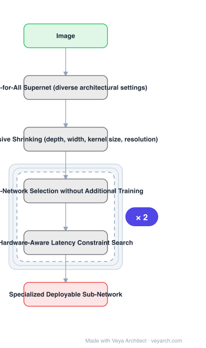

# Architecture: Once-for-All Network

## Motivation

Efficient inference must work across many devices and resource constraints, especially on edge devices. Conventional approaches either manually design or use NAS to find a specialized network and **train it from scratch for each case**, which is computationally prohibitive — the paper cites \(CO_2\) emission as much as 5 cars' lifetime — and therefore unscalable. The need is real: the optimal architecture varies significantly with hardware, and even on the same hardware it differs under different battery conditions or workloads.

## Core Idea

**Decouple training and search.** Train a **once-for-all (OFA) network** that supports diverse architectural settings; then a specialized sub-network is obtained quickly by **selecting** from it, **without additional training**. To make training such a network feasible, a novel **progressive shrinking** algorithm is proposed — a generalized pruning method that reduces model size across far more dimensions than pruning does.

## Architecture

### Overview

<b>Layer-by-layer (6 nodes)</b>

| # | Layer | Type | Params |
|---|---|---|---|
| 1 | Image | `input` |  |
| 2 | Once-for-All Supernet (diverse architectural settings) | `custom` |  |
| 3 | Progressive Shrinking (depth, width, kernel size, resolution) | `custom` |  |
| 4 | Sub-Network Selection without Additional Training | `custom` |  |
| 5 | Hardware-Aware Latency Constraint Search | `custom` |  |
| 6 | Specialized Deployable Sub-Network | `output` |  |

### Components

1. **OFA supernet** — one network supporting diverse architectural settings; trained once.
2. **Progressive shrinking** — the training algorithm; a generalized pruning method that reduces model size across **depth, width, kernel size, and resolution** — many more dimensions than ordinary pruning.
3. **Sub-network selection** — picking from the OFA network under a latency constraint, with no additional training.
4. **Hardware-aware search** — selection is guided by **measured latency** on the target device, not a proxy.
5. **Deployable sub-network** — the output, one of over \(10^{19}\) possible sub-networks.

### Data Flow

Train once: OFA supernet trained with progressive shrinking across depth, width, kernel size and resolution. Deploy many: for each target device and latency constraint, search selects a sub-network from the supernet → specialized model deployed with no retraining.

### State / Memory

No recurrent state. The object of interest is the supernet/sub-network relationship: one set of trained weights from which many architectures are extracted.

## Design Decisions

- **Decouple training from search** — the central move; it is what removes the per-case retraining cost.
- **Shrink progressively rather than prune once** — progressive shrinking is described as reducing across more dimensions than pruning, and it is what makes the very large design space trainable.
- **Cover four dimensions** — depth, width, kernel size and resolution, which is why the sub-network count reaches \(10^{19}\).
- **Search under measured latency** — the reported speedups are w.r.t. measured latency, not FLOPs.
- **Maintain independently-trained accuracy** — the claim is that sub-networks match training the same architecture independently.

## Evolution

- **Manual lightweight design** (predecessor).
- **Neural architecture search** (predecessor): finds a specialized network then trains from scratch.
- **Pruning** (predecessor): reduces model size, but over fewer dimensions.
- **Once-for-All (2019)**: train one supernet, specialize by selection; progressive shrinking.
- **Siblings**: Slimmable, BranchyNet, MobileNetV3 (the comparison point).
- **Contrast**: per-case NAS trained from scratch — the unscalable baseline.

## Characteristics

| Property | Value |
|---|---|
| Task | efficient inference across diverse devices |
| Method | decouple training and search |
| Training | progressive shrinking (depth, width, kernel size, resolution) |
| Sub-networks | > \(10^{19}\), no additional training |
| vs MobileNetV3 | +4.0% ImageNet top-1, or same accuracy 1.5× faster |
| vs EfficientNet | 2.6× faster at same accuracy (measured latency) |
| Mobile SOTA | 80.0% ImageNet top-1 under <600M MACs |

## Limitations

- Training the supernet with progressive shrinking is itself expensive, though amortized over many deployments.
- The \(10^{19}\) figure is a design-space size, not a count of verified-good sub-networks.
- Sub-network accuracy parity is claimed relative to independent training, but edge cases may regress.
- Latency-guided search requires on-device measurement, so results are device-specific.

## Implementation Notes

Essentials: (1) **decouple training and search** — the entire cost argument rests on this; training per deployment case is the unscalable baseline being replaced, (2) train with **progressive shrinking**, and shrink across all four dimensions (depth, width, kernel size, resolution) rather than pruning along one; the wide dimension coverage is what yields the very large sub-network space, (3) select sub-networks **without any additional training** — if finetuning is needed, the decoupling benefit is lost, (4) guide selection by **measured latency on the target device**, since the reported 1.5×/2.6× speedups are measured-latency figures and a FLOP-based proxy will not reproduce them, (5) verify sub-network accuracy against independently trained models of the same architecture, because parity with independent training is the stated accuracy claim.
