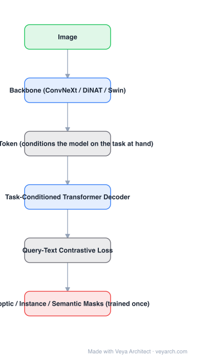

# Architecture: OneFormer

## Motivation

Panoptic architectures did not actually unify segmentation: to get the best numbers you still had to train one model per task (semantic, instance, panoptic), paying three training runs and keeping three models. A truly universal framework should be **trained once** and match or beat the specialists — which requires the model to know which task it is doing inside a single multi-task process.

## Core Idea

Three ingredients: a **task-conditioned joint training strategy** that consumes all three ground-truth types in one process; a **task token** that conditions the model on the task at hand (making it task-dynamic at train and test); and a **query-text contrastive loss** that sharpens inter-task and inter-class distinctions.

## Architecture

### Overview

<b>Layer-by-layer (6 nodes)</b>

| # | Layer | Type | Params |
|---|---|---|---|
| 1 | Image | `input` |  |
| 2 | Backbone (ConvNeXt / DiNAT / Swin) | `conv2d` |  |
| 3 | Task Token (conditions the model on the task at hand) | `custom` |  |
| 4 | Task-Conditioned Transformer Decoder | `attention` |  |
| 5 | Query-Text Contrastive Loss | `custom` |  |
| 6 | Panoptic / Instance / Semantic Masks (trained once) | `output` |  |

### Components

1. **Backbone** — ConvNeXt, DiNAT or Swin, supplying image features.
2. **Task token** — an input token that conditions the whole model on the current task; it is what allows one set of weights to produce semantic, instance or panoptic outputs.
3. **Task-conditioned transformer decoder** — queries attend to image features under the task conditioning.
4. **Query-text contrastive loss** — pulls query representations toward the right task/class text representation and away from others, giving better inter-task and inter-class separation.
5. **Single training process** — one run over the union of the three annotation types.

### Data Flow

Image → backbone features; task token → conditions decoder → task-conditioned transformer decoder → masks + classes for the requested task. Query-text contrastive loss supervises the query representations during training.

### State / Memory

No recurrent state. The task token is the conditioning input that replaces maintaining separate task-specific weights.

## Design Decisions

- **Train once on all three** — the definition of universality the paper insists on: separate per-task training is not unification.
- **Condition explicitly with a token** — the model must be task-dynamic, otherwise a single training run collapses the three output semantics together.
- **Contrast queries against text** — inter-task and inter-class confusions are the failure mode of multi-task training; the loss targets it directly.
- **Keep it backbone-agnostic** — reported with ConvNeXt and DiNAT as well as Swin.

## Evolution

- **FCN / Mask R-CNN** (task-specialized predecessors).
- **Panoptic architectures** (claimed unification, still trained per task).
- **MaskFormer / Mask2Former** (unified architecture, trained per task).
- **OneFormer (2022)**: multi-task train-once + task token + query-text contrastive loss.
- **Siblings**: SegFormer, Mask2Former, kMaX-DeepLab.
- **Successors**: X-Decoder, SEEM, SAM / SAM 2 (promptable, task-agnostic in a different sense).

## Characteristics

| Property | Value |
|---|---|
| Task | panoptic / instance / semantic — one model, trained once |
| Conditioning | task token (task-dynamic) |
| Training | task-conditioned joint training over all three GT types |
| Loss | query-text contrastive loss |
| Backbones | ConvNeXt, DiNAT, Swin |
| Result | one model beats per-task-specialized Mask2Former on ADE20K, Cityscapes, COCO |

## Limitations

- One joint training run is heavier per run than a single-task run, even though total compute is lower.
- The task token must be known at inference — the model does not infer the task from the image.
- Accuracy per task still depends on how much of each annotation type is in the training mixture.
- Image-only; video consistency needs a separate temporal model.

## Implementation Notes

Essentials: (1) feed the task token into the model at every relevant conditioning point, not just the decoder input, (2) sample ground truth from all three tasks within the same training loop and record which task each sample is — the joint strategy is the contribution, (3) implement the query-text contrastive loss over the query representations; without it inter-task confusion shows up as mixed output types, (4) evaluate all three tasks from the *same* checkpoint, (5) compare against per-task-specialized baselines at equal total training compute, since that is the claim being made.
