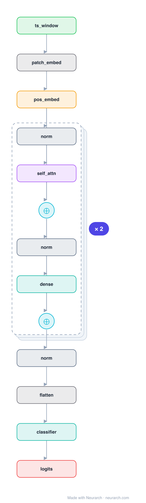

# Architecture: PatchTST

## Motivation

The Transformer that made long-horizon time-series forecasting work: each variable is sliced into patches (like ViT, but in time) and encoded channel-independently by a shared Transformer.

## Core Idea

The Transformer that made long-horizon time-series forecasting work: each variable is sliced into patches (like ViT, but in time) and encoded channel-independently by a shared Transformer.

## Architecture

### Overview

<b>Layer-by-layer (19 nodes)</b>

| # | Layer | Type | Params |
|---|---|---|---|
| 1 | ts_window | `input` | shape: [1, 22, 1000] |
| 2 | patch_embed | `patchEmbed` | patchSize: 16, stride: 8, embedDim: 128 |
| 3 | pos_embed | `positionalEncoding` | maxLen: 256, embedDim: 128 |
| 4 | norm | `layerNorm` | normalizedShape: 128 |
| 5 | self_attn | `multiHeadAttention` | embedDim: 128, numHeads: 16 |
| 6 | residual | `add` |   |
| 7 | norm | `layerNorm` | normalizedShape: 128 |
| 8 | dense | `feedForward` | embedDim: 128, ffDim: 256 |
| 9 | residual | `add` |   |
| 10 | norm | `layerNorm` | normalizedShape: 128 |
| 11 | self_attn | `multiHeadAttention` | embedDim: 128, numHeads: 16 |
| 12 | residual | `add` |   |
| 13 | norm | `layerNorm` | normalizedShape: 128 |
| 14 | dense | `feedForward` | embedDim: 128, ffDim: 256 |
| 15 | residual | `add` |   |
| 16 | norm | `layerNorm` | normalizedShape: 128 |
| 17 | flatten | `flatten` |   |
| 18 | classifier | `linear` | outFeatures: 4, inFeatures: NaN |
| 19 | logits | `output` |   |

This graph ships in Neurarch's in-app template library; the copy here passes shape propagation with zero errors.

### Design Notes

- Patching cuts sequence length quadratically for attention and gives each token local semantic content.
- Channel independence (one shared encoder applied per variable) beat channel-mixing on the standard long-horizon benchmarks.

## Design Decisions

> **Analysis** — Observations derived from studying the architecture.

- Patching cuts sequence length quadratically for attention and gives each token local semantic content.
- Channel independence (one shared encoder applied per variable) beat channel-mixing on the standard long-horizon benchmarks.

## Implementation Notes

- `model.json` contains the full structural graph with real dimensions and parameters.
- Open in [Neurarch](https://www.neurarch.com/) to visualize, edit, or export training code.
- Diagrams fold repeated identical blocks with a `× N` badge; `model.json` holds all nodes at real dimensions.

## Limitations

- This package focuses on the architectural structure. Training pipelines, 
dataset preparation, and production optimizations are out of scope.

## Evolution

> See `references/related/` for predecessor and successor architectures.

