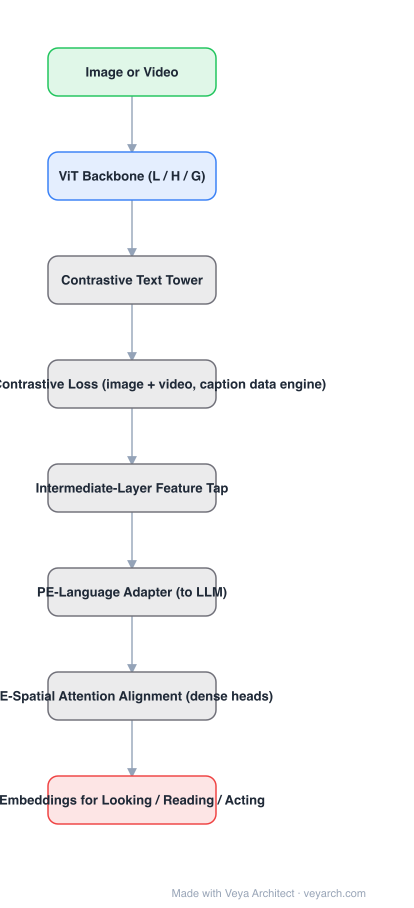

# Architecture: Perception Encoder (PE)

## Motivation

Visual encoders are usually pretrained with a stack of task-specific objectives — contrastive for retrieval, reconstruction/prediction for dense tasks, detection-style alignment for localization — because a single objective was believed insufficient for all downstream uses. PE's question: is that actually true, or does contrastive training already produce universally strong embeddings that we are simply reading from the wrong place?

## Core Idea

**Contrastive training suffices — if you know where to look.** Train a single contrastive core (PE-Core) on refined image-text data plus a large video corpus with a careful caption data engine. Then, instead of always taking the final output projection, read the network where each task's signal is strongest: **intermediate-layer features** for language alignment (PE-Language) and **attention-level representations** for dense spatial tasks (PE-Spatial). Task specialization moves into lightweight alignment heads on top of one shared core.

## Architecture

### Overview

<b>Layer-by-layer (8 nodes)</b>

| # | Layer | Type | Params |
|---|---|---|---|
| 1 | Image or Video | `input` |  |
| 2 | ViT Backbone (L / H / G) | `attention` |  |
| 3 | Contrastive Text Tower | `custom` |  |
| 4 | PE-Core Contrastive Loss (image + video) | `custom` |  |
| 5 | Intermediate-Layer Feature Tap | `custom` |  |
| 6 | PE-Language Adapter (→ LLM) | `custom` |  |
| 7 | PE-Spatial Attention Alignment (dense heads) | `custom` |  |
| 8 | Embeddings for Looking / Reading / Acting | `output` |  |

### Components

1. **ViT backbone** — image and video inputs through one tower; family sizes L, H, G (ViT-g class, ~1B).
2. **Contrastive core (PE-Core)** — refined image-text contrastive recipe, extended to video with a data engine mixing synthetic and human-annotated captions; this is the *only* pretraining objective.
3. **Text tower** — the contrastive partner; supplies the looking capability (zero-shot classification, retrieval).
4. **Intermediate-layer tap** — the empirical core of the paper: mid-layer features transfer better to language tasks than final outputs; dense tasks benefit from attention-level representations.
5. **PE-Language** — adapter aligning mid-layer features into an LLM's input space for document/image/video QA.
6. **PE-Spatial** — attention alignment training that equips the same core for detection, tracking, and depth; reaches SOTA COCO detection from a contrastive backbone.

### Data Flow

Image/video → ViT → per-layer features. Looking: final embeddings vs. text tower (contrastive, zero-shot). Reading: mid-layer features → adapter → LLM. Acting: attention-level features → dense heads (boxes, depth, tracks). All three read from the *same* pretrained core; only the alignment heads are task-specific.

### State / Memory

No recurrent state. Video is encoded clip-wise; the "shared state" of the system is the single contrastive core reused by all alignment heads.

## Design Decisions

- **One objective, many readouts** — contrastive pretraining only; task adaptation happens in where-you-tap + lightweight heads, not in pretraining.
- **Intermediate layers over outputs** — the output projection is optimized for the contrastive objective, which discards information other tasks need; middle layers preserve it.
- **Video as a first-class citizen** — the data engine (synthetic + human captions) exists because video captions are the bottleneck for contrastive scaling.
- **Attention for dense tasks** — dense prediction keys off attention-level representations rather than output features.

## Evolution

- **Predecessors**: CLIP/SigLIP (contrastive alignment), DINOv2 (self-supervised dense features), I-JEPA (predictive SSL) — PE claims the contrastive line, properly read, covers the others' strengths.
- **PE** (2025): unified looking/reading/acting encoder family; COCO 66.0 mAP from a contrastive core; open models and data engine released.
- **Contemporary**: DINOv3 — the self-supervised counterpart betting on Gram anchoring instead of contrastive training; the two bracket the current backbone design space.

## Characteristics

| Property | Value |
|---|---|
| Task | unified visual encoder: retrieval/classification, QA, dense prediction |
| Backbone | ViT-L / H / G (image + video) |
| Pretraining | contrastive only (image-text + video-caption engine) |
| Readout | intermediate layers (language), attention (spatial), output (looking) |
| Reported | IN robustness avg 86.6 (0-shot); K400 76.9 (0-shot); COCO 66.0 mAP; DocVQA 94.6 |

## Limitations

- Contrastive core still needs large captioned corpora; the video data engine is an engineering investment.
- Reading from intermediate layers complicates deployment (multi-tap feature extraction instead of one output).
- Spatial alignment heads remain task-trained; the core is shared but not the heads.
- No generative capability; purely an encoder family.

## Implementation Notes

Essentials: (1) train the core with contrastive loss only — resist adding reconstruction objectives, (2) probe *every layer* before choosing the tap point per task — mid-layer features typically beat outputs for language, attention-level representations for dense tasks, (3) build the caption data engine before scaling video, (4) keep task adapters lightweight so one core serves all heads. The layer-probing step is the cheapest, highest-leverage experiment in the whole recipe.

## Relevance to Veya

The most direct "**one general visual backbone**" candidate for Veya: a single PE core could simultaneously feed Veya-Depth (PE-Spatial path), Veya-Track (attention readout), and the language/command interface (PE-Language path). Its central finding — *where you tap a shared backbone matters as much as how you train it* — should be a standing rule for Veya's multi-head architecture: when one latent serves several heads, make the tap depth per head an explicit, probed design choice rather than defaulting to the final layer.
