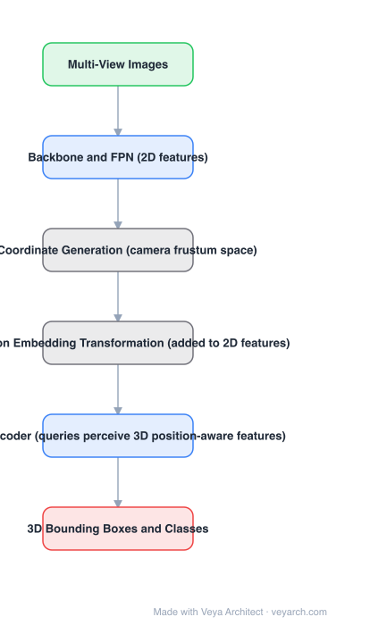

# Architecture: PETR

## Motivation

DETR3D made 3D multi-view detection end-to-end, but it kept an **online 2D-to-3D transformation**: each decoder layer predicts a 3D reference point, projects it into image space with camera parameters, and samples the 2D feature there. Three problems follow — an inaccurate reference point samples outside the object, sampling a single point misses global context, and the sampling procedure itself is awkward to deploy. The question PETR asks: can the 2D features be made 3D-aware *up front*, so no projection or sampling is needed at all?

## Core Idea

**Position embedding transformation**: generate 3D coordinates for the camera frustum space, encode them, and add them to the 2D image features. The features become **3D position-aware**, and the DETR decoder updates object queries directly in 3D. Borrowed from implicit neural representations, where MetaSR and LIFF encode HR coordinates into LR features.

## Architecture

### Overview

<b>Layer-by-layer (6 nodes)</b>

| # | Layer | Type | Params |
|---|---|---|---|
| 1 | Multi-View Images | `input` |  |
| 2 | Backbone and FPN (2D features) | `conv2d` |  |
| 3 | 3D Coordinate Generation (camera frustum space) | `custom` |  |
| 4 | 3D Position Embedding Transformation (added to 2D features) | `custom` |  |
| 5 | DETR Decoder (queries perceive 3D position-aware features) | `attention` |  |
| 6 | 3D Bounding Boxes and Classes | `output` |  |

### Components

1. **Backbone + FPN** — 2D multi-view image features (ResNet-class).
2. **3D coordinate generation** — for each view, points in the camera frustum space are converted to 3D coordinates using camera parameters.
3. **3D position embedding** — those coordinates are encoded and added to the 2D features, producing 3D position-aware features.
4. **DETR decoder** — object queries interact with the 3D-aware features and are updated in the 3D environment; no feature sampling at decoder layers.
5. **Detection head** — 3D boxes and classes.

### Data Flow

Multi-view images → backbone + FPN → 2D features; 3D frustum coordinates → 3D position embedding → added to features → DETR decoder over object queries → 3D boxes and classes.

### State / Memory

No recurrent state. The 3D position embedding is computed once per frame and added to the features — the entire 2D→3D transformation happens there, ahead of the decoder.

## Design Decisions

- **Move the transformation out of the decoder** — the failure mode is a predicted reference point, so removing the prediction removes the failure.
- **Encode coordinates, do not sample features** — implicit-representation style; sampling one point also loses global context, whereas the encoded features retain it.
- **Keep DETR unchanged otherwise** — the value is that this is a simple, strong baseline, not a new decoder.
- **Camera parameters still used** — but offline, for coordinate generation, not for per-query projection.

## Evolution

- **Monocular 3D detection** (predecessors): per-image detection then fusion.
- **DETR3D (2021)**: end-to-end, but with online 2D-to-3D projection and feature sampling.
- **PETR (2022)**: 3D position embedding instead of sampling.
- **Siblings**: BEVDepth (explicit depth supervision), BEVFormer (spatial-temporal attention), SparseBEV, StreamPETR.
- **Successors**: PETRv2 (temporal), StreamPETR (object-centric temporal).

## Characteristics

| Property | Value |
|---|---|
| Task | multi-view 3D object detection |
| Mechanism | 3D position embedding added to 2D features |
| Transformation | offline (frustum coordinates), none in the decoder |
| Decoder | standard DETR decoder |
| Results | 50.4% NDS, 44.1% mAP on nuScenes; 1st on the benchmark at publication |

## Limitations

- Still requires camera calibration to generate frustum coordinates.
- Position embedding is per-frame; no temporal modeling (PETRv2 adds it).
- Accuracy depends on the quality of the coordinate encoding — poorly calibrated cameras degrade it.
- Query-based detection has the usual fixed-query-count constraint in crowded scenes.

## Implementation Notes

Essentials: (1) generate 3D coordinates over the camera frustum and encode them into a position embedding — do not project reference points inside the decoder, (2) add the embedding to the 2D features before the decoder so every query sees 3D-aware features, (3) keep the DETR decoder standard; the paper's value is simplicity, (4) verify that removing the sampling step does not lose accuracy versus a DETR3D baseline, (5) calibrate carefully — coordinate generation assumes correct intrinsics/extrinsics.
