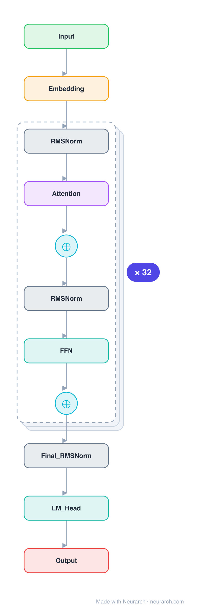

# Architecture: Phi-2

## Motivation

Microsoft's 2.7B "small model, textbook-quality data" flagship. Architecturally a GPT-NeoX-style parallel-residual decoder with partial rotary embeddings, included as the canonical example of the Phi data-over-scale thesis.

## Core Idea

Microsoft's 2.

## Architecture

### Overview

*Identical repeated blocks are folded into one representative block with a `× N` badge, so the whole architecture fits on screen. `model.json` uses a NAXS block template + `repeat` directive: the identical repeated layers are defined once and expand to all 197 nodes (open it in Neurarch to see and edit every layer). Vector: [diagram.svg](assets/diagram.svg).*

| Hyperparameter | Value |
|---|---|
| Type | Decoder-only transformer (causal LM) |
| Parameters | 2.78B |
| Layers | 32 |
| Hidden size | 2560 |
| Attention | Multi-head: 32 heads, head dim 80 |
| Block | Parallel residual (attention and MLP share one input) |
| FFN | Dense MLP, 10240, GeLU |
| Normalization | LayerNorm, pre-norm |
| Positions | Partial RoPE (40% of each head) |
| Vocabulary | 51,200 |
| Max context | 2,048 |

`model.json` is the full graph (repeated layers expressed via a NAXS block template + `repeat`), produced with the same import path the Neurarch app uses for "load from Hugging Face".

### Design Notes

- Parallel residual: attention and the MLP both read the same pre-norm input and their outputs are summed into the residual, so the two run side by side instead of in series (saves a norm, slightly faster).
- Partial RoPE: rotary embeddings are applied to only 40% of each 80-dim head; the rest is position-free, a GPT-NeoX inheritance.
- Plain dense GeLU MLP at 4x hidden, no GQA, no SwiGLU: the architecture is deliberately conventional. The Phi result is about data curation, not architecture.
- Untied input/output embeddings.

### Parameter Check

Neurarch's per-layer parameter estimate over this graph: **2.78B**.
Hugging Face safetensors metadata reports **2.78B** for the real weights.
Deviation from the authoritative count (2.78B): **-0.0%**.

## Design Decisions

> **Analysis** — Observations derived from studying the architecture.

- Parallel residual: attention and the MLP both read the same pre-norm input and their outputs are summed into the residual, so the two run side by side instead of in series (saves a norm, slightly faster).
- Partial RoPE: rotary embeddings are applied to only 40% of each 80-dim head; the rest is position-free, a GPT-NeoX inheritance.
- Plain dense GeLU MLP at 4x hidden, no GQA, no SwiGLU: the architecture is deliberately conventional. The Phi result is about data curation, not architecture.
- Untied input/output embeddings.

## Implementation Notes

- `model.json` contains the full structural graph with real dimensions and parameters, using a NAXS block template + `repeat` for the identical repeated layers.
- Open in [Neurarch](https://www.neurarch.com/) to visualize, edit, or export training code.
- Diagrams fold repeated identical blocks with a `× N` badge; `model.json` defines each repeated layer once at real dimensions and expands to all nodes.

## Limitations

- This package focuses on the architectural structure. Training pipelines, 
dataset preparation, and production optimizations are out of scope.

## Evolution

> See `references/related/` for predecessor and successor architectures.

