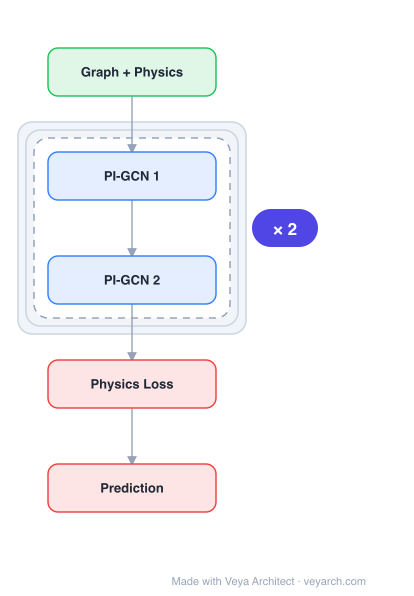

# Architecture: Physics-Informed GNN

## Motivation

Accurate, interpretable, and real-time modeling of multi-body dynamical systems is essential for predicting behaviors and inferring physical properties in natural and engineered environments. Traditional physics-based models face scalability challenges and are computationally demanding, while data-driven approaches like Graph Neural Networks (GNNs) often lack physical consistency, interpretability, and generalization.

Existing GNN-based dynamics models rely primarily on spatial inductive bias—representing components as nodes and interactions as edges via message passing (e.g., the Graph Neural Simulator). While symmetry-based inductive biases such as equivariance to 3D translations and rotations (EGNN, GMN, ClofNet) have advanced the field, these symmetries alone do not guarantee respect for fundamental conservation laws. Energy-conserving formulations (Hamiltonian/Lagrangian GNNs) underperform in non-conservative settings involving dissipation, external forcing, or constraints. Moreover, existing equivariant GNNs that can conserve linear momentum under certain architectural constraints often lose this property in practice when node features are incorporated into edge embeddings, leading to non-symmetric embeddings that violate force antisymmetry. Conserving angular momentum poses an even greater challenge, as non-central forces alter orbital angular momentum, requiring compensatory torques that are not explicitly modeled in prior architectures.

DYNAMI-CAL GRAPHNET addresses these gaps by embedding conservation of linear and angular momentum directly into the model architecture through Newton's third law at the level of internal pairwise interactions, enabling physically consistent predictions even under complex, non-central, and dissipative interactions.

## Core Idea

GNN with physics conservation laws built into architecture for physically consistent predictions.

## Architecture

### Overview

<b>Layer-by-layer (5 nodes)</b>

| # | Layer | Type | Params |
|---|---|---|---|
| 1 | Graph + Physics | `input` |  |
| 2 | PI-GCN 1 | `gcn_conv` |  |
| 3 | PI-GCN 2 | `gcn_conv` |  |
| 4 | Physics Loss | `loss` |  |
| 5 | Prediction | `output` |  |

DYNAMI-CAL GRAPHNET is a six-degree-of-freedom (6-DoF) equivariant GNN that predicts both internal forces and rotational torques through a structured scalarization-vectorization pipeline. The model represents dynamical systems as graphs where nodes encode position, linear velocity, and angular velocity, while bi-directional edges represent pairwise interactions.

The architecture consists of three key innovations: (1) edge-local reference frames that are equivariant to SO(3) rotations, invariant to T(3) translations, and antisymmetric under node exchange; (2) physically grounded vectorization that decodes edge embeddings into antisymmetric force vectors, angular interaction vectors, and predicted reference points; and (3) spatiotemporal message passing with sub-time stepping that enables edge embeddings to accumulate information across spatial neighbors and previous iterations.

The model uses only two blocks—an initialization block for the first step and a shared block reused for all subsequent steps—enabling multi-step rollout prediction with stable error accumulation.

### Components

- **Edge-local reference frames**: Each edge is assigned an orthonormal basis (a, b, c) that is SO(3)-equivariant, T(3)-invariant, and fully antisymmetric under node interchange. When the edge direction is reversed, all three basis vectors change signs, ensuring antisymmetry in all subsequent projections and derived interactions.

- **Scalarization module**: Node vector features (velocity, angular velocity) are projected onto the edge-local frames, yielding scalar components. These projected scalars are combined with scalar node and edge features to create invariant edge embeddings m_ij = m_ji, ensuring node-ordering invariance.

- **Vectorization decoder**: Edge embeddings are decoded into three physically meaningful channels: (i) antisymmetric internal force vectors F_ij = -F_ji (three scalar coefficients modulate the basis vectors); (ii) antisymmetric angular interaction vectors A_ij = -A_ji (total angular momentum exchange combining spin and orbital components); (iii) a predicted reference point x0_ij shared between both edge directions.

- **Spin torque isolation**: The spin torque is computed by subtracting the orbital contribution (cross product of internal force and relative position from the reference point) from the total angular interaction vector, yielding non-symmetric torques that update angular velocity.

- **Spatiotemporal message passing**: Decoded edge interaction vectors are aggregated at nodes, scaled by learned coefficients from scalar node embeddings, and integrated using implicit Euler stepping. Edge embeddings are retained as latent memory (Edge Memory) and used as skip connections for subsequent message-passing steps.

- **Boundary modeling**: A mesh-free, particle-free approach models interactions with boundaries (walls, floors, rigid enclosures) by representing boundaries as additional nodes with appropriate interaction properties.

### Data Flow

1. **Input**: Graph representation of the dynamical system state at time t—nodes carry position, linear velocity, and angular velocity; edges connect interacting components.
2. **Edge-local frame construction**: For each edge (i,j), construct an antisymmetric orthonormal basis that is SO(3)-equivariant and T(3)-invariant.
3. **Scalarization**: Project node vector features onto the edge-local frames, combine with scalar node/edge features to form invariant edge embeddings m_ij = m_ji.
4. **Force decoding**: Extract three scalar coefficients from each edge embedding to modulate the basis vectors, reconstructing antisymmetric 3D force vectors F_ij = -F_ji.
5. **Angular momentum decoding**: Extract scalar coefficients to construct antisymmetric angular interaction vectors A_ij = -A_ji; predict shared reference point x0_ij.
6. **Spin torque isolation**: Subtract orbital contribution (r_i - x0_ij) × F_ij from total angular interaction to obtain spin torque τ_ij.
7. **Node aggregation**: Aggregate decoded edge-wise forces and torques at connected nodes to obtain net force and torque per node.
8. **Velocity/position update**: Scale aggregated vectors using learned coefficients from scalar node embeddings; integrate using implicit Euler stepping to compute new positions and velocities.
9. **Edge memory update**: Retain edge embeddings as latent memory for skip connections in the next message-passing step.
10. **Iterate**: Repeat steps 2-9 for multiple sub-time steps within a single prediction interval, using the shared block.

### State / Memory

The architecture maintains **edge memory**—edge embeddings are retained as latent representations across message-passing steps and used as skip connections to inform edge embeddings in subsequent iterations. This enables spatiotemporal reasoning by accumulating both spatial context (from neighboring nodes) and temporal coherence (through interaction history across sub-time steps). The model uses two blocks: an initialization block for the first step and a shared block reused for all subsequent steps, with the edge memory evolving through each iteration.

## Design Decisions

- **Newtonian formulation over energy-based**: The paper deliberately chose Newtonian mechanics (vector forces/torques) over Hamiltonian/Lagrangian formulations because scalar energy potentials are less adaptable when energy is not conserved (dissipation, external forcing). Newton's third law naturally conserves linear and angular momentum even under non-conservative conditions.

- **Edge-local antisymmetric reference frames**: The fully antisymmetric basis (a, b, c all flip under node exchange) was chosen to overcome the limitation of ClofNet, whose basis is only partially antisymmetric (c_ij = c_ji), preventing strict momentum conservation. This ensures F_ij = -F_ji by construction.

- **Invariant edge embeddings**: By projecting vector features onto edge-local frames and combining with scalar features, edge embeddings satisfy m_ij = m_ji, unlike EGNN/GMN/ClofNet which incorporate node features hi, hj leading to non-symmetric embeddings.

- **Localized angular momentum conservation**: Rather than enforcing conservation globally about a fixed reference point, the model enforces it locally at each edge by anchoring interactions to a predicted reference point. This enables modular, fine-grained modeling and scales efficiently to large graphs.

- **Implicit Euler integration**: Chosen for stability in multi-step rollouts, preventing error accumulation over extended prediction horizons.

- **Sub-time stepping**: Multiple message-passing steps within a single prediction interval allow the model to capture dynamics at finer temporal resolution than the data sampling rate.

## Evolution

**Predecessors:**
- Graph Neural Simulator (GNS) — introduced spatial inductive bias for learning physical system dynamics via message passing
- E(n)-Equivariant GNN (EGNN) — scalarization-vectorization paradigm modulating relative position vectors with learned weights
- Graph Mechanics Networks (GMN) — extended EGNN with multiple geometric channels (position, velocity)
- ClofNet — introduced equivariant edge-local reference frames using projected geometric features
- Hamiltonian/Lagrangian GNNs — energy-conserving formulations that inspired physics-informed approaches
- Flux-GNN, Conservation-informed GNN — flux symmetry preservation for scalar PDEs

**Successors:**
- The framework is extensible to other physical conservation laws and can be adapted for systems with different interaction types (e.g., electromagnetic, gravitational)
- The mesh-free boundary modeling approach opens directions for modeling complex constrained systems

## Characteristics

| Property | Value |
|----------|-------|
| Year | 2025 |
| Authors | Sharma & Fink |
| Category | GNN/Architecture |
| Source Paper | `A_physics-informed_graph_neural_network_conserving_linear_Sharma_Fink_2025.md` |
| PaperVault Path | `GNN/03-gnn-architectures/A_physics-informed_graph_neural_network_conserving_linear_Sharma_Fink_2025.md` |

## Limitations

- The model is evaluated primarily on a 3D granular system with inelastic collisions; generalization to other physical domains (molecular dynamics, articulated motion) is demonstrated but limited in scope.
- The six-degree-of-freedom formulation increases model complexity compared to simpler scalar or position-only models.
- The antisymmetric reference frame construction and multi-channel vectorization introduce computational overhead relative to standard message-passing GNNs.
- The localized conservation formulation, while scalable, may not capture global conservation effects as precisely as global formulations in certain edge cases.
- Sub-time stepping increases the number of message-passing iterations, raising computational cost for long rollouts.
- The mesh-free boundary modeling is a simplification that may not capture all boundary interaction physics (e.g., friction, deformation).

## Implementation Notes

See `implementation/` for a minimal runnable implementation.

## Information Layers

- **Evidence:** Source paper available in `references/papers/`
- **Analysis:** DYNAMI-CAL GRAPHNET's key insight is that conservation laws can be embedded as structural biases rather than training-time soft constraints. The fully antisymmetric edge-local reference frame is the critical innovation that distinguishes it from ClofNet—ensuring both linear and angular momentum conservation by construction rather than approximation.
- **Hypothesis:** The localized edge-level conservation formulation may be sufficient for global conservation because antisymmetric forces and consistent reference points ensure pairwise cancellation, which aggregates to global conservation under symmetry-preserving aggregation. This suggests that conservation laws can be enforced locally without global coordination, enabling scalability.
