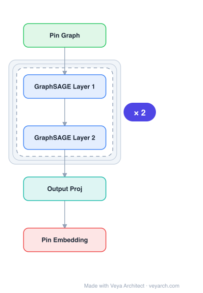

# Architecture: PinSage

## Motivation

Graph-structured data is essential for recommendation applications, as user-to-item relations and social graphs can be exploited for personalized recommendations. GCN-based methods have been successful on recommender system benchmarks, but they perform operations using the full graph Laplacian during training, which is problematic when there are billions of nodes and the graph structure is constantly evolving.

At Pinterest, the graph contains 3 billion nodes (pins and boards) and 18 billion edges—about 10,000x larger than typical GCN applications. Standard GCN approaches cannot scale to this size due to both computational complexity and memory requirements. The challenge is to apply GCN-based training and inference to graphs with billions of nodes and tens of billions of edges.

PinSage addresses this by leveraging random walks to generate node embeddings that incorporate both features and graph structure, using localized convolutions with importance-based neighbor sampling rather than full graph Laplacian operations.

## Core Idea

Web-scale graph convolution using random-walk-based neighbor sampling for Pinterest recommendation.

## Architecture

### Overview

<b>Layer-by-layer (5 nodes)</b>

| # | Layer | Type | Params |
|---|---|---|---|
| 1 | Pin Graph | `input` |  |
| 2 | GraphSAGE Layer 1 | `sage_conv` |  |
| 3 | GraphSAGE Layer 2 | `sage_conv` |  |
| 4 | Output Proj | `linear` |  |
| 5 | Pin Embedding | `output` |  |

PinSage is a GCN-based algorithm for web-scale recommendation that uses random-walk-based neighbor sampling to generate node embeddings. Instead of operating on the full graph Laplacian, PinSage samples neighborhoods through short random walks and uses the visit counts as importance scores to weight node features during convolution.

The model operates on the Pinterest bipartite graph (pins and boards), where pins have real-valued attributes (visual and text features). It uses localized convolutions with shared parameters across nodes, importance pooling based on random walk visit counts, curriculum training with increasingly hard negative examples, and a producer-consumer MapReduce pipeline for efficient computation at scale.

### Components

- **Importance-based neighbor sampling**: Instead of k-hop graph neighborhoods, PinSage starts random walks from node u and computes L1-normalized visit counts. The T most "influential" neighbors (highest visit counts) are selected, producing a set of weights α for importance pooling.

- **Localized convolution modules**: Convolutional modules share parameters across nodes. Each node's embedding is computed by a different network box, but parameters are shared among boxes with the same shading (same layer depth).

- **Importance pooling**: Uses the random walk visit count scores to weight node features during aggregation, providing a +46% improvement over unweighted pooling.

- **Loss function**: Maximizes inner product of positive examples (query q related to item i) while making inner product of negative examples smaller by a margin Δ. Uses 500 shared negative items per minibatch plus "hard" negatives (items with Personalized PageRank score in [2000, 5000]).

- **Curriculum training**: Gradually increases difficulty—first epoch uses no negative items, then at epoch n, n-1 hard negative items are used per item. This provides a +12% improvement.

- **MapReduce pipeline**: Producer-consumer minibatches for training; MapReduce-based node embedding computation for generating embeddings across the entire 3B-node graph.

- **Input features**: Each pin's features are a concatenation of visual embeddings (4096-D, 6th layer of VGG-16), textual embeddings (256-D, Word2Vec), and log-degree of the pin in the graph.

### Data Flow

1. **Input**: Pinterest bipartite graph (pins and boards, 3B nodes, 18B edges) with pin features (visual + text + degree).
2. **Neighbor sampling**: For each target node u, start random walks and compute L1-normalized visit counts. Select top-T most influential neighbors with weights α.
3. **Convolution layer 1**: Aggregate features from the T sampled neighbors, weighted by importance scores α, and combine with the node's own features.
4. **Convolution layer 2**: Repeat the sampling and aggregation process using the layer-1 representations as input, producing 2-level network embeddings.
5. **Training**: Use margin-based loss with 500 shared negatives + 6 hard negatives per pin per minibatch. Apply curriculum training (gradually add hard negatives).
6. **Inference at scale**: Use MapReduce pipeline to compute embeddings for the entire graph. Only train on a subset of the Pinterest graph, then generate embeddings for all nodes.
7. **Recommendation**: Compute nearest neighbors in embedding space for item recommendations.

### State / Memory

Stateless during inference—the model produces fixed embeddings per node. During training, the MapReduce pipeline maintains intermediate representations across layers. The graph structure is treated as static during a training/inference cycle, though in production the graph is constantly evolving, necessitating periodic re-computation of embeddings.

## Design Decisions

- **Random-walk-based sampling over full Laplacian**: Enables scaling to billions of nodes by avoiding the need to operate on the full graph Laplacian. The sampling approach also naturally handles the constantly evolving graph structure at Pinterest.

- **Importance pooling**: Using random walk visit counts as weights (rather than uniform aggregation) provides a +46% improvement by giving more weight to structurally important neighbors.

- **Curriculum training**: Gradually increasing negative sample difficulty (+12%) helps the model find a good region of parameter space before learning to distinguish between highly related and somewhat related items.

- **Shared negative sampling**: Using 500 negative items shared across all training examples in each minibatch approximates the normalization factor efficiently.

- **Hard negative mining**: Selecting items with Personalized PageRank score in [2000, 5000] as hard negatives focuses training on the most challenging examples.

- **MapReduce for inference**: Decoupling training (on a subset) from inference (on the full graph via MapReduce) enables web-scale deployment.

- **2-layer architecture**: A 2-level network balances expressiveness with computational efficiency at scale.

## Evolution

**Predecessors:**
- GCN (Kipf & Welling, 2017) — graph convolutional networks that PinSage scales to web
- DeepWalk (Perozzi et al., 2014) — random walk-based graph embedding
- node2vec (Grover & Leskovec, 2016) — biased random walks for network embedding
- GraphSAGE (Hamilton et al., 2017) — inductive representation learning with neighbor sampling
- Personalized PageRank — used for hard negative mining

**Successors:**
- PinSage demonstrated the feasibility of GCN-based recommendation at billion-scale, inspiring subsequent industrial GNN recommendation systems
- The importance-based sampling paradigm influenced subsequent scalable GNN training methods (e.g., Cluster-GCN, GraphSAINT)

## Characteristics

| Property | Value |
|----------|-------|
| Year | 2018 |
| Authors | Ying et al. |
| Category | GNN/Architecture |
| Source Paper | `Graph_Convolutional_Neural_Networks_for_Web_Scale_Recommende_Ying_He_Chen_etal_2018.md` |
| PaperVault Path | `GNN/03-gnn-architectures/Graph_Convolutional_Neural_Networks_for_Web_Scale_Recommende_Ying_He_Chen_etal_2018.md` |

## Limitations

- The 2-layer architecture limits the receptive field; nodes can only aggregate from 2-hop neighborhoods, which may miss longer-range dependencies.
- The random walk sampling introduces stochasticity; different runs may produce different embeddings for the same node.
- The model requires periodic re-computation of embeddings when the graph evolves, which is costly at web scale.
- The MapReduce pipeline introduces latency between training and deployment.
- The approach is designed for bipartite recommendation graphs; adaptation to other graph types may require modifications.
- The hard negative mining strategy (PPR score in [2000, 5000]) is tuned for Pinterest and may need recalibration for other domains.
- The model uses fixed pre-trained visual (VGG-16) and text (Word2Vec) features rather than end-to-end learning.

## Implementation Notes

See `implementation/` for a minimal runnable implementation.

## Information Layers

- **Evidence:** Source paper available in `references/papers/`
- **Analysis:** PinSage's key innovation is replacing full-graph Laplacian operations with random-walk-based importance sampling, making GCN feasible at billion scale. The importance pooling and curriculum training are engineering contributions that each provide measurable improvements, demonstrating that practical deployment at scale requires both algorithmic and systems-level innovations.
- **Hypothesis:** The importance-based sampling may implicitly capture multi-hop structural similarity better than uniform sampling, as random walks naturally integrate information beyond the immediate neighborhood. The curriculum training may help avoid poor local optima by first learning coarse structure before fine-grained discrimination.
