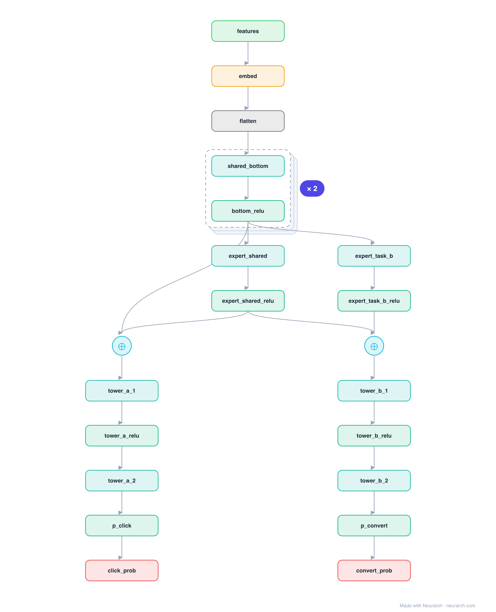

# Architecture: PLE (CGC)

## Motivation

Progressive Layered Extraction (and its single-level form CGC): splits experts into task-specific groups and a shared group, so each task draws on its own specialists plus the shared pool but never on another task's specialists. Tencent's answer to the "seesaw" effect where improving one task quietly degrades another.

## Core Idea

Progressive Layered Extraction (and its single-level form CGC): splits experts into task-specific groups and a shared group, so each task draws on its own specialists plus the shared pool but never on another task's specialists.

## Architecture

### Overview

*Identical repeated blocks are folded into one representative block with a `× N` badge, so the whole architecture fits on screen. `model.json` keeps all 23 nodes (open it in Neurarch to see and edit every layer). Vector: [diagram.svg](assets/diagram.svg).*

| Hyperparameter | Value |
|---|---|
| Type | Multi-task ranking |
| Experts | Task-specific groups plus a shared group |
| Routing | Each task uses its own experts plus shared |
| Towers | One MLP head per objective |
| Key idea | Explicit expert separation cuts negative transfer |

`model.json` is the full graph, hand-built against the official config.json.

### Design Notes

- CGC is the single-extraction-layer version; PLE stacks several extraction layers to progressively separate and recombine representations.
- Reference topology: one extraction layer with a task-A expert, a shared expert, and a task-B expert.
- Direct lineage from [mmoe](../mmoe/): same multi-task goal, but explicit expert grouping instead of purely soft gates.

### Parameter Check

This entry is a **structural reference**: its parameter mix is not recomputed by the per-layer estimator, so it carries no deviation gate. See the hyperparameter table above for the authoritative total / active parameter counts.

## Design Decisions

> **Analysis** — Observations derived from studying the architecture.

- CGC is the single-extraction-layer version; PLE stacks several extraction layers to progressively separate and recombine representations.
- Reference topology: one extraction layer with a task-A expert, a shared expert, and a task-B expert.
- Direct lineage from [mmoe](../mmoe/): same multi-task goal, but explicit expert grouping instead of purely soft gates.

## Implementation Notes

- `model.json` contains the full structural graph with real dimensions and parameters.
- Open in [Neurarch](https://www.neurarch.com/) to visualize, edit, or export training code.
- Diagrams fold repeated identical blocks with a `× N` badge; `model.json` holds all nodes at real dimensions.

## Limitations

- This package focuses on the architectural structure. Training pipelines, 
dataset preparation, and production optimizations are out of scope.

## Evolution

> See `references/related/` for predecessor and successor architectures.

