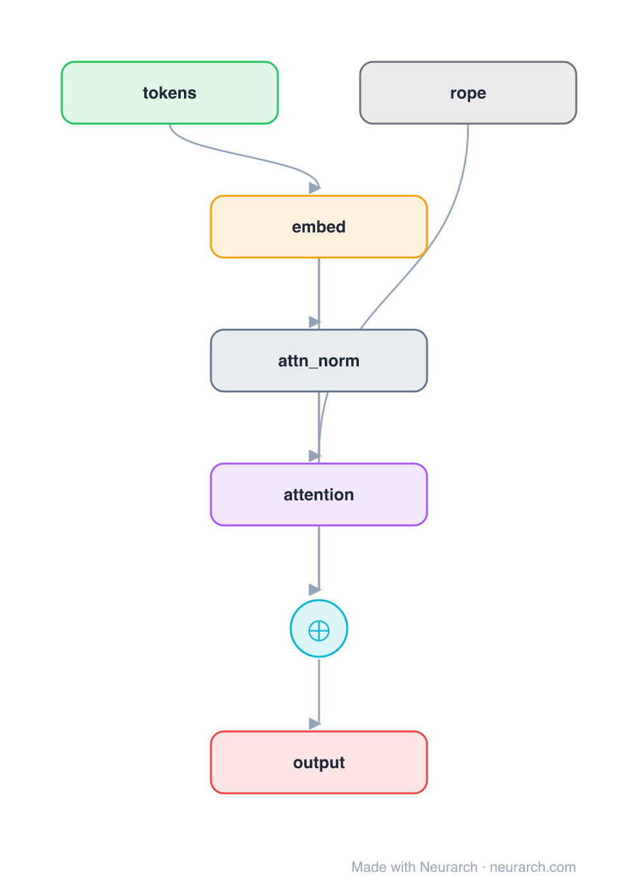

# Architecture: Rotary Positions (RoPE)

## Motivation

The same minimal decoder block as [posenc-learned](../posenc-learned/), but position is encoded by **rotary embeddings (RoPE)**: instead of adding a position vector, the query/key vectors are *rotated* by an angle that depends on position, inside the attention op. Relative position falls out of the dot product, and it extrapolates far better than a learned table. The scheme used by Llama, Qwen, Mistral, and most modern decoders.

**Second of three sibling blocks** (learned → RoPE → ALiBi). Here the position signal is a `rope` node wired **into the attention** as a side input, not into the residual stream. See [COMPARISONS.md → Positional encoding](../../COMPARISONS.md#positional-encoding-learned--rope--alibi).

## Core Idea

The same minimal decoder block as [posenc-learned](.

## Architecture

### Overview

<b>Layer-by-layer (7 nodes)</b>

| # | Layer | Type | Params |
|---|---|---|---|
| 1 | tokens | `input` | shape: [1, 128] |
| 2 | embed | `embedding` | numEmbeddings: 32000, embeddingDim: 512 |
| 3 | attn_norm | `layerNorm` | normalizedShape: 512 |
| 4 | rope | `rope` | dim: 64, maxSeqLen: 2048 |
| 5 | attention | `multiHeadAttention` | embedDim: 512, numHeads: 8 |
| 6 | residual | `add` |   |
| 7 | output | `output` |   |

Shape-validated end to end (passes Neurarch's shape propagation with zero errors).

### Design Notes

- No vector is added to the embeddings: the `rope` node rotates Q/K **inside attention**, so the position signal is a side input to node 5, not a main-path add.
- `dim` is the per-head rotation dimension (here headDim = 512 / 8 = 64); `maxSeqLen` sets the frequency base. Tweaking these (NTK / YaRN scaling) is how RoPE models extend context after training.
- Encodes *relative* position, which is why it extrapolates past `maxSeqLen` far better than [learned absolute](../posenc-learned/) positions.

## Design Decisions

> **Analysis** — Observations derived from studying the architecture.

- No vector is added to the embeddings: the `rope` node rotates Q/K **inside attention**, so the position signal is a side input to node 5, not a main-path add.
- `dim` is the per-head rotation dimension (here headDim = 512 / 8 = 64); `maxSeqLen` sets the frequency base. Tweaking these (NTK / YaRN scaling) is how RoPE models extend context after training.
- Encodes *relative* position, which is why it extrapolates past `maxSeqLen` far better than [learned absolute](../posenc-learned/) positions.

## Implementation Notes

- `model.json` contains the full structural graph with real dimensions and parameters.
- Open in [Neurarch](https://www.neurarch.com/) to visualize, edit, or export training code.
- Diagrams fold repeated identical blocks with a `× N` badge; `model.json` holds all nodes at real dimensions.

## Limitations

- This package focuses on the architectural structure. Training pipelines, 
dataset preparation, and production optimizations are out of scope.

## Evolution

> See `references/related/` for predecessor and successor architectures.

