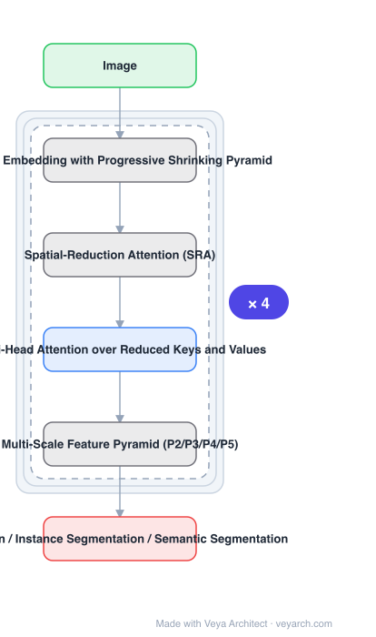

# Architecture: PVT

## Motivation

CNNs had been the versatile, dominant approach, but the paper looks for a **convolution-free** alternative usable for dense prediction, not only classification. ViT was **designed for image classification specifically**, and porting it to dense prediction fails on two counts: it **yields low-resolution outputs** and **incurs high computational and memory cost**. Prior uses of transformers in vision had mostly been task-specific decoder heads on top of CNN backbones, or attention modules inserted into CNNs — a clean, convolution-free transformer backbone for dense prediction was rarely studied.

## Core Idea

A **pyramid** vision transformer. Unlike ViT's fixed-resolution column, PVT uses a **progressive shrinking pyramid** so it can (a) train on **dense partitions** of an image and keep **high output resolution** for pixel-level tasks, and (b) reduce the computation needed for large feature maps. The result inherits advantages of both CNN and Transformer and can replace a CNN backbone directly.

## Architecture

### Overview

<b>Layer-by-layer (6 nodes)</b>

| # | Layer | Type | Params |
|---|---|---|---|
| 1 | Image | `input` |  |
| 2 | Patch Embedding with Progressive Shrinking Pyramid | `custom` |  |
| 3 | Spatial-Reduction Attention (SRA) | `custom` |  |
| 4 | Multi-Head Attention over Reduced Keys and Values | `attention` |  |
| 5 | Multi-Scale Feature Pyramid (P2/P3/P4/P5) | `custom` |  |
| 6 | Detection / Instance Segmentation / Semantic Segmentation | `output` |  |

### Components

1. **Patch embedding with progressive shrinking pyramid** — multi-stage pyramid from high to low resolution, reducing computation on large feature maps.
2. **Spatial-Reduction Attention (SRA)** — the efficiency mechanism: keys and values are spatially reduced before attention, cutting the quadratic cost.
3. **Multi-head attention over reduced keys and values** — standard attention, but operating on the reduced K/V.
4. **Multi-scale feature pyramid (P2/P3/P4/P5)** — the output form a CNN backbone would provide, so dense prediction heads work unchanged.
5. **Convolution-free design** — no convolutions anywhere in the backbone.

### Data Flow

Image → patch embedding → stage 1..4, each applying SRA (spatially reduce K and V → multi-head attention) and progressively shrinking resolution → multi-scale pyramid outputs P2–P5 → detection / instance segmentation / semantic segmentation heads.

### State / Memory

No recurrent state. The memory argument is central: large feature maps dominate cost, which is exactly what the shrinking pyramid and the spatial reduction of K/V address.

## Design Decisions

- **Dense prediction as the design target** — the paper states the aim is to explore a backbone beyond CNN useful for dense prediction, not classification.
- **High output resolution** — obtained by training on dense partitions; required for pixel-level tasks.
- **Progressive shrinking pyramid** — reduces the computation of large feature maps, which is where ViT's cost concentrates.
- **Spatially reduce keys and values** — the concrete mechanism for making attention affordable at high resolution.
- **Stay convolution-free and directly swappable** — so it can replace a CNN backbone without adapting the heads.
- **Validate across downstream tasks** — detection, instance and semantic segmentation.

## Evolution

- **CNNs** (predecessor family and the thing being replaced).
- **ViT** (predecessor): classification-specific, low-resolution output, high cost.
- **Transformer decoders on CNN backbones; attention inserted into CNNs** (contrast): not clean convolution-free backbones.
- **PVT (2021)**: pyramid + spatial-reduction attention.
- **Successors**: PVT v2 and the broader pyramid-attention backbone family.
- **Siblings**: Swin V2, CSWin, MaxViT, MViTv2.

## Characteristics

| Property | Value |
|---|---|
| Task | dense prediction backbone (detection, instance/semantic segmentation) |
| Convolutions | none |
| Structure | progressive shrinking pyramid, multi-scale outputs |
| Attention | Spatial-Reduction Attention (SRA) |
| Swappable | direct replacement for CNN backbones |
| COCO | PVT+RetinaNet 40.4 AP vs ResNet50+RetinaNet 36.3 AP (+4.1 AP) |

## Limitations

- Reducing keys and values spatially loses spatial precision, which can matter for fine-grained localization.
- No convolutions means no built-in locality inductive bias; the paper notes this makes it harder to compete without sufficient data.
- Spatial-reduction ratios are per-stage hyper-parameters requiring tuning.
- Optimized as a backbone; the heads are standard and not part of the contribution.

## Implementation Notes

Essentials: (1) emit a multi-scale pyramid (P2–P5) rather than a single-resolution token grid — the pyramid is what makes it a drop-in CNN backbone replacement for dense heads, (2) apply spatial reduction to keys and values inside attention; without it the large-feature-map cost that motivates the design returns, (3) shrink resolution progressively across stages rather than keeping it fixed, since that is the other half of the cost control, (4) keep the backbone convolution-free — inserting convolutions makes it a hybrid rather than the "without convolutions" backbone being proposed, (5) benchmark on detection and segmentation with standard heads (e.g. RetinaNet) and compare against the CNN backbone at comparable parameter count, since the replacement claim is only visible there.
