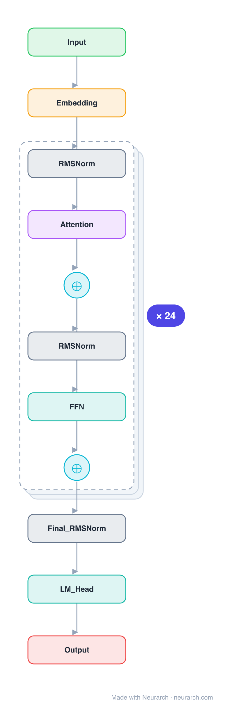

# Architecture: Pythia-1.4B

## Motivation

One rung of EleutherAI's Pythia suite, the interpretability-and-training-dynamics workhorse: an identical GPT-NeoX architecture trained at 8 sizes on the exact same data order, with 154 checkpoints each. The 1.4B is the popular mid-size.

## Core Idea

One rung of EleutherAI's Pythia suite, the interpretability-and-training-dynamics workhorse: an identical GPT-NeoX architecture trained at 8 sizes on the exact same data order, with 154 checkpoints each.

## Architecture

### Overview

*Identical repeated blocks are folded into one representative block with a `× N` badge, so the whole architecture fits on screen. `model.json` uses a NAXS block template + `repeat` directive: the identical repeated layers are defined once and expand to all 149 nodes (open it in Neurarch to see and edit every layer). Vector: [diagram.svg](assets/diagram.svg).*

| Hyperparameter | Value |
|---|---|
| Type | Decoder-only transformer (causal LM) |
| Parameters | 1.4B |
| Layers | 24 |
| Hidden size | 2048 |
| Attention | Multi-head: 16 heads, head dim 128 |
| Block | Parallel residual (GPT-NeoX) |
| FFN | Dense MLP, 8192, GeLU |
| Normalization | LayerNorm, pre-norm |
| Positions | RoPE (full) |
| Vocabulary | 50,304 |
| Max context | 2,048 |

`model.json` is the full graph (repeated layers expressed via a NAXS block template + `repeat`), produced with the same import path the Neurarch app uses for "load from Hugging Face".

### Design Notes

- GPT-NeoX parallel-residual block: attention and MLP both consume the same normed input and sum into the residual.
- Full RoPE on 128-dim heads; untied embeddings; 50304-token GPT-NeoX BPE vocabulary (padded for efficiency).
- The value is the controlled suite, not the architecture: same data, same order, every size and checkpoint released, so you can study how a fixed architecture learns.

### Parameter Check

Neurarch's per-layer parameter estimate over this graph: **1.41B**.
Hugging Face safetensors metadata reports **1.52B** for the real weights.
Deviation from the authoritative count (1.52B): **-6.6%**.

## Design Decisions

> **Analysis** — Observations derived from studying the architecture.

- GPT-NeoX parallel-residual block: attention and MLP both consume the same normed input and sum into the residual.
- Full RoPE on 128-dim heads; untied embeddings; 50304-token GPT-NeoX BPE vocabulary (padded for efficiency).
- The value is the controlled suite, not the architecture: same data, same order, every size and checkpoint released, so you can study how a fixed architecture learns.

## Implementation Notes

- `model.json` contains the full structural graph with real dimensions and parameters, using a NAXS block template + `repeat` for the identical repeated layers.
- Open in [Neurarch](https://www.neurarch.com/) to visualize, edit, or export training code.
- Diagrams fold repeated identical blocks with a `× N` badge; `model.json` defines each repeated layer once at real dimensions and expands to all nodes.

## Limitations

- This package focuses on the architectural structure. Training pipelines, 
dataset preparation, and production optimizations are out of scope.

## Evolution

> See `references/related/` for predecessor and successor architectures.

