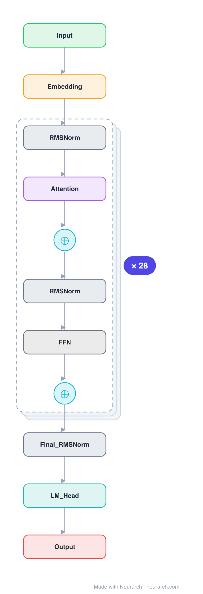

# Architecture: Qwen2.5-7B

## Motivation

A 7.6B-parameter decoder-only transformer from the Qwen2.5 family, one of the most widely deployed open-weight Chinese and multilingual LLM series. Llama-style pre-norm decoder with grouped-query attention, RoPE, RMSNorm, and SwiGLU.

## Core Idea

A 7.

## Architecture

### Overview

*Identical repeated blocks are folded into one representative block with a `× N` badge, so the whole architecture fits on screen. `model.json` uses a NAXS block template + `repeat` directive: the identical repeated layers are defined once and expand to all 173 nodes (open it in Neurarch to see and edit every layer). Vector: [diagram.svg](assets/diagram.svg).*

| Hyperparameter | Value |
|---|---|
| Type | Decoder-only transformer (causal LM) |
| Parameters | 7.6B |
| Layers | 28 |
| Hidden size | 3584 |
| Attention | Grouped-query: 28 query heads, 4 KV heads |
| Head dim | 128 |
| FFN | SwiGLU, intermediate size 18,944 |
| Normalization | RMSNorm, pre-norm |
| Positions | RoPE (rotary dim 128) |
| Vocabulary | 152,064 |
| Max context | 131,072 |

`model.json` is the full 28-layer graph (the repeated layers expressed via a NAXS block template + `repeat`), produced with the same import path the Neurarch app uses for "load from Hugging Face", with all hyperparameters from the official `config.json`.

### Design Notes

- Grouped-query attention with 28 query heads sharing 4 KV heads (7:1 ratio), which keeps the KV cache small at long context.
- Unusually for the Llama lineage, Qwen adds a bias term to the Q, K, V projections (attention bias on, everywhere else off).
- Wide FFN: the SwiGLU intermediate size (18944) is about 5.3x the hidden size, wider than the Llama-2 ratio.
- Native 131072-token context window with rope_theta = 1e6.

### Parameter Check

Neurarch's per-layer parameter estimate over this graph: **7.62B**.
Hugging Face safetensors metadata reports **7.62B** for the real weights.
Deviation from the authoritative count (7.62B): **+0.0%**.

## Design Decisions

> **Analysis** — Observations derived from studying the architecture.

- Grouped-query attention with 28 query heads sharing 4 KV heads (7:1 ratio), which keeps the KV cache small at long context.
- Unusually for the Llama lineage, Qwen adds a bias term to the Q, K, V projections (attention bias on, everywhere else off).
- Wide FFN: the SwiGLU intermediate size (18944) is about 5.3x the hidden size, wider than the Llama-2 ratio.
- Native 131072-token context window with rope_theta = 1e6.

## Implementation Notes

- `model.json` contains the full structural graph with real dimensions and parameters, using a NAXS block template + `repeat` for the identical repeated layers.
- Open in [Neurarch](https://www.neurarch.com/) to visualize, edit, or export training code.
- Diagrams fold repeated identical blocks with a `× N` badge; `model.json` defines each repeated layer once at real dimensions and expands to all nodes.

## Limitations

- This package focuses on the architectural structure. Training pipelines, 
dataset preparation, and production optimizations are out of scope.

## Evolution

> See `references/related/` for predecessor and successor architectures.

