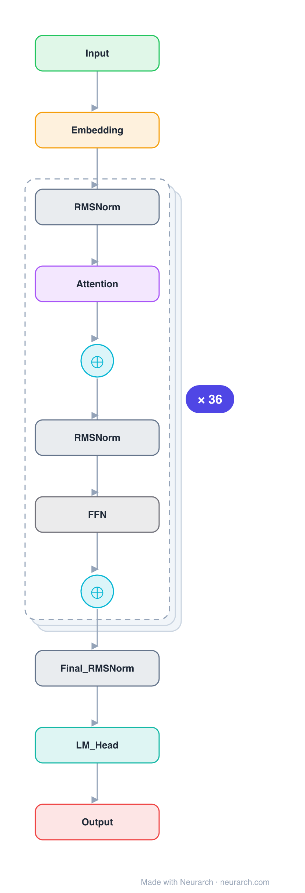

# Architecture: Qwen3-8B

## Motivation

The dense 8B from the Qwen3 generation, the default open model of 2025 by download count. Architecturally a cleanup: QKV bias out, QK-Norm in, more depth per parameter.

## Core Idea

The dense 8B from the Qwen3 generation, the default open model of 2025 by download count.

## Architecture

### Overview

*Identical repeated blocks are folded into one representative block with a `× N` badge, so the whole architecture fits on screen. `model.json` uses a NAXS block template + `repeat` directive: the identical repeated layers are defined once and expand to all 221 nodes (open it in Neurarch to see and edit every layer). Vector: [diagram.svg](assets/diagram.svg).*

| Hyperparameter | Value |
|---|---|
| Type | Decoder-only transformer (causal LM) |
| Parameters | 8.2B |
| Layers | 36 |
| Hidden size | 4096 |
| Attention | Grouped-query: 32 query heads, 8 KV heads, QK-Norm |
| Head dim | 128 |
| FFN | SwiGLU, intermediate size 12,288 |
| Normalization | RMSNorm, pre-norm |
| Positions | RoPE (rotary dim 128) |
| Vocabulary | 151,936 |
| Max context | 40,960 |

`model.json` is the full 36-layer graph (the repeated layers expressed via a NAXS block template + `repeat`), produced with the same import path the Neurarch app uses for "load from Hugging Face", with all hyperparameters from the official `config.json`.

### Design Notes

- QK-Norm replaces the Qwen2.5 QKV bias: per-head RMSNorm on queries and keys before RoPE (attention_bias is false in the config), trading the bias trick for norm-based attention stability.
- Deeper and thinner than Qwen2.5-7B: 36 layers at 4096 hidden versus 28 at 3584, with a narrower 12288 FFN.
- GQA 32:8 with explicit head_dim 128; native 40960-token context at rope_theta 1e6.
- The dense workhorse of the Qwen3 release; the same recipe scales to the 235B-A22B MoE flagship. Hybrid thinking/non-thinking modes are a training-time property, not an architecture change.

### Parameter Check

Neurarch's per-layer parameter estimate over this graph: **8.19B**.
Hugging Face safetensors metadata reports **8.19B** for the real weights.
Deviation from the authoritative count (8.19B): **+0.0%**.

## Design Decisions

> **Analysis** — Observations derived from studying the architecture.

- QK-Norm replaces the Qwen2.5 QKV bias: per-head RMSNorm on queries and keys before RoPE (attention_bias is false in the config), trading the bias trick for norm-based attention stability.
- Deeper and thinner than Qwen2.5-7B: 36 layers at 4096 hidden versus 28 at 3584, with a narrower 12288 FFN.
- GQA 32:8 with explicit head_dim 128; native 40960-token context at rope_theta 1e6.
- The dense workhorse of the Qwen3 release; the same recipe scales to the 235B-A22B MoE flagship. Hybrid thinking/non-thinking modes are a training-time property, not an architecture change.

## Implementation Notes

- `model.json` contains the full structural graph with real dimensions and parameters, using a NAXS block template + `repeat` for the identical repeated layers.
- Open in [Neurarch](https://www.neurarch.com/) to visualize, edit, or export training code.
- Diagrams fold repeated identical blocks with a `× N` badge; `model.json` defines each repeated layer once at real dimensions and expands to all nodes.

## Limitations

- This package focuses on the architectural structure. Training pipelines, 
dataset preparation, and production optimizations are out of scope.

## Evolution

> See `references/related/` for predecessor and successor architectures.

