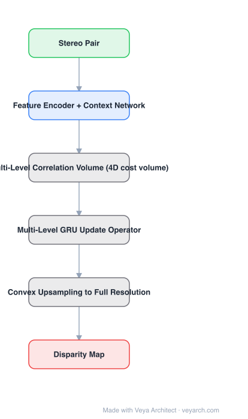

# Architecture: RAFT-Stereo

## Motivation

Deep stereo networks build a 4D cost volume and filter it with **3D convolutions** — expensive, which caps operating resolution, and domain-specific, so a model trained on synthetic data does not transfer to a new dataset. HITNet and similar lightweight designs help speed but need extra losses and a full-resolution running prediction. RAFT-Stereo takes the recurrent-update idea from optical flow and applies it to disparity.

## Core Idea

**Multilevel recurrent field transforms**: build correlation (cost) volumes at several resolutions, then iteratively refine disparity with **GRU update operators** that read from those volumes. No 3D convolutions anywhere, and the disparity is upsampled to full resolution only at the very end via **convex upsampling** — which is what makes megapixel stereo fit in memory and generalize zero-shot.

## Architecture

### Overview

<b>Layer-by-layer (6 nodes)</b>

| # | Layer | Type | Params |
|---|---|---|---|
| 1 | Stereo Pair | `input` |  |
| 2 | Feature Encoder + Context Network | `conv2d` |  |
| 3 | Multi-Level Correlation Volume (4D cost volume) | `custom` |  |
| 4 | Multi-Level GRU Update Operator | `custom` |  |
| 5 | Convex Upsampling to Full Resolution | `custom` |  |
| 6 | Disparity Map | `output` |  |

### Components

1. **Feature encoder + context network** — per-image features plus a context map (mirroring RAFT).
2. **Multi-level correlation volume** — correlation pyramids at several resolutions, with cross-connections between levels so both large and small disparities are represented.
3. **GRU update operator** — replaces the 3D conv stack: at each iteration it reads local correlation features and updates the disparity estimate.
4. **Convex upsampling** — the disparity is refined at reduced resolution and upsampled learnably at the end only.
5. **L1 supervision over iterations** — a plain L1 loss on the sequence of disparity predictions; no extra tile/angle losses as in HITNet.

### Data Flow

Stereo pair → features + multi-level correlation volume → GRU iterations updating disparity → convex upsampling → full-resolution disparity map.

### State / Memory

The GRU hidden state and current disparity field are the per-iteration state. Because the running prediction stays at reduced resolution, memory does not scale with full-resolution disparity until the final upsample — the property that enables megapixel inputs.

## Design Decisions

- **No 3D convolutions** — the direct attack on cost and poor cross-domain generalization.
- **Recurrent updates instead of a feed-forward filter** — disparity is refined over iterations, borrowing the structure that worked for flow.
- **Multi-level volume with cross-connections** — handles disparity range without a coarse-to-fine cascade.
- **Upsample only at the end** — memory efficiency, and the reason full-resolution stereo is feasible.
- **Standard L1 loss only** — no auxiliary geometry losses, unlike tile-based designs.

## Evolution

- **DispNet / GC-Net / PSMNet / GA-Net** (predecessors): cost volume + 3D convolutions.
- **DSMNet** (contrast): normalization and non-local filtering to improve generalization, still using 3D convs.
- **HITNet** (contrast): tile-based planar priors, lightweight but with extra losses and full-resolution running prediction.
- **RAFT-Stereo (2021)**: recurrent field transforms.
- **Siblings**: CREStereo, IGEV (geometry encoding volume).
- **Successors**: FoundationStereo (zero-shot foundation stereo), Fast-FoundationStereo (real-time).

## Characteristics

| Property | Value |
|---|---|
| Task | stereo matching (disparity) |
| Cost representation | multi-level correlation volume |
| Update | GRU recurrent operator (no 3D convs) |
| Upsampling | convex, at the end |
| Loss | L1 on the prediction sequence |
| Strength | zero-shot cross-dataset generalization (ETH3D, KITTI, Middlebury) |

## Limitations

- Iterative: latency scales with the number of update iterations chosen at inference.
- Zero-shot generalization is relative — absolute accuracy on a new domain still drops versus in-domain training.
- Requires rectified stereo pairs and known calibration; not a monocular method.
- Correlation lookup assumes a disparity search range; very large disparities need range tuning.

## Implementation Notes

Essentials: (1) build correlation volumes at multiple levels and wire cross-connections between them, (2) use GRU update operators reading local correlation — do not reintroduce 3D convolutions, (3) keep the running disparity at reduced resolution and upsample convexly only at the end, (4) supervise every iteration with L1, (5) evaluate zero-shot transfer (train synthetic, test ETH3D/KITTI/Middlebury) as well as in-domain, since cross-domain generalization is the headline claim.
