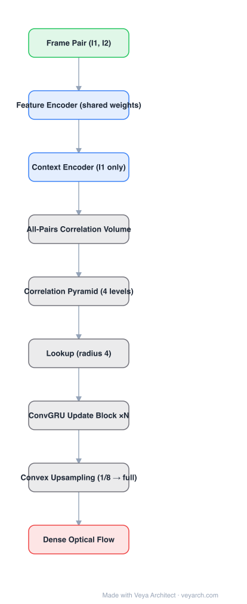

# Architecture: RAFT

## Motivation

Optical flow had been dominated by coarse-to-fine cascades (SpyNet, PWC-Net, LiteFlowNet): estimate flow at low resolution, then warp and refine upward. That design has known failure modes — errors made at coarse resolutions are hard to recover, small fast-moving objects are missed, and multi-stage cascades need very long training schedules. RAFT replaces the cascade with a single high-resolution flow field updated by one recurrent, weight-tied operator.

## Core Idea

Three ideas compose the architecture:

1. **All-pairs correlation** — build a 4D correlation volume over *all* pixel pairs (no warping), then pool it into a multi-scale pyramid so a fixed-resolution update still sees large displacements.
2. **Recurrent, weight-tied update** — a small ConvGRU block is applied repeatedly to produce a sequence of flow refinements; iterations are not separate networks, so inference depth is free to grow.
3. **Convex upsampling** — the hidden full-resolution flow is recovered as a learned convex combination of the 3×3 neighborhood of each coarse flow vector, instead of bilinear upsampling.

## Architecture

### Overview

<b>Layer-by-layer (9 nodes)</b>

| # | Layer | Type | Params |
|---|---|---|---|
| 1 | Frame Pair (I1, I2) | `input` |  |
| 2 | Feature Encoder (shared weights) | `conv2d` |  |
| 3 | Context Encoder (I1 only) | `conv2d` |  |
| 4 | All-Pairs Correlation Volume | `custom` |  |
| 5 | Correlation Pyramid (4 levels) | `custom` |  |
| 6 | Lookup (radius 4) | `custom` |  |
| 7 | ConvGRU Update Block ×N | `custom` |  |
| 8 | Convex Upsampling (1/8 → full) | `custom` |  |
| 9 | Dense Optical Flow | `output` |  |

### Components

1. **Feature encoder** — 6 residual blocks at 1/8 input resolution, 256 channels, applied with **shared weights** to both frames.
2. **Context encoder** — a second network applied to the first frame only; its feature map initializes and drives the recurrent update operator.
3. **Correlation volume** — all-pairs inner products between the two feature maps give C ∈ R^{H×W×H×W}. It is computed once and reused across all iterations.
4. **Correlation pyramid** — average pooling of the last two dimensions produces 4 levels; a constant lookup radius therefore covers a much larger range at coarser levels (radius 4 at level 4 ≈ 256 pixels at full resolution).
5. **Correlation lookup** — for the current flow estimate x′, sample the neighborhood N(x′)_r (L1 radius r = 4) on every pyramid level with bilinear sampling and concatenate the results into one correlation feature map.
6. **Update operator** — a ConvGRU-style gated recurrent unit (≈2.7M parameters) that takes context features, current flow, and correlation features, and outputs a flow update Δf. Weights are tied across iterations.
7. **Convex upsampling** — the hidden state produces weights over the 3×3 neighborhood of each 1/8-resolution flow vector; the softmax-weighted combination yields full-resolution flow.

### Data Flow

(I₁, I₂) → shared feature encoder → correlation volume + pyramid → initialize flow f = 0 → repeat: lookup correlation around f, run the update block (context + correlation + current flow), emit Δf, set f ← f + Δf → convex upsample the final hidden flow to full resolution.

### State / Memory

The recurrent hidden state of the update block carries information across iterations; the correlation volume is fixed external memory that is queried at each step. Thus "depth" is temporal recurrence, not stacked layers.

## Design Decisions

- **Shared weights across iterations** — makes the model applicable for 100+ iterations at inference without divergence and removes the need for a fixed cascade depth.
- **High-resolution single flow field** — avoids coarse-resolution error accumulation and keeps small objects visible.
- **Fixed resolution updates** — the flow field is never warped to a new scale; only the correlation lookup is multi-scale.
- **Exponentially weighted supervision** — L1 loss over all iterations with weights growing by γ ≈ 0.8, teaching the operator to converge rather than to hit a target at one specific step.

## Evolution

- **FlowNet / FlowNet 2.0** (predecessors): direct regression and stacked refinement.
- **SpyNet, PWC-Net, LiteFlowNet**: coarse-to-fine pyramids with per-level weights.
- **RAFT**: recurrent all-pairs formulation; the reference design for modern flow.
- **FlowFormer, GMFlow**: transformer-based cost/feature processing on top of RAFT-style volumes.
- **SEA-RAFT**: reformulated loss and initialization for faster convergence at fewer iterations.

## Characteristics

| Property | Value |
|---|---|
| Feature resolution | 1/8 of input |
| Feature encoder | 6 residual blocks, 256 channels, shared |
| Correlation | all-pairs 4D volume + 4-level pyramid |
| Update operator | ConvGRU (gated), ≈2.7M params, weight-tied |
| Upsampling | convex combination of 3×3 neighborhood |
| Reported accuracy | KITTI F1-all 5.10%; Sintel (final) EPE 2.855 px |
| Reported speed | 1088×436 @ 10 fps on a 1080Ti (small variant 20 fps) |

## Limitations

- All-pairs correlation is O(N²) in pixels; memory and compute grow quadratically with resolution (computable once, but expensive at 1080p+).
- Accuracy depends on iteration count: fewer iterations trade accuracy for latency.
- Single-resolution recurrence struggles with very large displacements unless the pyramid range is wide.
- Supervised training on synthetic data; generalization to non-rigid real motion is not guaranteed.

## Implementation Notes

A minimal implementation needs: (1) a shared feature encoder, (2) an all-pairs correlation builder with a pyramid, (3) a bilinear correlation lookup around the current flow, (4) the ConvGRU update block, (5) convex upsampling. Training losses should be accumulated over all iterations with exponentially increasing weights — this is what makes the weight-tied operator converge.
