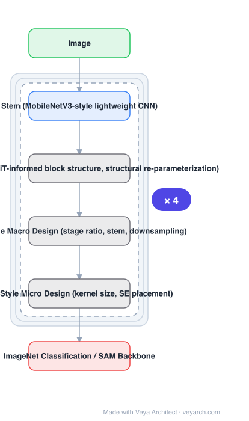

# Architecture: RepViT

## Motivation

Lightweight ViTs had begun outperforming lightweight CNNs on both accuracy and latency on resource-constrained devices. Prior work noted structural connections between the two families, but the **architectural disparities in block structure, macro design and micro design** had not been adequately examined — so it was unclear how much of the ViT advantage came from attention itself versus from design choices a CNN could also adopt.

## Core Idea

Take a standard lightweight CNN (MobileNetV3) and **incrementally enhance it with the efficient architectural designs of lightweight ViTs**, examining block structure, macro design and micro design separately. The end result is a family of **pure lightweight CNNs** — no attention — that outperforms lightweight ViTs.

## Architecture

### Overview

<b>Layer-by-layer (6 nodes)</b>

| # | Layer | Type | Params |
|---|---|---|---|
| 1 | Image | `input` |  |
| 2 | Stem (MobileNetV3-style lightweight CNN) | `conv2d` |  |
| 3 | RepViT Block (ViT-informed block structure, structural re-parameterization) | `custom` |  |
| 4 | ViT-Style Macro Design (stage ratio, stem, downsampling) | `custom` |  |
| 5 | ViT-Style Micro Design (kernel size, SE placement) | `custom` |  |
| 6 | ImageNet Classification / SAM Backbone | `output` |  |

### Components

1. **MobileNetV3 starting point** — the standard lightweight CNN being enhanced, chosen as the baseline to modify.
2. **Block-structure redesign** — informed by lightweight ViT blocks; includes structural re-parameterization along the RepVGG line, giving separate training-time and inference-time topologies.
3. **Macro design changes** — ViT-derived choices about stage composition, stem and downsampling.
4. **Micro design changes** — ViT-derived choices about kernel sizes and squeeze-and-excite placement.
5. **Pure CNN output** — no attention anywhere in the final family.

### Data Flow

Image → lightweight CNN stem → stacked RepViT blocks (with re-parameterizable branches at training time, folded at inference) → classification head. As a backbone, the same feature pyramid feeds detection/segmentation or SAM.

### State / Memory

No recurrent state. Structural re-parameterization means the *training* graph has extra branches that are algebraically folded into the inference graph — the only place "two topologies" exist.

## Design Decisions

- **Enhance incrementally, keeping the CNN** — isolates which ViT design choices actually matter, rather than switching architecture families.
- **Separate block / macro / micro analysis** — the paper's stated gap is that these three levels had not been examined separately.
- **Structural re-parameterization** — lets training-time capacity exist without inference-time cost.
- **Validate as a SAM backbone, not just ImageNet** — RepViT-SAM is a real deployment test (~10× faster than MobileSAM).

## Evolution

- **MobileNetV3** (predecessor and starting point).
- **RepVGG** (structural re-parameterization).
- **Lightweight ViTs** (the source of the design ideas being transferred).
- **RepViT (2023)**: pure lightweight CNN with ViT-informed design.
- **Siblings**: MobileNetV4, StarNet, FasterNet, EfficientViT, MobileSAM.
- **Contrast**: the lightweight ViTs RepViT benchmarks against.

## Characteristics

| Property | Value |
|---|---|
| Task | efficient image classification / general mobile backbone |
| Base | MobileNetV3, incrementally enhanced |
| Result | >80% ImageNet top-1 at 1.0 ms latency on iPhone 12 |
| SAM variant | RepViT-SAM, ~10× faster than MobileSAM |
| Attention | none — a pure CNN family |

## Limitations

- Derived from MobileNetV3, so it inherits that design space's constraints.
- The incremental-enhancement procedure is a research method; the reported gain is the result, and the intermediate ablations matter for reproducing it.
- Classification-centric evaluation; dense-prediction quality follows from it but is not the main claim.
- Re-parameterization means training and inference graphs differ, which complicates checkpoint handling.

## Implementation Notes

Essentials: (1) start from MobileNetV3 and apply changes level by level — block structure, then macro, then micro — so each level's contribution is measurable, (2) use structural re-parameterization and fold branches before measuring latency; measuring the training graph would misreport, (3) keep the resulting network attention-free, since that is the claim, (4) verify on-device latency (iPhone 12) rather than FLOPs, (5) if used as a backbone, test with SAM and compare against MobileSAM directly.
