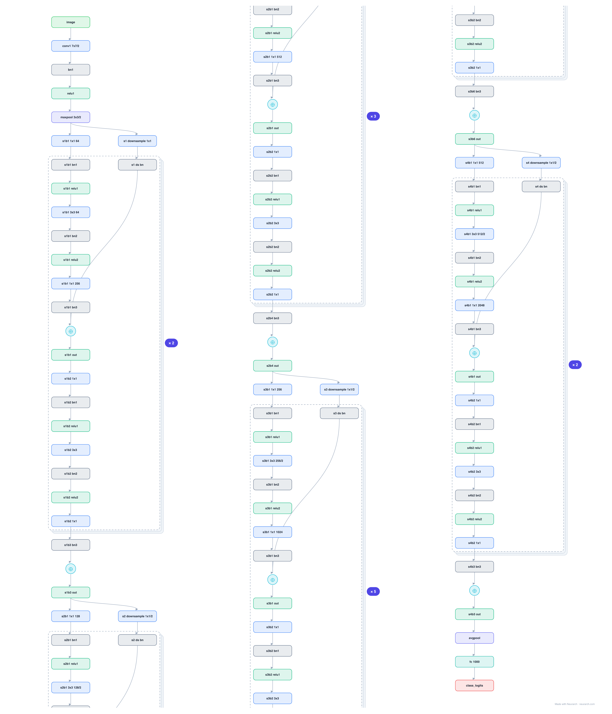

# Architecture: ResNet-50

## Motivation

The most-cited convolutional network ever and the ILSVRC 2015 winner. This is the full graph: conv stem, all 16 bottleneck residual blocks (3+4+6+3) with every conv, batch norm, and skip connection, global average pooling, and the 1000-way head.

## Core Idea

The most-cited convolutional network ever and the ILSVRC 2015 winner.

## Architecture

### Overview

*Identical repeated blocks are folded into one representative block with a `× N` badge, so the whole architecture fits on screen. `model.json` uses NAXS block templates + `repeat` directives and expands back to all 176 nodes (open it in Neurarch to see and edit every layer). Vector: [diagram.svg](assets/diagram.svg).*

| Hyperparameter | Value |
|---|---|
| Type | Convolutional network (image classification) |
| Parameters | 25.6M |
| Stem | 7x7/2 conv (64) + 3x3/2 max-pool |
| Stages | 4 stages of bottleneck blocks: 3, 4, 6, 3 |
| Bottleneck | 1x1 reduce, 3x3, 1x1 expand (4x) |
| Channels | 256 / 512 / 1024 / 2048 per stage |
| Shortcuts | Identity; 1x1 projection at stage boundaries |
| Head | Global average pool + FC-1000 |
| Input | 3x224x224 |

`model.json` is the full graph, hand-built against the official config.json.

### Design Notes

- Bottleneck design: 1x1 reduce, 3x3 conv, 1x1 expand in every block, which is how 50 layers stay at 25.6M parameters.
- Stage transitions double channels and halve resolution with strided 1x1 projections on the skip path.
- A decade later it is still the default vision backbone for detection, segmentation, and as a sanity-check baseline.

### Parameter Check

Neurarch's per-layer parameter estimate over this graph: **25.6M**.
Deviation from the authoritative count (25.6M): **-0.1%**.

## Design Decisions

> **Analysis** — Observations derived from studying the architecture.

- Bottleneck design: 1x1 reduce, 3x3 conv, 1x1 expand in every block, which is how 50 layers stay at 25.6M parameters.
- Stage transitions double channels and halve resolution with strided 1x1 projections on the skip path.
- A decade later it is still the default vision backbone for detection, segmentation, and as a sanity-check baseline.

## Implementation Notes

- `model.json` contains the full structural graph with real dimensions and parameters, using NAXS block templates + `repeat` for repeated units.
- Open in [Neurarch](https://www.neurarch.com/) to visualize, edit, or export training code.
- Diagrams fold repeated identical blocks with a `× N` badge; `model.json` defines each repeated unit once at real dimensions and expands to all nodes.

## Limitations

- This package focuses on the architectural structure. Training pipelines, 
dataset preparation, and production optimizations are out of scope.

## Evolution

> See `references/related/` for predecessor and successor architectures.

