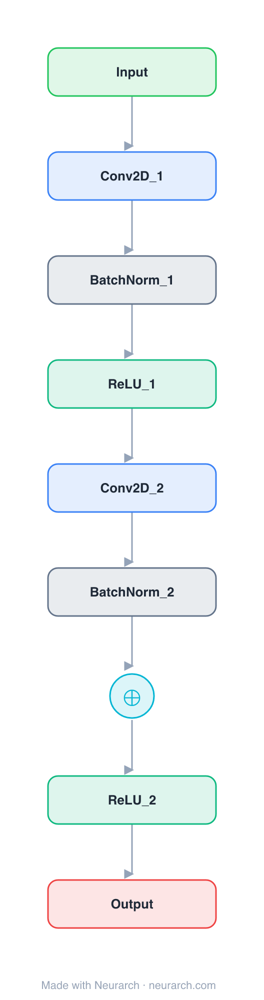

# Architecture: ResNet Residual Block

## Motivation

The residual unit from ResNet: conv-BN-ReLU twice, plus the identity skip connection that made 100+ layer networks trainable. Arguably the most influential 9 nodes in deep learning.

## Core Idea

The residual unit from ResNet: conv-BN-ReLU twice, plus the identity skip connection that made 100+ layer networks trainable.

## Architecture

### Overview

<b>Layer-by-layer (9 nodes)</b>

| # | Layer | Type | Params |
|---|---|---|---|
| 1 | Input | `input` | shape: [64, 32, 32] |
| 2 | Conv2D_1 | `conv2d` | outChannels: 64, kernelSize: 3, stride: 1, padding: 1, inChannels: 64 |
| 3 | BatchNorm_1 | `batchNorm` |   |
| 4 | ReLU_1 | `relu` |   |
| 5 | Conv2D_2 | `conv2d` | outChannels: 64, kernelSize: 3, stride: 1, padding: 1, inChannels: 64 |
| 6 | BatchNorm_2 | `batchNorm` |   |
| 7 | Add | `add` |   |
| 8 | ReLU_2 | `relu` |   |
| 9 | Output | `output` |   |

This graph ships in Neurarch's in-app template library; the copy here passes shape propagation with zero errors.

### Design Notes

- The skip connection turns layers into residual functions; every modern transformer residual stream descends from this idea.
- Companion to the full [resnet-50](../resnet-50/) entry, which stacks bottleneck versions of this block 16 times.

## Design Decisions

> **Analysis** — Observations derived from studying the architecture.

- The skip connection turns layers into residual functions; every modern transformer residual stream descends from this idea.
- Companion to the full [resnet-50](../resnet-50/) entry, which stacks bottleneck versions of this block 16 times.

## Implementation Notes

- `model.json` contains the full structural graph with real dimensions and parameters.
- Open in [Neurarch](https://www.neurarch.com/) to visualize, edit, or export training code.
- Diagrams fold repeated identical blocks with a `× N` badge; `model.json` holds all nodes at real dimensions.

## Limitations

- This package focuses on the architectural structure. Training pipelines, 
dataset preparation, and production optimizations are out of scope.

## Evolution

> See `references/related/` for predecessor and successor architectures.

