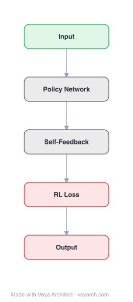

# Architecture: Representation Learning for Scale-free Networks

## Motivation

Network representation learning (network embedding) aims to automatically project a network into a low-dimensional latent space while preserving network structure. Existing methods primarily focus on preserving microscopic structure—first- and second-order proximity between vertices—while the macroscopic scale-free property is largely ignored.

Scale-free property depicts that vertex degrees follow a heavy-tailed (power-law) distribution: only a few vertices have high degrees. This is a critical property of real-world networks like social networks. The paper shows that most traditional embedding algorithms overestimate the number of higher-degree vertices when reconstructing networks, failing to preserve the scale-free property.

The paper studies why this happens theoretically by converting the problem to the Sphere Packing problem, and proposes the "degree penalty" principle: punishing the proximity between high-degree vertices to preserve the scale-free property in the learned embeddings.

## Core Idea

Representation learning specifically designed for scale-free network structures.

## Architecture

### Overview

<b>Layer-by-layer (5 nodes)</b>

| # | Layer | Type | Params |
|---|---|---|---|
| 1 | Input | `input` |  |
| 2 | Policy Network | `custom` |  |
| 3 | Self-Feedback | `custom` |  |
| 4 | RL Loss | `loss` |  |
| 5 | Output | `output` |  |

The approach proposes the "degree penalty" principle for designing scale-free property preserving network embedding algorithms. The core idea is to punish the proximity between high-degree vertices: when two high-degree vertices are placed close in the embedding space, their many low-degree neighbors would also be close, creating spurious edges and overestimating degrees.

Two implementations are proposed: (1) DP-Spectral, using spectral techniques (Laplacian Eigenmap with degree penalty), and (2) DP-Walker, using a skip-gram model (DeepWalk-style) with degree penalty. Both modify the objective to reduce the proximity between high-degree vertices, better preserving the power-law degree distribution.

### Components

- **Degree penalty principle**: The core design principle—punishing proximity between high-degree vertices. When a high-degree vertex has many neighbors placed in its ε-ball, those neighbors are likely close to each other, creating spurious edges. The degree penalty counteracts this by pushing high-degree vertices apart.

- **Sphere Packing analysis**: The theoretical foundation. Reconstructing a scale-free network by ε-NN (connecting vertices within distance ε) is equivalent to a sphere packing problem. The optimal packing density Δ_k bounds the number of points that can fit in a ball while maintaining pairwise distances ≥ ε. The bounds show that exponentially increasing embedding dimension k is needed to preserve the scale-free property.

- **DP-Spectral**: A spectral implementation based on Laplacian Eigenmap. The objective function is modified to incorporate a degree penalty term that reduces the attraction between high-degree vertices during the spectral embedding.

- **DP-Walker**: A skip-gram implementation based on random walks. The random walk sampling or the skip-gram objective is modified to incorporate the degree penalty, reducing the co-occurrence probability of high-degree vertices in walks.

- **Network reconstruction**: Edge probability p_{i,j} = 1 / (1 + e^{||u_i - u_j||}), where u_i and u_j are embedding vectors. A threshold ε is chosen and edges are created when p_{i,j} ≥ ε (ε-NN method).

### Data Flow

1. **Input**: Undirected scale-free network G = (V, E) with adjacency matrix A and degree matrix D.
2. **Degree computation**: Compute vertex degrees D_ii = Σ_j A_ij.
3. **Embedding**: Apply DP-Spectral or DP-Walker:
   - DP-Spectral: Solve modified Laplacian Eigenmap objective with degree penalty term.
   - DP-Walker: Generate random walks, apply modified skip-gram with degree penalty in the co-occurrence objective.
4. **Degree penalty application**: During embedding optimization, reduce proximity between high-degree vertex pairs.
5. **Output**: Low-dimensional embeddings U ∈ R^{n×k} where the reconstructed degree distribution follows a power law.
6. **Downstream tasks**: Use embeddings for vertex classification, link prediction, and network reconstruction.

### State / Memory

Stateless—both DP-Spectral and DP-Walker produce fixed embeddings through optimization. No recurrent state or memory mechanism is used. The degree information is computed once from the input graph and used as a static feature in the embedding objective.

## Design Decisions

- **Degree penalty principle**: The key design innovation—punishing proximity between high-degree vertices. This directly addresses the root cause of degree overestimation: when high-degree vertices are close, their many low-degree neighbors are also close, creating spurious edges.

- **Sphere Packing theoretical foundation**: Provides rigorous bounds on the feasibility of scale-free network reconstruction in Euclidean space. The bounds (Δ_k ≥ 2^{-k}, Δ_k ≤ 2^{-0.599k}) show that exponentially increasing dimension is needed, motivating the degree penalty as a practical alternative.

- **Two implementations (spectral + skip-gram)**: Demonstrates the generality of the degree penalty principle—it can be applied to both spectral and random-walk-based embedding methods.

- **Macroscopic property preservation**: Unlike most methods that focus on microscopic structure (pairwise proximity), this approach explicitly preserves a macroscopic property (degree distribution), providing a complementary perspective.

## Evolution

**Predecessors:**
- DeepWalk (Perozzi et al., 2014) — random walk + word2vec for network embedding
- node2vec (Grover & Leskovec, 2016) — biased random walks
- Laplacian Eigenmap (Belkin & Niyogi, 2003) — spectral dimensionality reduction
- LINE (Tang et al., 2015) — first/second-order proximity preservation
- Sphere Packing theory (Cohn & Elkies, 2003; Kabatiansky & Levenshtein) — theoretical foundation

**Successors:**
- The degree penalty principle inspired subsequent work on property-preserving network embedding
- The macroscopic property preservation paradigm influenced methods that preserve additional global network properties beyond communities

## Characteristics

| Property | Value |
|----------|-------|
| Year | 2018 |
| Authors | Hu et al. |
| Category | GNN/Embedding |
| Source Paper | `Representation_Learning_for_Scale_free_Networks_Hu_Wu_Zhuang_2018.md` |
| PaperVault Path | `GNN/02-network-embedding/Representation_Learning_for_Scale_free_Networks_Hu_Wu_Zhuang_2018.md` |

## Limitations

- The degree penalty principle only addresses the scale-free property; other macroscopic properties (clustering coefficient, small-world, community structure) are not explicitly preserved.
- The Sphere Packing analysis shows that preserving the scale-free property in Euclidean space is fundamentally difficult—exponentially increasing dimension is needed without the degree penalty.
- The degree penalty may reduce embedding quality for tasks that depend on local structure (e.g., link prediction between high-degree vertices).
- The method is designed for undirected networks; extension to directed or signed networks is not addressed.
- The choice of penalty strength requires tuning; too much penalty may distort local structure while too little fails to preserve the scale-free property.
- The theoretical bounds on packing density are asymptotic and may not be tight for practical embedding dimensions.

## Implementation Notes

See `implementation/` for a minimal runnable implementation.

## Information Layers

- **Evidence:** Source paper available in `references/papers/`
- **Analysis:** The key insight is that preserving macroscopic network properties (like scale-free degree distribution) requires fundamentally different constraints than preserving microscopic pairwise proximity. The Sphere Packing connection elegantly explains why standard methods fail: the geometry of Euclidean space cannot simultaneously accommodate many points near a hub while keeping those points far apart.
- **Hypothesis:** The degree penalty may be capturing a form of geometric regularization that prevents the embedding space from collapsing high-degree vertices together. The success of the approach suggests that explicit property preservation constraints may be more effective than implicit ones for macroscopic structure.
