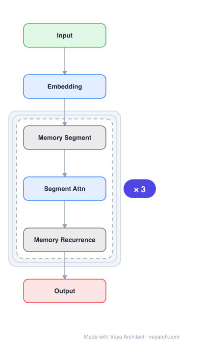

# Architecture: RMT (Recurrent Memory Transformer)

## Motivation

Transformer-based models show effectiveness across multiple domains, but the length of input sequences is limited by the quadratic computational complexity of self-attention. Additionally, global and local information must be stored in the same element-wise representations. RMT addresses these limitations by proposing a memory-augmented segment-level recurrent Transformer that can store and process local and global information separately, and pass information between segments of long sequences via recurrence.

## Core Idea

A memory-augmented segment-level recurrent Transformer that adds special memory tokens to the input/output sequence, enabling the model to store and process local and global information and pass information between segments. The memory mechanism requires no changes to the Transformer model itself — memory is implemented as tokens that the model learns to control.

## Architecture

### Overview

<b>Layer-by-layer (6 nodes)</b>

| # | Layer | Type | Params |
|---|---|---|---|
| 1 | Input | `input` |  |
| 2 | Embedding | `embed` |  |
| 3 | Memory Segment | `custom` |  |
| 4 | Segment Attn | `attention` |  |
| 5 | Memory Recurrence | `custom` |  |
| 6 | Output | `output` |  |

RMT processes long sequences in segments. Memory tokens are added to each segment's input, and the model's output memory tokens are passed to the next segment. During training, gradients flow from the current segment through memory to previous segments, enabling end-to-end learning of memory operations. The memory mechanism is implemented entirely through special tokens, requiring no architectural changes to the Transformer.

### Components

1. **Transformer Encoder/Decoder** — Standard transformer:
   - Processes each segment + memory tokens
   - No architectural modifications needed
   - Self-attention over segment + memory tokens

2. **Memory Tokens** — Special tokens for inter-segment communication:
   - Added to the input sequence of each segment
   - Initialized from the previous segment's memory output
   - Updated by the transformer's self-attention
   - Output memory tokens passed to the next segment
   - Memory size is configurable (number of tokens)

3. **Segment-Level Recurrence** — Processing long sequences:
   - Long sequence split into fixed-size segments
   - Each segment processed with memory tokens from previous segment
   - Memory output passed to next segment
   - Gradients flow through memory during training (BPTT over segments)

### Data Flow

1. **Input segmentation**: Split long sequence into segments (e.g., 150 tokens for WikiText-103)
2. **Memory injection**: Add memory tokens (from previous segment) to current segment input
3. **Transformer processing**: Standard self-attention over segment + memory tokens
4. **Memory extraction**: Extract output memory tokens
5. **Recurrent step**: Pass memory tokens to next segment
6. **Output**: Final segment output + memory state
7. **Gradient flow**: During training, gradients flow through memory to previous segments

### State / Memory

- **Memory tokens**: The core memory mechanism. Special tokens that carry information across segment boundaries.
- **Segment-level recurrence**: Memory tokens are updated at each segment and passed forward, creating a recurrent loop.
- **Memory size**: Configurable number of memory tokens (e.g., 10 tokens in experiments).
- **Gradient flow**: During training, gradients flow through memory tokens from current to previous segments (truncated BPTT).
- **No architectural changes**: Memory is implemented purely through tokens, not structural modifications.

## Design Decisions

1. **Memory as tokens (not structural changes)** — Adding memory tokens to input:
   - No changes to the Transformer architecture
   - Model learns to control memory operations
   - Can be added to any pre-trained transformer (BERT, RoBERTa, DeBERTa, T5)
   - Simple, general, and compatible with existing models

2. **Segment-level recurrence** — Processing in segments:
   - Overcomes quadratic attention complexity
   - Enables processing of arbitrarily long sequences
   - Memory tokens carry information between segments

3. **Gradient flow through memory** — End-to-end training:
   - Gradients flow from current segment through memory to previous segments
   - Enables learning of memory operations (what to store, what to retrieve)
   - Truncated BPTT for computational efficiency

4. **Configurable memory size** — Number of memory tokens:
   - Smaller memory: more efficient but less capacity
   - Larger memory: more capacity but more computation
   - RMT performs on par with Transformer-XL for smaller memory sizes

## Evolution

**Predecessors:**
- **Transformer** (Vaswani et al., 2017) — Self-attention architecture.
- **Transformer-XL** (Dai et al., 2019) — Segment-level recurrence with hidden states.
- **Memory Networks** (Sukhbaatar et al., 2015) — External memory for RNNs.

**Successors:**
- **ARMT** (Rodkin et al., 2024) — Associative Recurrent Memory Transformer (extension with associative memory).
- **Compressive Transformer** — Memory compression.
- **RAG** — Retrieval-augmented generation (alternative approach to long contexts).

## Characteristics

| Property | Value |
|----------|-------|
| Year | 2022 |
| Authors | Bulatov, Kuratov, Burtsev (MIPT, AIRI) |
| Category | DL/Transformer |
| Source Paper | `Recurrent_Memory_Transformer_Airi_Moscow_Russia_2022.md` |
| PaperVault Path | `DL-Architectures/01-transformers/Recurrent_Memory_Transformer_Airi_Moscow_Russia_2022.md` |

## Limitations

1. **Memory bottleneck** — Fixed-size memory tokens must compress all information, potentially losing details.
2. **Sequential segment processing** — Segments must be processed sequentially (recurrence dependency), limiting parallelism.
3. **Memory interference** — Old information in memory tokens may be overwritten by new information.
4. **Training complexity** — BPTT through segments adds training complexity and memory cost.
5. **Segment size trade-off** — Smaller segments increase recurrence steps; larger segments increase attention cost.
6. **Limited memory size** — Small memory sizes may be insufficient for complex tasks; large sizes add overhead.

## Implementation Notes

See `implementation/` for a minimal runnable implementation. Key details:
- Memory tokens: added to input sequence, output passed to next segment
- No transformer architecture changes — memory is purely token-based
- Segment size: 150 tokens (WikiText-103), 512 characters (enwik8), 500 tokens (Hyperpartisan)
- Memory size: 10 tokens (experiments)
- Can augment pre-trained models: BERT-base, RoBERTa-base, DeBERTa-base, T5-base
- Gradient flow: through memory tokens to previous segments (truncated BPTT)
- Outperforms Transformer-XL for tasks requiring longer sequence processing
- Adding memory tokens to Transformer-XL improves its performance
- Benchmarks: WikiText-103, enwik8, copy/reverse tasks, Hyperpartisan news
- Code: available on GitHub

## Information Layers

- **Evidence:** Source paper available in `references/papers/` (Bulatov et al., 2022, "Recurrent Memory Transformer")
- **Analysis:** RMT's key insight is that memory can be implemented as tokens rather than structural changes to the transformer. This makes the approach remarkably general — any pre-trained transformer can be augmented with memory tokens. The gradient flow through memory tokens enables end-to-end learning of memory operations, which is more principled than fixed memory mechanisms. The finding that RMT outperforms Transformer-XL for longer sequences suggests that explicit memory tokens are more effective than hidden-state recurrence for long-context tasks. The ability to add memory to existing pre-trained models (BERT, RoBERTa, etc.) makes the approach immediately practical.
- **Hypothesis:** The token-based memory approach may be the most general way to add memory to transformers — it works with any architecture and any pre-trained model. The learned memory operations may reveal insights into what information is important for long-context tasks. The segment-level recurrence paradigm may be the practical compromise between full attention (too expensive) and RNNs (too limited).
