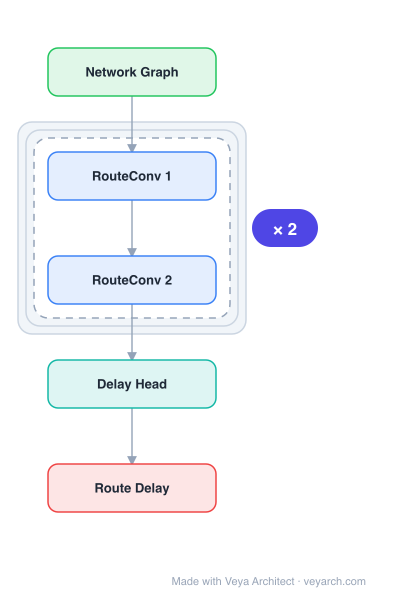

# Architecture: RouteNet

## Motivation

The paper addresses **network modeling for Software-Defined Networks (SDN)** — predicting Key Performance Indicators (KPIs) such as delay, jitter, and packet loss from network topology, routing configuration, and input traffic. Accurate network models are essential for self-driving networks that must optimize routing configurations to meet QoS objectives. Prior approaches fall short: analytic models based on Queuing Theory assume unrealistic properties (Poisson traffic, probabilistic routing) and are inaccurate for large-scale multi-hop networks; packet-level simulators are accurate but too computationally expensive for short-time-scale network operation. Existing neural network approaches (fully-connected, CNN, RNN, VAE) treat networks as flat feature vectors, ignoring the **graph-structured nature** of computer networks, which limits both accuracy and generalization to unseen topologies and routing configurations.

RouteNet fills this gap by modeling the network as a **graph** and using a Graph Neural Network (GNN) to learn the complex relationship between topology, routing, and input traffic. Because GNNs are designed for graph-structured data, RouteNet generalizes to arbitrary topologies, routing schemes, and variable traffic intensity — including configurations never seen during training.

## Core Idea

GNN for network routing optimization that generalizes to unseen topologies via message passing.

## Architecture

### Overview

<b>Layer-by-layer (5 nodes)</b>

| # | Layer | Type | Params |
|---|---|---|---|
| 1 | Network Graph | `input` |  |
| 2 | RouteConv 1 | `gcn_conv` |  |
| 3 | RouteConv 2 | `gcn_conv` |  |
| 4 | Delay Head | `linear` |  |
| 5 | Route Delay | `output` |  |

RouteNet represents a computer network as a graph where nodes are routers/switches and links are edges. The model captures the relationship between topology, routing, and input traffic to estimate the per-source/destination per-packet delay distribution and loss ratio. The key architectural innovation is representing **paths as ordered sequences of links** and propagating information along these paths via message passing. The model uses a message-passing GNN with residual connections, inspired by Generalized Linear Models for probabilistic delay distribution estimation. A single trained model predicts any metric associated with end-to-end per-packet delay (mean delay, jitter) and also the per-source/destination packet loss ratio.

### Components

- **Node (router) embeddings:** Each node in the graph (representing a network device) maintains a hidden state vector updated via message passing from its neighbors.
- **Link embeddings:** Each link (edge) carries features such as capacity, traffic intensity, and routing state. Links are the primary carriers of routing information.
- **Path representation as ordered link sequences:** A path from source to destination is represented as an ordered sequence of links. Messages are propagated along this sequence, aggregating link-level information into a path-level representation. This is RouteNet's key contribution — encoding routing as ordered path sequences rather than flat graph features.
- **Message-passing / readout module:** Iteratively updates node and link hidden states by aggregating messages from neighboring links and nodes. After message passing converges (or after a fixed number of iterations), a readout function produces the per-path delay distribution and loss ratio.
- **Probabilistic modeling (Generalized Linear Models inspired):** The output layer estimates the parameters of a per-packet delay distribution (e.g., mean and variance), enabling prediction of any delay-related metric (mean delay, jitter) from a single model.
- **Residual connections:** Facilitate training of the message-passing iterations, inspired by ResNet.

### Data Flow

1. **Input:** Network topology (graph with nodes as devices, links as edges), routing configuration (source-destination paths as ordered link sequences), and traffic matrix (input traffic intensity per source-destination pair).
2. **Initialization:** Initialize node and link hidden states from their input features (capacity, traffic, routing state).
3. **Path-based message passing:** For each source-destination path, propagate information along the ordered sequence of links, aggregating link states into a path representation.
4. **Graph message passing:** Iteratively update node and link hidden states by aggregating messages from graph neighbors, capturing the interaction between topology, routing, and traffic.
5. **Readout:** Apply the readout function to each path representation to estimate delay distribution parameters and loss ratio.
6. **Output:** Per-source/destination predictions of mean delay, jitter, and packet loss.
7. **Training:** Supervised on a dataset generated by a packet-level simulator (Omnet++), with the model learning to predict KPIs for unseen topologies, routing, and traffic.

### State / Memory

The message-passing process maintains hidden states for nodes and links that are iteratively updated. These states are transient (reset per forward pass) but provide a form of local memory within the message-passing iterations. There is no cross-inference persistent state. The number of message-passing iterations is a hyperparameter controlling the receptive field.

## Design Decisions

- **GNN over flat neural networks:** Computer networks are fundamentally graphs; GNNs naturally encode topology and routing, enabling generalization to unseen topologies — a capability flat NNs lack.
- **Paths as ordered link sequences:** This representation captures the sequential nature of routing (the order of links in a path matters for delay accumulation), which is lost in aggregate graph representations. This is RouteNet's distinguishing contribution.
- **Single model for all delay metrics:** Inspired by Generalized Linear Models, the model estimates the delay distribution parameters directly, enabling any delay metric (mean, jitter, percentiles) to be derived from one model rather than training separate models per metric.
- **Residual connections:** Improve training stability of the message-passing iterations, especially for deeper propagation.
- **Generalization by design:** Because the GNN operates on graph structure rather than fixed-size inputs, a model trained on 14/24/50-node topologies generalizes to unseen 17-node networks (worst-case MRE=15.4%).

## Evolution

**Predecessors:**
- Queuing theory-based analytic network models — accurate under idealized assumptions but fail for realistic multi-hop networks.
- Packet-level simulators (Omnet++, NS-3) — accurate but computationally prohibitive for real-time operation.
- Flat neural network models for network modeling — limited accuracy and no topology generalization.
- Message-passing neural networks (Gilmer et al., 2017) — the general MPNN framework RouteNet builds upon.

**Successors:**
- RouteNet-Transformer — extends RouteNet with attention-based message passing for improved accuracy.
- GraphDeep / network digital twin models — GNN-based network models for self-driving SDN.
- Models extending the path-sequence representation to other network optimization tasks (link placement, capacity planning).

## Characteristics

| Property | Value |
|----------|-------|
| Year | 2020 |
| Authors | Rusek et al. |
| Category | GNN/TimeSeries |
| Source Paper | `RouteNet_RouteNet_2020.md` |
| PaperVault Path | `GNN/06-gnn-for-time-series/RouteNet_RouteNet_2020.md` |

## Limitations

- **Simulator dependency for training labels:** Training data is generated by packet-level simulators; the model's accuracy ceiling is bounded by simulator fidelity and its assumptions.
- **Fixed message-passing iterations:** The number of iterations is a hyperparameter; too few under-reach long paths, too many add computational cost without proportional benefit.
- **Generalization bounds:** While generalization to unseen topologies is demonstrated, very large or structurally novel topologies (e.g., data center fat-trees vs. ISP backbones) may exceed the training distribution.
- **No dynamic re-routing during inference:** The model predicts KPIs for a given routing configuration but does not itself propose optimal routing; it must be paired with a separate optimization algorithm.
- **Loss prediction accuracy:** Packet loss prediction is generally harder than delay prediction due to the discrete, bursty nature of loss events.

## Implementation Notes

See `implementation/` for a minimal runnable implementation.

## Information Layers

- **Evidence:** Source paper available in `references/papers/`
- **Analysis:** RouteNet's central insight is that computer networks are graphs, and modeling them with GNNs — rather than flat neural networks — enables structural generalization to unseen topologies. The path-as-ordered-link-sequence representation is the key architectural innovation, capturing the sequential nature of routing that aggregate representations lose. The GLM-inspired probabilistic output enables a single model to serve multiple KPIs.
- **Hypothesis:** The model's generalization ability depends on the diversity of training topologies; training on homogeneous topology families may limit cross-family transfer. Attention-based path representations (as in successor models) may better capture non-uniform link importance within paths. The reliance on simulator-generated labels means the model inherits simulator biases, potentially limiting real-world deployment accuracy.
