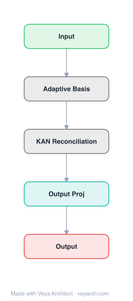

# Architecture: RPN-v2 (Reconciled Polynomial Network v2)

## Motivation

The original RPN model was designed under the assumption of input data independence — presuming independence among individual instances within data batches and attributes in each data instance. This assumption often proves invalid for function learning tasks involving complex, interdependent data such as language, images, time series, and graphs. Ignoring such data interdependence inevitably leads to significant performance degradation. RPN-v2 addresses this by explicitly modeling data interdependence.

## Core Idea

An extension of RPN that incorporates data and structural interdependence functions, explicitly modeling how data instances and attributes depend on each other. This enables RPN-v2 to unify and advance not just PGMs, kernel SVMs, MLP, and KAN (as RPN did), but also CNNs, RNNs, GNNs, and Transformers — the dominant backbone architectures in modern deep learning.

## Architecture

### Overview

<b>Layer-by-layer (5 nodes)</b>

| # | Layer | Type | Params |
|---|---|---|---|
| 1 | Input | `input` |  |
| 2 | Adaptive Basis | `custom` |  |
| 3 | KAN Reconciliation | `custom` |  |
| 4 | Output Proj | `linear` |  |
| 5 | Output | `output` |  |

RPN-v2 extends RPN by adding interdependence functions to the three original component functions (data expansion, parameter reconciliation, remainder). The interdependence functions model relationships between data instances (batch-level) and attributes (feature-level), enabling the framework to handle sequential, spatial, and graph-structured data. This expansion allows RPN-v2 to subsume CNNs, RNNs, GNNs, and Transformers as special cases.

### Components

1. **Data Expansion Function** (from RPN) — Projects data vectors to high-dimensional intermediate space:
   - f_expansion(x): R^d → R^D
   - Now extended to handle interdependent data

2. **Parameter Reconciliation Function** (from RPN) — Fabricates compact parameters into high-dimensional matrices:
   - g_reconciliation(w): R^m → R^{D×d'}
   - Addresses curse of dimensionality

3. **Remainder Function** (from RPN) — Provides complementary information:
   - h_remainder(x): R^d → R^{d'}
   - Reduces approximation errors

4. **Data Interdependence Function** (NEW) — Models relationships between data instances:
   - Captures batch-level dependencies (e.g., sequence ordering, graph structure)
   - Enables modeling of sequential data (RNN), spatial data (CNN), graph data (GNN)
   - Transforms input data based on inter-instance relationships

5. **Structural Interdependence Function** (NEW) — Models relationships between attributes:
   - Captures feature-level dependencies (e.g., spatial proximity, attention weights)
   - Enables modeling of spatial structure (CNN), attention patterns (Transformer)
   - Transforms input features based on inter-attribute relationships

6. **Extended Layer Composition** — A single RPN-v2 layer:
   - Incorporates interdependence functions alongside expansion, reconciliation, and remainder
   - Models both data-level and structural-level dependencies
   - Can instantiate as CNN (spatial interdependence), RNN (sequential interdependence), GNN (graph interdependence), or Transformer (attention-based interdependence)

### Data Flow

1. **Input**: Data vector x ∈ R^d (potentially interdependent with other instances/attributes)
2. **Data interdependence**: Model relationships between data instances (batch-level)
3. **Structural interdependence**: Model relationships between attributes (feature-level)
4. **Data expansion**: f_expansion(x') → R^D (with interdependent data)
5. **Parameter reconciliation**: g_reconciliation(w) → R^{D×d'}
6. **Inner product**: expansion · reconciliation → R^{d'}
7. **Remainder**: h_remainder(x') → R^{d'}
8. **Output**: y = expansion · reconciliation + remainder
9. **Stacking**: Multiple layers for deep function learning

### State / Memory

- **Interdependence state**: The interdependence functions maintain state about relationships between data instances and attributes (e.g., sequence position, graph adjacency, attention patterns).
- **Model parameters**: Compact parameters w per layer, fabricated into high-dimensional matrices.
- **No explicit recurrent state**: While RPN-v2 can model RNN-like behavior, the interdependence is captured by functions rather than recurrent state.

## Design Decisions

1. **Explicit interdependence modeling** — Adding data and structural interdependence functions:
   - Addresses the key limitation of RPN (independence assumption)
   - Enables handling of language, images, time series, graphs
   - Makes the framework applicable to real-world complex data

2. **Two types of interdependence** — Separating data (instance) and structural (attribute) interdependence:
   - Data interdependence: relationships between instances (e.g., word order, graph structure)
   - Structural interdependence: relationships between attributes (e.g., spatial proximity, feature attention)
   - Each can be modeled independently with different functions

3. **Unifying modern backbones** — Extending to CNN, RNN, GNN, Transformer:
   - CNN = spatial structural interdependence (local receptive fields)
   - RNN = sequential data interdependence (temporal ordering)
   - GNN = graph data interdependence (adjacency structure)
   - Transformer = attention-based structural interdependence (global attention)

4. **Backward compatibility** — RPN-v2 subsumes RPN:
   - Setting interdependence functions to identity recovers original RPN
   - All RPN capabilities are preserved

## Evolution

**Predecessors:**
- **RPN** (Zhang, 2024) — Original Reconciled Polynomial Network (unified PGMs, SVM, MLP, KAN).
- **CNN** — Convolutional neural networks (spatial interdependence).
- **RNN/LSTM** — Recurrent neural networks (sequential interdependence).
- **GNN** — Graph neural networks (graph interdependence).
- **Transformer** — Self-attention (global interdependence).

**Successors:**
- **tinyBIG v0.2.0** — Implementation toolkit for RPN-v2.
- Further extensions with more interdependence types.
- Automated architecture search within the RPN-v2 framework.

## Characteristics

| Property | Value |
|----------|-------|
| Year | 2024 |
| Authors | Jiawei Zhang (UC Davis, IFM Lab) |
| Category | DL/Theory |
| Source Paper | `RPN_V2_Rnn_Gnn_Transformer_2025.md` |
| PaperVault Path | `DL-Architectures/07-theory-classics/RPN_V2_Rnn_Gnn_Transformer_2025.md` |

## Limitations

1. **Theoretical complexity** — Even more complex than RPN, with additional interdependence functions.
2. **Computational overhead** — Modeling interdependence adds computation, especially for large graphs or long sequences.
3. **Empirical validation** — The practical advantage over specialized architectures (CNN, Transformer) is unclear.
4. **Implementation complexity** — The framework's generality makes implementation challenging.
5. **Interdependence function design** — Optimal interdependence functions are task-dependent and unclear.
6. **Scalability** — Modeling all pairwise interdependencies may not scale to very large inputs.

## Implementation Notes

See `implementation/` for a minimal runnable implementation. Key details:
- Extended layer: interdependence + expansion + reconciliation + remainder
- Data interdependence: models instance-level relationships (sequence, graph, batch)
- Structural interdependence: models attribute-level relationships (spatial, attention)
- Unifies: PGMs, SVMs, MLP, KAN, CNN, RNN, GNN, Transformer
- Backward compatible with RPN (identity interdependence)
- Toolkit: tinyBIG v0.2.0 (github.com/jwzhanggy/tinyBIG)
- Project website: tinybig.org
- Various interdependence function types (sequential, spatial, graph, attention)

## Information Layers

- **Evidence:** Source paper available in `references/papers/` (Zhang, 2024, "RPN 2: On Interdependence Function Learning Towards Unifying and Advancing CNN, RNN, GNN, and Transformer")
- **Analysis:** RPN-v2's key insight is that the independence assumption of RPN was a fundamental limitation for real-world data. By adding interdependence functions, the framework can now model the relationships that make CNNs, RNNs, GNNs, and Transformers effective. The decomposition reveals that these architectures differ primarily in how they model interdependence: CNNs use local spatial interdependence, RNNs use sequential interdependence, GNNs use graph-structured interdependence, and Transformers use attention-based global interdependence. This unification suggests that interdependence modeling is the fundamental differentiator between modern backbone architectures.
- **Hypothesis:** The interdependence function framework may enable automatic architecture selection: given a data type, the optimal interdependence function can be determined automatically. The separation of data interdependence (instance-level) and structural interdependence (attribute-level) may be the "right" decomposition for understanding neural network design. The framework may reveal that many modern architectures are over-engineered — simpler interdependence functions may suffice for many tasks.
