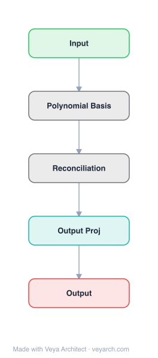

# Architecture: RPN (Reconciled Polynomial Network)

## Motivation

Deep learning lacks a unified theoretical framework that connects different model architectures. Models like PGMs (Bayesian/Markov networks), kernel SVMs, MLPs, and KANs are treated as fundamentally different, making it difficult to transfer insights across architectures. The goal is to build a general deep model architecture that can unify these diverse base models into one canonical representation, providing a theoretical foundation for understanding and improving deep function learning.

## Core Idea

A novel deep model named Reconciled Polynomial Network (RPN) that disentangles the underlying function into the inner product of a data expansion function and a parameter reconciliation function, plus a remainder function. Inspired by Taylor's Theorem, RPN can unify PGMs, kernel SVMs, MLP, and KAN as special cases, providing a canonical representation for deep function learning.

## Architecture

### Overview

<b>Layer-by-layer (5 nodes)</b>

| # | Layer | Type | Params |
|---|---|---|---|
| 1 | Input | `input` |  |
| 2 | Polynomial Basis | `custom` |  |
| 3 | Reconciliation | `custom` |  |
| 4 | Output Proj | `linear` |  |
| 5 | Output | `output` |  |

RPN has a general architecture based on Taylor's Theorem. The underlying function to be inferred is decomposed into three component functions: (1) a data expansion function that projects input vectors to a high-dimensional intermediate space, (2) a parameter reconciliation function that fabricates a small number of parameters into a higher-order parameter matrix, and (3) a remainder function that provides complementary information to reduce approximation errors. These components are composed into layers and stacked to form deep networks.

### Components

1. **Data Expansion Function** — Projects data vectors from input space to high-dimensional intermediate space:
   - f_expansion(x): R^d → R^D (D >> d)
   - Inspired by Taylor expansion terms (polynomial features)
   - Different expansion functions yield different base models (e.g., polynomial expansion → SVM kernel)

2. **Parameter Reconciliation Function** — Fabricates a small number of parameters into a higher-order parameter matrix:
   - g_reconciliation(w): R^m → R^{D×d'} (m << D×d')
   - Addresses the "curse of dimensionality" caused by data expansion
   - Maps compact parameters to high-dimensional weight matrices
   - Different reconciliation functions yield different base models (e.g., low-rank → MLP)

3. **Remainder Function** — Provides complementary information to reduce approximation errors:
   - h_remainder(x): R^d → R^{d'}
   - Inspired by the remainder term in Taylor's Theorem
   - Reduces potential approximation errors from the expansion-reconciliation product

4. **Layer Composition** — A single RPN layer computes:
   - output = f_expansion(x) · g_reconciliation(w) + h_remainder(x)
   - Inner product of expanded data and reconciled parameters, plus remainder
   - Multiple layers can be stacked for deep function learning

5. **Canonical Representation** — RPN unifies:
   - **PGMs** (Bayesian/Markov networks): specific expansion + reconciliation choices
   - **Kernel SVMs**: polynomial expansion + specific reconciliation
   - **MLP**: specific expansion (identity) + low-rank reconciliation
   - **KAN**: specific expansion + spline-based reconciliation

### Data Flow

1. **Input**: Data vector x ∈ R^d
2. **Data expansion**: f_expansion(x) → R^D (high-dimensional intermediate space)
3. **Parameter reconciliation**: g_reconciliation(w) → R^{D×d'} (from compact parameters w)
4. **Inner product**: f_expansion(x) · g_reconciliation(w) → R^{d'} (polynomial integration in intermediate space)
5. **Remainder**: h_remainder(x) → R^{d'} (complementary information)
6. **Output**: y = f_expansion(x) · g_reconciliation(w) + h_remainder(x) ∈ R^{d'}
7. **Stacking**: Multiple layers composed for deep function learning

### State / Memory

- **No explicit memory mechanism**: RPN is a feedforward architecture without recurrent state.
- **Model parameters**: The compact parameters w (per layer) are persistent; reconciliation functions fabricate them into high-dimensional matrices on-the-fly.
- **Expansion terms**: The expanded data representation is transient per forward pass.
- **Layer-specific parameters**: Each layer has its own expansion, reconciliation, and remainder functions.

## Design Decisions

1. **Taylor's Theorem inspiration** — Using Taylor expansion as the mathematical foundation:
   - Provides a principled decomposition of functions
   - Data expansion = Taylor terms; remainder = Taylor remainder
   - Naturally unifies polynomial and non-polynomial models

2. **Disentanglement of data and parameters** — Separating data expansion from parameter reconciliation:
   - Data expansion handles feature engineering (input space → intermediate space)
   - Parameter reconciliation handles parameter efficiency (compact → high-dimensional)
   - Each can be optimized independently

3. **Remainder function** — Including a remainder term:
   - Reduces approximation errors
   - Provides complementary information not captured by expansion-reconciliation
   - Inspired by Taylor remainder, ensuring theoretical completeness

4. **Parameter reconciliation for curse of dimensionality** — Fabricating few parameters into large matrices:
   - Addresses the dimensionality explosion from data expansion
   - Low-rank, structured, or other parameterizations possible
   - Enables efficient training despite high-dimensional intermediate space

5. **Unifying framework** — Designing RPN to subsume existing models:
   - PGMs, kernel SVMs, MLP, KAN as special cases
   - Enables transfer of insights across architectures
   - Provides a theoretical foundation for deep function learning

## Evolution

**Predecessors:**
- **Taylor's Theorem** — Mathematical foundation for function approximation.
- **PGMs** (Bayesian/Markov networks) — Probabilistic graphical models.
- **Kernel SVMs** — Support vector machines with kernel methods.
- **MLP** (multi-layer perceptron) — Standard feedforward neural networks.
- **KAN** (Kolmogorov-Arnold Networks) — Learnable activation functions on edges.

**Successors:**
- **RPN 2** (RPN-v2) — Extension with interdependence functions for CNN, RNN, GNN, Transformer.
- **tinyBIG toolkit** — Implementation and extensions of RPN.
- Unified frameworks for deep learning theory.

## Characteristics

| Property | Value |
|----------|-------|
| Year | 2024 |
| Authors | Jiawei Zhang (UC Davis, IFM Lab) |
| Category | DL/Theory |
| Source Paper | `RPN_Reconciled_Polynomial_Network_PGMs_SVMs_2025.md` |
| PaperVault Path | `DL-Architectures/07-theory-classics/RPN_Reconciled_Polynomial_Network_PGMs_SVMs_2025.md` |

## Limitations

1. **Theoretical complexity** — The framework is mathematically dense, making it difficult to implement and use practically.
2. **Empirical validation** — While extensive experiments are claimed, the practical advantage over specialized architectures (MLP, KAN) is unclear.
3. **Scalability** — The high-dimensional intermediate space from data expansion may be computationally expensive despite parameter reconciliation.
4. **Adoption barrier** — The framework's generality may make it harder to optimize than specialized architectures for specific tasks.
5. **Remainder function design** — The optimal form of the remainder function is unclear and may be task-dependent.
6. **Unification vs. specialization** — While unifying models is theoretically elegant, specialized models may outperform general frameworks in practice.

## Implementation Notes

See `implementation/` for a minimal runnable implementation. Key details:
- Layer: output = f_expansion(x) · g_reconciliation(w) + h_remainder(x)
- Data expansion: f: R^d → R^D (polynomial, Taylor-inspired)
- Parameter reconciliation: g: R^m → R^{D×d'} (low-rank, structured)
- Remainder: h: R^d → R^{d'} (error correction)
- Unifies: PGMs, kernel SVMs, MLP, KAN (as special cases)
- Stack layers for deep function learning
- Toolkit: tinyBIG (github.com/jwzhanggy/tinyBIG)
- Various complexities, capacities, and completeness levels
- Extensive empirical experiments on benchmark datasets

## Information Layers

- **Evidence:** Source paper available in `references/papers/` (Zhang, 2024, "RPN: Reconciled Polynomial Network Towards Unifying PGMs, Kernel SVMs, MLP and KAN")
- **Analysis:** RPN's key contribution is providing a theoretical framework that unifies seemingly different model architectures under a common mathematical foundation (Taylor's Theorem). The decomposition into data expansion, parameter reconciliation, and remainder provides a principled way to understand what each model family does: PGMs and SVMs differ in expansion functions, MLPs use specific reconciliation, KANs use spline-based reconciliation. This unification could enable cross-architecture insights and more principled architecture design.
- **Hypothesis:** The Taylor-inspired decomposition may be the "right" way to think about neural networks: data expansion (feature engineering) + parameter reconciliation (parameter efficiency) + remainder (error correction). The framework's generality may enable automatic architecture search by selecting optimal expansion and reconciliation functions per layer. The remainder function may be key to understanding residual connections and skip connections in modern architectures.
