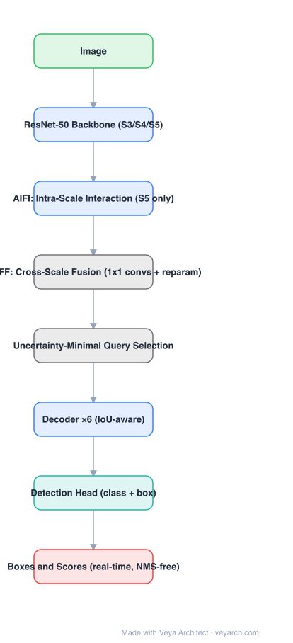

# Architecture: RT-DETR

## Motivation

DETR-family detectors were accurate but considered too slow for real time; meanwhile YOLO-family detectors were fast but needed NMS and anchor/grid design, so their latency is data-dependent and hard to guarantee. RT-DETR asks: can the end-to-end (NMS-free) design be made both faster and more accurate than YOLO at the same scale?

## Core Idea

Two costs dominate a DETR: the encoder's global self-attention over high-resolution multi-scale tokens, and the decoder's work on poorly initialized queries. RT-DETR attacks both — an **efficient hybrid encoder** that does scale interaction cheaply, and **uncertainty-minimal query selection** that initializes the decoder with queries the model is already confident about.

## Architecture

### Overview

<b>Layer-by-layer (8 nodes)</b>

| # | Layer | Type | Params |
|---|---|---|---|
| 1 | Image | `input` |  |
| 2 | ResNet-50 Backbone (S3/S4/S5) | `conv2d` |  |
| 3 | AIFI: Intra-Scale Interaction (S5 only) | `attention` |  |
| 4 | CCFF: Cross-Scale Fusion (1x1 convs + reparam) | `custom` |  |
| 5 | Uncertainty-Minimal Query Selection | `custom` |  |
| 6 | Decoder ×6 (IoU-aware) | `attention` |  |
| 7 | Detection Head (class + box) | `linear` |  |
| 8 | Boxes & Scores (real-time, NMS-free) | `output` |  |

### Components

1. **Backbone (ResNet-50/101)** — emits the last three stages S3, S4, S5.
2. **AIFI (Attention-based Intra-scale Feature Interaction)** — self-attention applied **only to S5**, the highest-semantic and lowest-resolution stage. This is the key efficiency move: intra-scale interaction on low-resolution tokens is cheap, and high-resolution stages do not need it.
3. **CCFF (CNN-based Cross-scale Feature Fusion)** — a fusion path built from 1×1 convolutions and reparameterized blocks that injects S5's context back into S3/S4 in the style of PANet. Cheaper than transformer cross-scale attention.
4. **Uncertainty-minimal query selection** — instead of randomly initialized queries, candidate features are selected from the encoder by optimizing for **both** classification and localization quality, explicitly minimizing the uncertainty of the predicted distribution. Queries whose localization uncertainty is high are rejected.
5. **Decoder (6 layers)** — cross-attention over the fused multi-scale features, with **IoU-aware** supervision so the classification score reflects localization quality.
6. **Detection head** — class + box FFNs, as in DETR; NMS-free output.

### Data Flow

Image → backbone (S3/S4/S5) → AIFI on S5 → CCFF fusion across scales → uncertainty-minimal query selection → decoder → class/box heads → final boxes (no NMS).

### State / Memory

No recurrent state. Queries are selected from encoder features per image (input-dependent rather than learned parameters), which is what makes the decoder cheap.

## Design Decisions

- **Decouple intra-scale from cross-scale processing** — attention where it pays (semantic, low-res), convolution where it pays (cross-scale fusion of high-res maps).
- **Select queries by uncertainty, not just by score** — a high classification score with poor localization produces a bad query; minimizing uncertainty improves both.
- **Decoder depth as a runtime dial** — the decoder can be truncated at inference to trade accuracy for latency without retraining; this is a deployment-level feature, not just a training trick.
- **No NMS** — removes the data-dependent post-processing step that makes YOLO latency unpredictable at high object counts.

## Evolution

- **DETR / Deformable DETR** (predecessors): end-to-end detection, but expensive encoder and slow convergence.
- **DINO / DN-DETR**: query denoising and contrastive learning, improving accuracy and convergence.
- **RT-DETR**: real-time encoder + query selection; the first DETR to beat YOLOs on speed and accuracy.
- **RT-DETRv2 / v3 and D-FINE**: improved training, deployment-friendly variants, and fine-grained distribution refinement.
- **Competitive line**: YOLOv8–YOLOv11 (anchor-free, NMS-based, highly optimized).

## Characteristics

| Property | Value |
|---|---|
| Backbone | ResNet-50 / ResNet-101 (S3, S4, S5) |
| Encoder | Hybrid: AIFI (attention on S5) + CCFF (CNN fusion) |
| Query selection | Uncertainty-minimal |
| Decoder layers | 6 (adjustable at inference) |
| Post-processing | None (NMS-free) |
| Reported | 54%+ AP COCO for RT-DETR-R101 on a T4 GPU with TensorRT FP16 |

## Limitations

- Multi-scale fusion path still processes high-resolution maps; very high resolutions erode the speed advantage.
- Query selection quality depends on encoder features — ambiguous or crowded scenes hurt.
- Real-time numbers depend on TensorRT/FP16 deployment; the PyTorch reference is much slower.
- Like all DETRs, small-object accuracy depends on the fusion path quality rather than on deformable attention.

## Implementation Notes

A minimal implementation should reproduce: (1) attention only on the deepest stage, (2) a CNN fusion path across scales, (3) uncertainty-minimal query selection (a scoring function combining class score and box-quality uncertainty), (4) a decoder whose depth can be changed at inference. Keep the output NMS-free — that is the property that makes latency deterministic.
