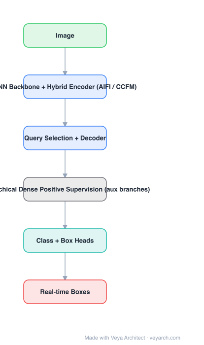

# Architecture: RT-DETRv3

## Motivation

Real-time DETR detectors pay a hidden training cost: one-to-one Hungarian matching means each decoder layer sees only **one positive query per object**. Models like Group-DETR and DEYO showed that adding one-to-many (dense) assignment during training fixes this — but they attach it in a way that does not transfer cleanly to the hybrid-encoder, real-time setting. RT-DETRv3 asks how to give RT-DETR that supervision **hierarchically** without changing the inference graph.

## Core Idea

Attach **hierarchical dense positive supervision** branches: auxiliary detection heads with denser (one-to-many) assignment are placed at several depths of the encoder/decoder, so every level — not just the final decoder — receives rich positive supervision. All auxiliary branches are removed at inference.

## Architecture

### Overview

<b>Layer-by-layer (6 nodes)</b>

| # | Layer | Type | Params |
|---|---|---|---|
| 1 | Image | `input` |  |
| 2 | CNN Backbone + Hybrid Encoder (AIFI / CCFM) | `conv2d` |  |
| 3 | Query Selection + Decoder | `attention` |  |
| 4 | Hierarchical Dense Positive Supervision (aux branches) | `custom` |  |
| 5 | Class + Box Heads | `linear` |  |
| 6 | Real-time Boxes | `output` |  |

### Components

1. **CNN backbone** (ResNet / HGNet-style) producing multi-scale features.
2. **Hybrid encoder (from RT-DETR)** — AIFI (attention-based intra-scale feature interaction) on the top scale, then CCFM (CNN-based cross-scale feature fusion) — the design that keeps the transformer cost confined to the lowest-resolution scale.
3. **Uncertainty-minimal query selection** — pick decoder queries from encoder features.
4. **Decoder with class and box heads** — the main one-to-one branch.
5. **Hierarchical dense positive supervision** — auxiliary branches at multiple levels, each with dense (one-to-many) assignment and its own losses; supervision density is what differs per level, hence "hierarchical".
6. **Inference graph** — auxiliary branches dropped; architecture is identical to RT-DETR at deployment.

### Data Flow

Image → CNN backbone → hybrid encoder (AIFI + CCFM) → query selection → decoder → boxes. During training, auxiliary dense-assignment branches tap intermediate features at several depths and add their losses.

### State / Memory

No temporal state. The multi-level feature pyramid plus the query set is the whole intermediate structure; the auxiliary branches exist only in the training graph.

## Design Decisions

- **Supervision density, not architecture change** — the model is unchanged at inference; only training signal is added, which is the constraint for a real-time method.
- **Hierarchical placement** — supervising several depths (not just the last decoder) is what makes early features useful.
- **Dense (one-to-many) assignment** — the direct fix for the too-few-positives problem of one-to-one matching.
- **Keep the hybrid encoder** — the reason RT-DETR is real-time; do not replace it with a full transformer encoder.

## Evolution

- **DETR → Deformable DETR → DINO**: one-to-one matching, slow convergence.
- **Group-DETR / DEYO / DETA**: one-to-many *training* assignment as a trick to densify supervision.
- **RT-DETR**: hybrid encoder + query selection, first real-time DETR. **RT-DETRv2**: training refinements (bag-of-freebies).
- **RT-DETRv3**: hierarchical dense positive supervision across levels.
- **Siblings**: D-FINE (distribution-refinement regression), LW-DETR, YOLOv11 (CNN anchor-free).

## Characteristics

| Property | Value |
|---|---|
| Task | real-time end-to-end object detection |
| Backbone | CNN (ResNet / HGNet-style) |
| Encoder | hybrid: AIFI intra-scale attention + CCFM CNN cross-scale fusion |
| Assignment | one-to-one at inference; dense one-to-many auxiliary during training |
| Supervision | hierarchical (multiple depths) |
| Inference cost | unchanged vs. RT-DETR (aux branches removed) |

## Limitations

- The gain is a training-time gain: if training budget is already sufficient, the benefit shrinks.
- Adding auxiliary branches increases training memory and tuning effort (assignment ratio per level is a new hyperparameter).
- Reported improvements are relative to RT-DETR on COCO; absolute advantage over strong CNN detectors (YOLOv11) depends on the latency regime.
- Quality of query selection still bounds the final accuracy — dense supervision helps but does not fix bad queries.

## Implementation Notes

Essentials: (1) keep RT-DETR's hybrid encoder exactly as-is, (2) attach auxiliary detection heads at several feature depths, (3) use one-to-many assignment in the auxiliary branches and one-to-one in the main branch, (4) weight the auxiliary losses per level, (5) verify that removing the auxiliary branches at export leaves latency and output identical to the base RT-DETR — if it does not, the deployment advantage is lost.
