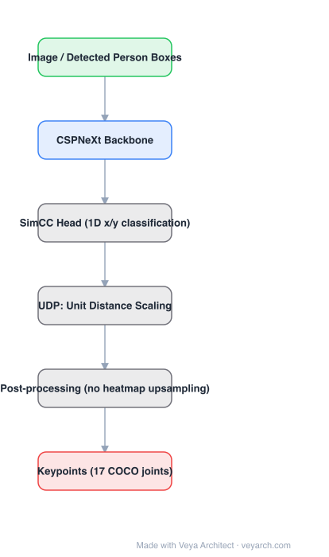

# Architecture: RTMPose

## Motivation

2D pose models were accurate but too heavy for industrial deployment: heatmap-based heads require deconvolution/upsampling back to input resolution, which dominates latency, and backbone choices were made on GFlops rather than measured throughput. RTMPose is an end-to-end study of paradigm, backbone, training strategy, and deployment, with latency measured on real CPUs and GPUs.

## Core Idea

Two changes remove most of the cost. First, replace the **2D heatmap regression** head with **SimCC**: pose is cast as two **1D classification** problems (which x-bin, which y-bin), so no upsampling is needed — just two linear layers and a softmax over bins. Second, use **UDP (Unit Distance Scaling)** to fix the sub-pixel and flip-consistency problems that naive SimCC has. Backbone: **CSPNeXt**, chosen for hardware throughput.

## Architecture

### Overview

<b>Layer-by-layer (6 nodes)</b>

| # | Layer | Type | Params |
|---|---|---|---|
| 1 | Image / Detected Person Boxes | `input` |  |
| 2 | CSPNeXt Backbone | `conv2d` |  |
| 3 | SimCC Head (1D x/y classification) | `custom` |  |
| 4 | UDP: Unit Distance Scaling | `custom` |  |
| 5 | Post-processing (no heatmap upsampling) | `custom` |  |
| 6 | Keypoints (17 COCO joints) | `output` |  |

### Components

1. **Person detector (top-down)** — a detector supplies person boxes; each box is cropped and normalized for the pose model.
2. **CSPNeXt backbone** — a CSP-style convnet with large-kernel depthwise convolutions chosen for measured latency rather than parameter count; the m/l variants scale width/depth.
3. **Global average pooling + SimCC head** — pooled features go to two independent 1D classification branches producing x-bin and y-bin logits per keypoint. No deconvolution layers, no high-resolution heatmaps.
4. **UDP (Unit Distance Scaling)** — a coordinate transform applied to targets and predictions that removes the dependence on image size/aspect ratio and makes flip-test consistent.
5. **Loss** — classification losses (with label smoothing) on the two 1D distributions instead of MSE on heatmaps.
6. **Deployment path** — the paper's fourth factor: ONNX/TensorRT export and quantization-aware choices; RTMPose-m runs 90+ FPS on an Intel i7-11700 CPU and 430+ FPS on a GPU at 75.8% COCO AP.

### Data Flow

Image → detector boxes → crop/resize → CSPNeXt features → GAP → SimCC x/y heads → 1D argmax/expectation → keypoint coordinates (with UDP inverse transform). Optionally → tracking/association for multi-person video.

### State / Memory

No recurrent state in the base model; video use relies on an external tracker/associator (e.g. OKS-based or BYTE-style).

## Design Decisions

- **Classification over regression** — 1D bin classification is quantization-friendly and avoids the resolution-limited accuracy of heatmaps.
- **UDP** — fixes the two practical problems of SimCC (sub-pixel ambiguity, flip-test inconsistency) with a pure coordinate transform, at no runtime cost.
- **Hardware-aware backbone** — measured throughput, not GFlops, drives the CSPNeXt choice; this is why CPU latency is competitive.
- **Holistic optimization** — training strategy (augmentation, loss weighting, pretraining) and deployment export are treated as first-class, not afterthoughts.

## Evolution

- **Hourglass / CPN / SimpleBaseline** (predecessors): heatmap regression with deconvolution heads.
- **HRNet / HigherHRNet**: multi-resolution heatmaps; accurate, heavy.
- **SimCC / UDP**: coordinate classification formulation.
- **RTMPose**: CSPNeXt + SimCC + UDP + deployment co-design; the latency reference for real-time pose.
- **Siblings**: YOLO-Pose (single-stage), ViTPose (transformer, accuracy-focused), DWPose (whole-body), WiLoR (3D hand).

## Characteristics

| Property | Value |
|---|---|
| Task | top-down multi-person 2D pose (17 COCO keypoints) |
| Backbone | CSPNeXt (t/s/m/l) |
| Head | SimCC — two 1D classification branches + UDP |
| Post-processing | lightweight (no heatmap argmax/upsampling) |
| Reported | RTMPose-m: 75.8% AP COCO, 90+ FPS CPU (i7-11700), 430+ FPS GPU |

## Limitations

- Top-down: latency and accuracy depend on the person detector; crowded scenes suffer from box errors.
- Bin-based classification has a resolution/accuracy trade-off set by the number of bins.
- 2D only — no depth; 3D requires a separate lifting model (and RTMPose's CPU advantage does not transfer to 3D).
- CPU/GPU numbers are for exported/optimized runtimes; naive PyTorch is much slower.

## Implementation Notes

Essentials: (1) CSPNeXt-style backbone with hardware-friendly convolutions, (2) global average pooling into two 1D classification heads, (3) UDP applied consistently to targets and predictions, (4) export to ONNX/TensorRT without high-resolution intermediate tensors. When benchmarking, measure end-to-end latency including the detector and the crop cost.
